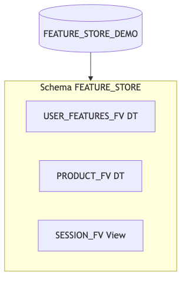
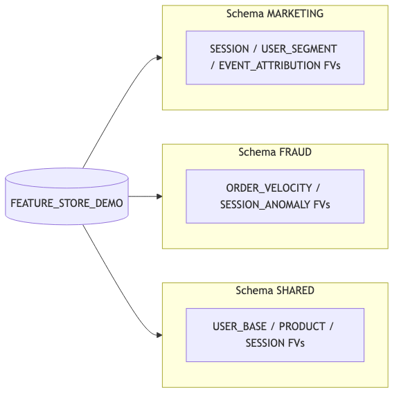
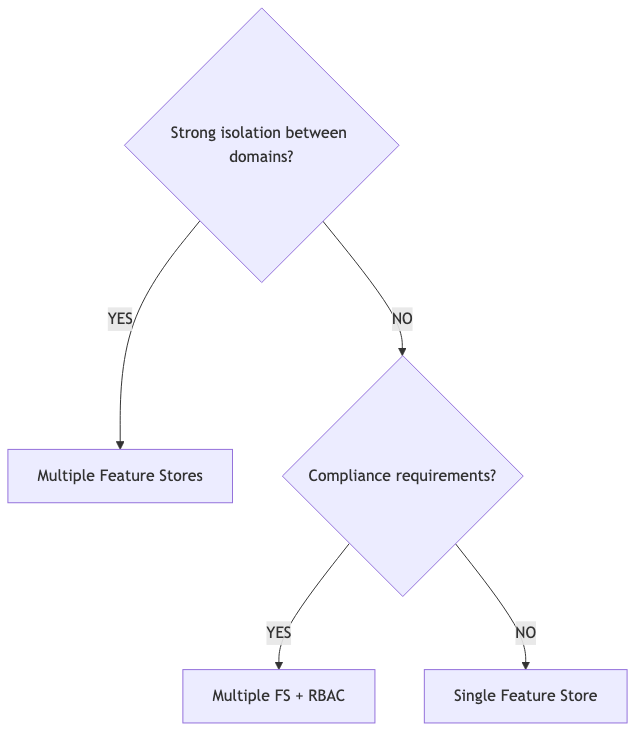
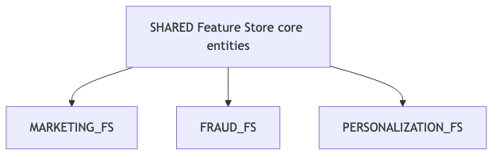
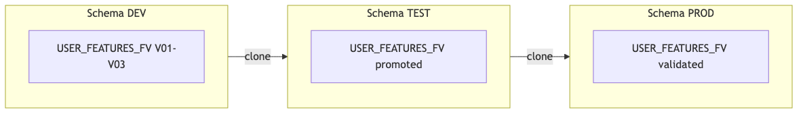
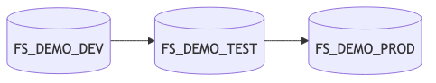
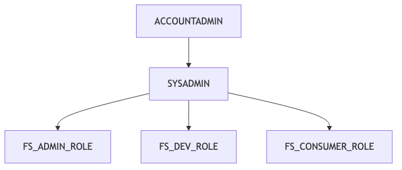
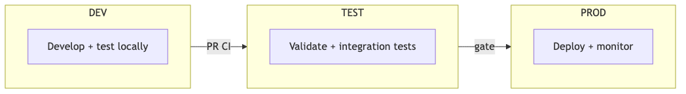
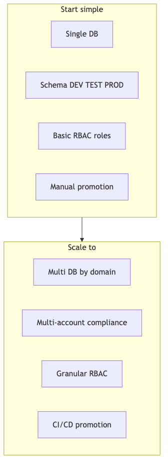

## Overview

This chapter covers organizational patterns for Snowflake Feature Stores, including single vs. multiple Feature Store strategies, environment management, role-based access control, and cross-environment promotion strategies. A well-designed Feature Store organization is critical for scalability, maintainability, and compliance.

## Learning Objectives

After completing this chapter, you will be able to:

- Choose the appropriate Feature Store organization pattern for your needs
- Design environment strategies for dev/test/prod workflows
- Implement role-based access control (RBAC) for Feature Store objects
- Plan and execute cross-environment feature promotion

> 📂 **Chapter code:** [Browse companion scripts on GitHub](https://github.com/Snowflake-Labs/snowflake-featurestore-imp-guide/tree/main/Snowflake_FeatureStore_Implementation_Guide/02_design_organization/_code)

---

## Organization Patterns

Snowflake Feature Store uses native Snowflake objects for storage and metadata:

| Logical Concept | Snowflake Object | Scope |
|-----------------|------------------|-------|
| Feature Store | Schema + Tags | Database-level |
| Entity | Tag | Schema-level |
| Feature View (materialized) | Dynamic Table | Schema-level |
| Feature View (query-time) | View | Schema-level |
| Online Feature Table | Online Feature Table | Schema-level |
| Feature metadata | Tags | Column/Object-level |

### Basic Organization: One Database, One Schema

The simplest organization uses a single database with one Feature Store schema:

{fig-alt="Single database with one schema containing several feature views"}

> 📁 **Full code:** [`_code/organization_patterns.py`](_code/organization_patterns.py)

```python
from snowflake.ml.feature_store import FeatureStore, CreationMode

# Create a single Feature Store
fs = FeatureStore(
    session=session,
    database="FEATURE_STORE_DEMO",
    name="FEATURE_STORE",
    default_warehouse="FS_DEV_WH",
    creation_mode=CreationMode.CREATE_IF_NOT_EXIST,
)
```

**When to use**:

- Small teams (1-5 data scientists)
- Single ML project or use case
- Quick proof-of-concept work
- No regulatory separation requirements
- Naming conventions are sufficient to distinguish environment promotion

### Intermediate Organization: One Database, Multiple Schemas

Separate schemas by domain, team, or use case within a single database:

{fig-alt="Marketing, fraud, and shared schemas under one database"}

```python
# Marketing team's Feature Store
marketing_fs = FeatureStore(
    session=session,
    database="FEATURE_STORE_DEMO",
    name="MARKETING",
    default_warehouse="FS_DEV_WH",
)

# Fraud team's Feature Store
fraud_fs = FeatureStore(
    session=session,
    database="FEATURE_STORE_DEMO",
    name="FRAUD",
    default_warehouse="FS_DEV_WH",
)

# Shared features accessible to all
shared_fs = FeatureStore(
    session=session,
    database="FEATURE_STORE_DEMO",
    name="SHARED",
    default_warehouse="FS_DEV_WH",
)
```

**When to use**:

- Multiple teams sharing a platform
- Different domains with some shared features
- Need for domain-specific access control
- Medium-sized organizations (5-20 data scientists)

---

## Single vs Multiple Feature Stores

### Decision Framework

{fig-alt="Decision tree for isolation and compliance"}

### Single Feature Store

**Advantages**:

- Simpler management and discovery
- All features in one place
- Easier cross-domain joins
- Single point of governance

**Disadvantages**:

- More complex RBAC for many teams
- Risk of naming conflicts
- Can become unwieldy at scale
- Harder to isolate compute costs

### Multiple Feature Stores

**Advantages**:

- Clear domain boundaries
- Independent team ownership
- Separate compute/cost allocation
- Compliance-friendly isolation

**Disadvantages**:

- Feature duplication risk
- Harder cross-domain discovery
- More complex management
- Potential for inconsistent patterns

### Hybrid: Shared + Domain-Specific

The recommended pattern for larger organizations combines shared and domain-specific Feature Stores:

{fig-alt="Shared features connect to marketing, fraud, and personalization feature stores"}

---

## Environment Strategies {#sec-environments}

Production ML systems require separate environments for development, testing, and production.

### Pattern 1: Schema-Based Environments (Same Account)

Use different schemas for each environment within the same database:

{fig-alt="Three schemas for dev test and prod with promotion flow"}

> 📁 **Full code:** [`_code/environment_setup.py`](_code/environment_setup.py)

```python
import os

FS_DATABASE  = os.environ.get("FS_DATABASE", "FEATURE_STORE_DEMO")
FS_SCHEMA    = os.environ.get("FS_SCHEMA", "DEV")
FS_WAREHOUSE = os.environ.get("FS_WAREHOUSE", "FS_DEV_WH")

fs = FeatureStore(
    session=session,
    database=FS_DATABASE,
    name=FS_SCHEMA,
    default_warehouse=FS_WAREHOUSE,
)
```

::: {.callout-tip}
## Environment Configuration in Practice

In production codebases, **never hard-code** database, schema, or warehouse names. Instead, resolve them at execution time so the same code runs unmodified across DEV, TEST, and PROD:

- **Environment variables** (shown above) -- the simplest approach, well-suited to containers, Snowflake Tasks, and CI/CD pipelines where the runner sets `FS_DATABASE`, `FS_SCHEMA`, `FS_WAREHOUSE` per stage.
- **Configuration files** -- YAML/TOML/JSON per environment (e.g., `config/dev.yaml`, `config/prod.yaml`), loaded at startup.
- **CI/CD parameter injection** -- GitHub Actions secrets, GitLab CI variables, or Terraform outputs substituted into deployment manifests or Jinja templates.
- **Snowflake session context** -- use `session.get_current_database()` / `session.get_current_schema()` when the session is already connected to the correct environment (e.g., inside a Snowflake Notebook or Stored Procedure scoped to a specific role and schema).
- **[Snowflake DCM Projects](https://docs.snowflake.com/en/user-guide/dcm-projects/dcm-projects-overview)** (Public Preview) -- a declarative, infrastructure-as-code approach native to Snowflake. You define the desired state of databases, schemas, tables, warehouses, roles, and grants in SQL definition files with Jinja templating, and Snowflake determines and applies the necessary changes via a plan-then-deploy workflow. Create a separate DCM project per environment and parameterise with `USING (env => 'PROD', wh_size => 'XLARGE')` to deploy the same definitions across DEV, TEST, and PROD without changing any source files.

The pattern applies equally to source table references (`CLICKSTREAM_DATA` schema), warehouse names, and role assumptions -- anything that varies between environments should be externalised.
:::

**Advantages**:

- Simple setup
- Zero-copy cloning between schemas
- Shared source data access
- Single account management

### Pattern 2: Database-Based Environments

Use separate databases for stronger logical isolation:

{fig-alt="Separate databases per environment"}

### Environment Strategy Comparison

| Aspect | Schema-Based | Database-Based | Multi-Account |
|--------|--------------|----------------|---------------|
| **Setup Complexity** | Low | Medium | High |
| **Isolation Level** | Logical | Logical | Physical |
| **RBAC Granularity** | Schema-level | Database-level | Account-level |
| **Promotion Method** | Clone | Clone/Export | Share/Replicate |
| **Compliance** | Basic | Moderate | Enterprise |
| **Best For** | Small teams | Medium orgs | Regulated industries |

---

## Role-Based Access Control {#sec-rbac}

Snowflake's native RBAC integrates with Feature Store objects. Design roles around the principle of least privilege.

### Recommended Role Hierarchy

{fig-alt="Account admin to sysadmin to FS admin dev and consumer roles"}

### RBAC Implementation

> 📁 **Full code:** [`_code/rbac_setup.sql`](_code/rbac_setup.sql)

```sql
-- Create Feature Store roles
CREATE ROLE IF NOT EXISTS FS_ADMIN_ROLE;
CREATE ROLE IF NOT EXISTS FS_DEV_ROLE;
CREATE ROLE IF NOT EXISTS FS_CONSUMER_ROLE;

-- Grant schema privileges to admin
GRANT USAGE ON DATABASE FEATURE_STORE_DEMO TO ROLE FS_ADMIN_ROLE;
GRANT ALL PRIVILEGES ON SCHEMA FEATURE_STORE_DEMO.FEATURE_STORE TO ROLE FS_ADMIN_ROLE;
GRANT CREATE DYNAMIC TABLE ON SCHEMA FEATURE_STORE_DEMO.FEATURE_STORE TO ROLE FS_ADMIN_ROLE;
GRANT CREATE VIEW ON SCHEMA FEATURE_STORE_DEMO.FEATURE_STORE TO ROLE FS_ADMIN_ROLE;

-- Grant developer privileges (create and modify)
GRANT USAGE ON DATABASE FEATURE_STORE_DEMO TO ROLE FS_DEV_ROLE;
GRANT USAGE ON SCHEMA FEATURE_STORE_DEMO.FEATURE_STORE TO ROLE FS_DEV_ROLE;
GRANT CREATE DYNAMIC TABLE ON SCHEMA FEATURE_STORE_DEMO.FEATURE_STORE TO ROLE FS_DEV_ROLE;
GRANT CREATE VIEW ON SCHEMA FEATURE_STORE_DEMO.FEATURE_STORE TO ROLE FS_DEV_ROLE;

-- Grant consumer privileges (read-only)
GRANT USAGE ON DATABASE FEATURE_STORE_DEMO TO ROLE FS_CONSUMER_ROLE;
GRANT USAGE ON SCHEMA FEATURE_STORE_DEMO.FEATURE_STORE TO ROLE FS_CONSUMER_ROLE;
GRANT SELECT ON ALL DYNAMIC TABLES IN SCHEMA FEATURE_STORE_DEMO.FEATURE_STORE TO ROLE FS_CONSUMER_ROLE;
GRANT SELECT ON ALL VIEWS IN SCHEMA FEATURE_STORE_DEMO.FEATURE_STORE TO ROLE FS_CONSUMER_ROLE;

-- Future grants for new objects
GRANT SELECT ON FUTURE DYNAMIC TABLES IN SCHEMA FEATURE_STORE_DEMO.FEATURE_STORE TO ROLE FS_CONSUMER_ROLE;
GRANT SELECT ON FUTURE VIEWS IN SCHEMA FEATURE_STORE_DEMO.FEATURE_STORE TO ROLE FS_CONSUMER_ROLE;

-- Role hierarchy
GRANT ROLE FS_CONSUMER_ROLE TO ROLE FS_DEV_ROLE;
GRANT ROLE FS_DEV_ROLE TO ROLE FS_ADMIN_ROLE;
GRANT ROLE FS_ADMIN_ROLE TO ROLE SYSADMIN;
```

---

## Cross-Environment Promotion {#sec-promotion}

> 📁 **Full code:** [`_code/promotion_utils.py`](_code/promotion_utils.py) | [`_code/feature_discovery.sql`](_code/feature_discovery.sql)

Moving features from development to production requires a controlled promotion process. For the Feature View version lifecycle that underpins promotion (V01 → V02 → deprecation), see [Chapter 4: Versioning Strategies](../04_feature_views/index.qmd#sec-versioning).

### Promotion Workflow

{fig-alt="Develop and test locally then validate in test and deploy to production"}

### Method 1: Re-register via CI/CD (Recommended)

The most robust promotion strategy is to **re-register the Feature View in the target environment using the same parameterised code** that created it in DEV. Because the `FeatureStore` connection, source table references, and warehouse are all resolved from environment configuration (see the callout above), the same Python module produces the correct objects in each environment:

```python
# Same code runs in every environment -- only the config changes
fs = FeatureStore(
    session=session,
    database=os.environ["FS_DATABASE"],
    name=os.environ["FS_SCHEMA"],
    default_warehouse=os.environ["FS_WAREHOUSE"],
)

source_table = f"{os.environ['FS_DATABASE']}.{os.environ['SOURCE_SCHEMA']}.ORDERS"

feature_df = (
    session.table(source_table)
    .group_by("USER_ID")
    .agg(F.sum("TOTAL_AMT").alias("TOTAL_SPEND"))
)

fv = FeatureView(
    name="USER_PURCHASE_FEATURES",
    entities=[user_entity],
    feature_df=feature_df,
    refresh_freq="1 hour",
)
fs.register_feature_view(feature_view=fv, version="V01")
```

This ensures the Dynamic Table in each environment reads from that environment's source data, uses the appropriate warehouse, and runs a full initial refresh against the correct dataset. View-based Feature Views work identically -- the view definition is created fresh in the target schema.

### Method 2: Object Cloning (Snapshot Only)

Snowflake's zero-copy cloning can be useful for creating a **point-in-time snapshot** of a Feature Store schema -- for example, to stand up a quick test environment with realistic data, or to preserve a known-good state before a migration.

```sql
-- Clone entire Feature Store schema
CREATE SCHEMA <TARGET_DB>.<TARGET_SCHEMA> CLONE <SOURCE_DB>.<SOURCE_SCHEMA>;
```

::: {.callout-warning}
## Cloning Limitations for Promotion

Cloning copies both the **object definition and the data** at a point in time. For Dynamic Table-backed Feature Views, the cloned DT retains the original fully-qualified source table references in its SQL definition -- it does not automatically redirect to the target environment's data. If DEV and PROD use different source schemas or different data subsets, the cloned DT will still read from the DEV source on its next refresh.

View-based Feature Views have the same issue: the cloned view's SQL still references the original source tables.

For this reason, cloning is best suited for **testing and snapshotting**, not for production promotion across environments with distinct data. Use Method 1 (re-registration via CI/CD) for true environment promotion.
:::

### Method 3: Snowflake DCM Projects

[DCM Projects](https://docs.snowflake.com/en/user-guide/dcm-projects/dcm-projects-overview) (Public Preview) provide a declarative, infrastructure-as-code approach to promotion. Define Feature Store objects in SQL definition files with Jinja templating, create a DCM project per environment, and deploy with environment-specific parameters:

```sql
EXECUTE DCM PROJECT FEATURE_STORE_PROD DEPLOY
  USING (env => 'PROD', source_schema => 'CLICKSTREAM_DATA', wh_size => 'XLARGE')
FROM @my_stage/feature_store_definitions/;
```

This gives you a plan-then-deploy workflow with full audit trail, and Snowflake determines the DDL changes needed to reach the desired state.

**DCM support for Dynamic Tables.** Dynamic Tables are a [supported object type](https://docs.snowflake.com/en/user-guide/dcm-projects/dcm-projects-supported-entities) in DCM Projects. The change behavior depends on what you modify:

| Change | Behavior |
|--------|-----------|
| Warehouse, target-lag | Applied without full refresh |
| Body changes (add/drop columns, new logic) | Re-initialization or full refresh of the DT |
| Refresh mode | Re-initialization or full refresh |
| Rename or reorder columns | Not supported (requires drop + recreate) |

When a Dynamic Table is re-initialized due to a body change, any **downstream** Dynamic Tables that depend on it will also need to refresh to pick up the schema/data changes -- this follows the standard DT dependency chain behavior.

DCM Projects also provide pipeline-aware commands: `REFRESH ALL` bulk-refreshes all Dynamic Tables managed by the project (plus required upstream DTs), and `TEST ALL` runs attached data quality expectations. A typical CI/CD promotion flow is: `PLAN` → `DEPLOY` → `REFRESH ALL` → `TEST ALL` on staging, then repeat `PLAN` → `DEPLOY` on production.

::: {.callout-note}
## DCM Projects: Preview status and limitations
DCM Projects is in Public Preview (March 2026) and is still a relatively new capability within Snowflake. Not all object types or operations are supported yet -- for example, some object properties are immutable after creation (requiring drop + recreate), and column rename/reorder on Dynamic Tables is not supported. Feature Store-specific objects (Entities, Feature Views as logical constructs) are not directly managed by DCM -- you would define the underlying Dynamic Tables, Views, Tags, and grants in DCM definition files, and use the Feature Store Python API for the logical registration layer. Check the [supported object types and limitations](https://docs.snowflake.com/en/user-guide/dcm-projects/dcm-projects-supported-entities) page for current coverage and constraints.
:::

---

## Best Practices

### 1. Start Simple, Scale as Needed {.unnumbered}

{fig-alt="Start with single database and schema envs then scale to multi-db and CI/CD"}

### 2. Establish Naming Conventions Early {.unnumbered}
| Object Type | Convention | Example |
|-------------|------------|---------|
| Database | `FEATURE_STORE_DEMO` (guide) | `FEATURE_STORE_DEMO` |
| Source data schema | `CLICKSTREAM_DATA` | Raw `USERS`, `EVENTS`, `ORDERS`, … |
| Schema (env) | `<ENV>` | `DEV`, `TEST`, `PROD` |
| Schema (domain) | `<DOMAIN>` or `<DOMAIN>_FEATURES` | `MARKETING`, `SHARED_FEATURES` |
| Feature View | `<ENTITY>_<DOMAIN>_FV` | `USER_ORDER_FV`, `SESSION_EVENT_FV` |
| Entity | SCREAMING_SNAKE singular | `USER`, `PRODUCT`, `SESSION`, `ORDER` |

For detailed versioning conventions, `$`-delimited object naming, and programmatic version helpers, see [Chapter 4: Versioning Strategies](../04_feature_views/index.qmd#sec-versioning).

### 3. Separate Compute by Environment {.unnumbered}
```sql
-- Environment-specific warehouses with appropriate sizing
CREATE WAREHOUSE FS_DEV_WH      WITH WAREHOUSE_SIZE = 'XSMALL' AUTO_SUSPEND = 60;
CREATE WAREHOUSE FS_TEST_WH     WITH WAREHOUSE_SIZE = 'SMALL'  AUTO_SUSPEND = 120;
CREATE WAREHOUSE FS_PROD_WH     WITH WAREHOUSE_SIZE = 'MEDIUM' AUTO_SUSPEND = 300;
CREATE WAREHOUSE FS_PROD_OFT_WH WITH WAREHOUSE_SIZE = 'SMALL' AUTO_SUSPEND = 60;
```

::: {.callout-tip}
## Dual warehouse for Dynamic Tables
Dynamic Tables support specifying an `INITIALIZATION_WAREHOUSE` separate from the regular `WAREHOUSE`. The initialisation warehouse is used for the first full refresh (and any subsequent re-initialisations), which typically scans all source data, while the regular warehouse handles lighter incremental refreshes. This lets you assign a larger warehouse for the heavy initial build without over-provisioning ongoing incremental compute:

```sql
ALTER DYNAMIC TABLE FEATURE_STORE_DEMO.FEATURE_STORE."USER_ORDER_FV$V01"
  SET INITIALIZATION_WAREHOUSE = FS_PROD_INIT_WH;
```

This is not yet exposed through the Feature Store Python API's `FeatureView` constructor -- use `ALTER DYNAMIC TABLE` after registration. See the [DT warehouse documentation](https://docs.snowflake.com/en/user-guide/dynamic-tables-warehouses) for details.
:::

---

## Common Pitfalls

### ❌ Pitfall 1: No Environment Isolation

**Problem**: Developers experimenting in production Feature Store.

**Solution**: Always separate environments with RBAC. Developers should never have write access to PROD.

### ❌ Pitfall 2: Feature Duplication Across Teams

**Problem**: Multiple teams create similar features independently.

**Solution**: Implement a shared Feature Store for common entities. Require feature review before creation. Use [feature discovery tools](../11_operations/index.qmd) to search existing features before creating new ones.

### ❌ Pitfall 3: No Promotion Process

**Problem**: Features move from dev to prod without validation.

**Solution**: Implement gated promotion with required tests and approvals.

### ❌ Pitfall 4: Ignoring Cost Attribution

**Problem**: Unable to charge back Feature Store costs to teams.

**Solution**: Use separate warehouses per team/environment. Tag resources appropriately.

### ❌ Pitfall 5: Over-Engineering Early

**Problem**: Building complex multi-account setup for a small team.

**Solution**: Start simple. Migrate to more complex patterns when actually needed.

---

## Summary

| Pattern | When to Use | Key Benefit |
|---------|-------------|-------------|
| **Single FS** | Small teams, POC | Simplicity |
| **Multi-Schema FS** | Multiple teams, domains | Organization |
| **Multi-Database FS** | Clear domain boundaries | Isolation |
| **Multi-Account FS** | Regulated industries | Compliance |

| Environment Strategy | Isolation Level | Best For |
|---------------------|-----------------|----------|
| **Schema-based** | Logical | Most teams |
| **Database-based** | Stronger logical | Growing orgs |
| **Multi-account** | Physical | Enterprise/Regulated |

---

## Next Steps

Continue to [Chapter 3: Entities & Hierarchies](../03_entities_hierarchies/index.qmd) to learn about entity design patterns, compound keys, and entity relationships.
