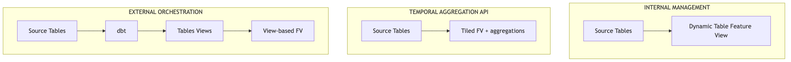
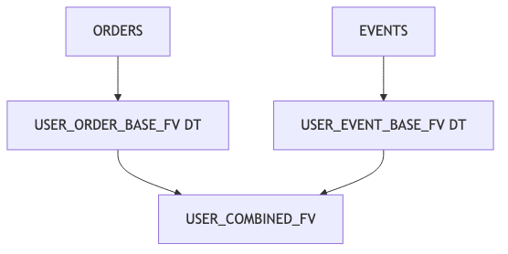
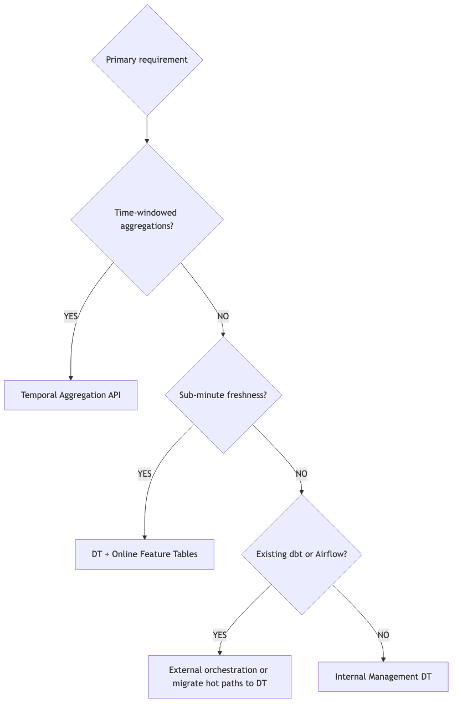

## Overview

Feature pipelines are the workflows that transform raw data into features ready for ML consumption. They are the "plumbing" that connects your source data to your Feature Store. Snowflake supports multiple pipeline architectures, each with distinct trade-offs for freshness, cost, complexity, and flexibility.

This chapter covers four pipeline patterns and a hierarchical extension:

1. **External Orchestration** -- dbt, Airflow, or other tools managing transformations
2. **Internal Management** -- Dynamic Table-based pipelines fully managed by Snowflake
3. **Chained Feature Views** -- Using Feature Views as sources for downstream Feature Views (multi-stage DT → DT or DT → View pipelines)
4. **Temporal Aggregation API** -- The `Feature` class for time-windowed features with tiling (summary; full reference in [Chapter 7](../07_aggregations_api/index.qmd))
5. **Rollup Feature Views** -- Hierarchical aggregation from fine- to coarse-grained entities (summary; full reference in [Chapter 7](../07_aggregations_api/index.qmd#sec-rollup))

## Learning Objectives

After completing this chapter, you will be able to:

- Choose the right pipeline architecture for your requirements
- Implement dbt-managed feature pipelines with View-based Feature Views
- Build internally-managed pipelines using Dynamic Tables (SQL and Snowpark DataFrame API)
- Chain Feature Views into multi-stage pipelines (DT → DT, DT → View) and understand refresh cascading
- Use the Temporal Aggregation API and rollup Feature Views (summary; full reference in [Chapter 7](../07_aggregations_api/index.qmd))
- Configure refresh strategies for optimal freshness vs. cost

```{python}
#| output: false
#| echo: false

from snowflake.snowpark import Session
from snowflake.snowpark import functions as F
from snowflake.snowpark.context import get_active_session
from snowflake.ml.feature_store import FeatureStore, FeatureView, Feature, Entity, CreationMode

try:
    session = get_active_session()
except Exception:
    session = Session.builder.config("connection_name", "default").create()

fs = FeatureStore(
    session=session,
    database="FEATURE_STORE_DEMO",
    name="FEATURE_STORE",
    default_warehouse="FS_DEV_WH",
    creation_mode=CreationMode.CREATE_IF_NOT_EXIST,
)

user_entity = Entity(name="USER", join_keys=["USER_ID"])
```

---

## Pipeline Architecture Patterns

### The Feature Pipeline Landscape

{fig-alt="Three pipeline patterns from source tables to feature views"}

- **INTERNAL:** Snowflake-managed automatic refresh and incremental compute.
- **TEMPORAL API:** Snowflake-managed optimized temporal aggregation (windows + tiling).
- **EXTERNAL:** Orchestrated by dbt Projects on Snowflake, Airflow, Dagster, or similar.

### Architecture Comparison

| Aspect | Internal (Dynamic Tables) | Temporal API | Rollup | External (dbt / Airflow) |
|--------|---------------------------|--------------|--------|--------------------------|
| **Orchestration** | Snowflake managed | Snowflake managed | Snowflake managed | dbt Projects on Snowflake, or external tool |
| **Feature View Type** | DT-based | DT-based (tiled) | DT-based (from tiled source) | View-based |
| **Refresh Trigger** | `refresh_freq` | `refresh_freq` | Follows source FV | Scheduled jobs / Tasks |
| **Typical Freshness** | Seconds to minutes | Configurable | Follows source FV | Minutes to hours |
| **Operational Complexity** | Lower | Lowest | Low (once source exists) | Higher |
| **Cost Model** | Continuous compute | Continuous compute | Incremental from tiles | Job-based compute |
| **Best For** | New implementations | Time-windowed features | Entity hierarchy aggs | Existing dbt investments |

---

## Internal Management (Dynamic Tables) {#sec-dynamic-tables}

### When to Use Dynamic Tables

Dynamic Tables are ideal when you:

- Want Snowflake to manage the entire pipeline
- Need low-latency feature freshness (seconds to minutes)
- Prefer declarative over imperative pipeline definition
- Are building new feature pipelines from scratch

### Dynamic Table Implementation

> 📁 **Full code:** [`_code/dynamic_table_pattern.py`](_code/dynamic_table_pattern.py)

The `feature_df` can be defined using either `session.sql()` or the Snowpark DataFrame API -- both produce the same Dynamic Table:

```python
from snowflake.ml.feature_store import FeatureStore, FeatureView, Entity
import snowflake.snowpark.functions as F

# Option A: SQL string
user_purchase_df = session.sql("""
    SELECT 
        USER_ID,
        COUNT(DISTINCT ORDER_ID) AS ORDER_CNT,
        SUM(TOTAL_AMT) AS SPEND_SUM,
        AVG(TOTAL_AMT) AS AVG_ORDER_AMT,
        MAX(ORDER_TS) AS LAST_ORDER_TS
    FROM FEATURE_STORE_DEMO.CLICKSTREAM_DATA.ORDERS
    GROUP BY USER_ID
""")

# Option B: Snowpark DataFrame API (equivalent result)
orders = session.table("FEATURE_STORE_DEMO.CLICKSTREAM_DATA.ORDERS")
user_purchase_df = orders.group_by("USER_ID").agg(
    F.count_distinct("ORDER_ID").alias("ORDER_CNT"),
    F.sum("TOTAL_AMT").alias("SPEND_SUM"),
    F.avg("TOTAL_AMT").alias("AVG_ORDER_AMT"),
    F.max("ORDER_TS").alias("LAST_ORDER_TS"),
)
```

Both approaches produce a lazy Snowpark DataFrame -- no data moves until the Feature View is registered and the Dynamic Table is materialized.

```python
# Create Dynamic Table-backed Feature View
user_purchase_fv = FeatureView(
    name="USER_PURCHASE_STATS",
    entities=[user_entity],
    feature_df=user_purchase_df,
    timestamp_col="LAST_ORDER_TS",
    refresh_freq="15 minutes",  # Dynamic Table with TARGET_LAG
    desc="User purchase statistics - auto-refreshed"
)

# Register and wait for initial materialization
registered_fv = fs.register_feature_view(
    feature_view=user_purchase_fv,
    version="V01",
    block=True,
)
```

### How `refresh_freq` Selects the Backing Object

`refresh_freq` on the Feature View determines whether Snowflake builds a **view** or a **Dynamic Table**, and how refresh is scheduled:

| Mode | `refresh_freq` | Behavior |
|------|----------------|----------|
| **View-based Feature View** | `None` or omitted | No Dynamic Table. The `feature_df` is registered as a view; **you** refresh upstream tables (dbt, Airflow, manual loads). |
| **Dynamic Table (lag)** | Time period (e.g. `"1 hour"`, `"15 minutes"`) | Snowflake creates a Dynamic Table with **TARGET_LAG** matching that interval. |
| **Dynamic Table (scheduled)** | CRON expression (e.g. `"0 8 * * *"`) | Dynamic Table refresh driven by a **Task** (or equivalent schedule) for fixed clock-time runs. |

For tiled temporal features, you still pass `timestamp_col`, `feature_granularity`, and `features`; `refresh_freq` follows the same idea (lag vs schedule) for how often tiles are updated.

### Refresh Configuration Options (lag-based Dynamic Tables)

When using a **time period** for `refresh_freq`, typical choices balance freshness and cost:

| Refresh Freq | Use Case | Cost Impact |
|--------------|----------|-------------|
| `1 minute` | Near real-time, critical features | High |
| `15 minutes` | Standard operational | Medium |
| `1 hour` | Balanced freshness/cost | Low |
| `1 day` | Slowly-changing features | Minimal |

### Monitoring Dynamic Table Refresh

> 📁 **Full code:** [`_code/monitoring.sql`](_code/monitoring.sql)

```sql
-- Check refresh history
SELECT 
    NAME,
    STATE,
    REFRESH_START_TIME,
    REFRESH_END_TIME,
    STATISTICS:numInsertedRows::INT AS ROWS_INSERTED
FROM TABLE(INFORMATION_SCHEMA.DYNAMIC_TABLE_REFRESH_HISTORY(
    NAME => 'FEATURE_STORE_DEMO.FEATURE_STORE.USER_PURCHASE_STATS$V01'
))
ORDER BY REFRESH_START_TIME DESC
LIMIT 10;
```

---

## Chained Feature View Pipelines {#sec-chaining}

Feature Views can reference other Feature Views (or their underlying Dynamic Tables / Views) as their `feature_df` source, creating **multi-stage pipelines** within the Feature Store. This is a natural way to layer transformations: base Feature Views handle raw-to-feature computation, and downstream Feature Views combine or enrich those outputs.

::: {.callout-warning}
## Views cannot appear in the middle of a DT chain
Snowflake does **not** allow a Dynamic Table to read from a View that queries another Dynamic Table (DT -> View -> DT). Views can only appear at the **end** of a pipeline (DT -> DT -> View is fine). If your pipeline has intermediate stages that feed a downstream DT, each intermediate stage must itself be a Dynamic Table -- not a View. See the [Dynamic Table limitations](https://docs.snowflake.com/en/user-guide/dynamic-tables-limitations) documentation.

In Feature Store terms: if a downstream Feature View is DT-backed (`refresh_freq` set), all upstream Feature Views it references must also be DT-backed. A View-based Feature View can only be a **terminal consumer** in the chain.
:::

### How Chaining Works

{fig-alt="Orders and events feed base feature views then a combined feature view"}

### Example: Base + Derived Feature Views

```python
# Base layer: order aggregates per user (DT-backed)
user_order_base = FeatureView(
    name="USER_ORDER_BASE_FV",
    entities=[user_entity],
    feature_df=session.sql("""
        SELECT USER_ID,
               DATE_TRUNC('day', ORDER_TS)::TIMESTAMP_NTZ AS ORDER_DATE,
               SUM(TOTAL_AMT) AS ORDER_TOTAL_AMT_SUM,
               COUNT(ORDER_ID) AS ORDER_CNT
        FROM FEATURE_STORE_DEMO.CLICKSTREAM_DATA.ORDERS
        GROUP BY USER_ID, DATE_TRUNC('day', ORDER_TS)
    """),
    timestamp_col="ORDER_DATE",
    refresh_freq="1 hour",
    desc="Base: daily order aggregates per user",
)
fs.register_feature_view(user_order_base, version="V01", block=True)

# Base layer: event aggregates per user (DT-backed)
user_event_base = FeatureView(
    name="USER_EVENT_BASE_FV",
    entities=[user_entity],
    feature_df=session.sql("""
        SELECT USER_ID,
               DATE_TRUNC('day', EVENT_TS)::TIMESTAMP_NTZ AS ACTIVITY_DATE,
               COUNT(EVENT_ID) AS EVENT_CNT,
               COUNT(DISTINCT PRODUCT_ID) AS PRODUCT_DISTINCT_CNT
        FROM FEATURE_STORE_DEMO.CLICKSTREAM_DATA.EVENTS
        GROUP BY USER_ID, DATE_TRUNC('day', EVENT_TS)
    """),
    timestamp_col="ACTIVITY_DATE",
    refresh_freq="1 hour",
    desc="Base: daily event aggregates per user",
)
fs.register_feature_view(user_event_base, version="V01", block=True)

# Derived layer: join both base FVs into a combined view
# References the underlying DTs by their $-delimited object names
combined_df = session.sql("""
    SELECT
        o.USER_ID,
        o.ORDER_DATE,
        o.ORDER_TOTAL_AMT_SUM,
        o.ORDER_CNT,
        e.EVENT_CNT,
        e.PRODUCT_DISTINCT_CNT
    FROM FEATURE_STORE.USER_ORDER_BASE_FV$V01 o
    JOIN FEATURE_STORE.USER_EVENT_BASE_FV$V01 e
        ON o.USER_ID = e.USER_ID AND o.ORDER_DATE = e.ACTIVITY_DATE
""")

user_combined_fv = FeatureView(
    name="USER_COMBINED_FV",
    entities=[user_entity],
    feature_df=combined_df,
    timestamp_col="ORDER_DATE",
    refresh_freq=None,    # View: always reflects latest base DT state
    desc="Derived: combines order + event base Feature Views",
)
fs.register_feature_view(user_combined_fv, version="V01")
```

### DT-to-DT Chaining (Refresh Cascading)

When a downstream Feature View is also DT-backed (`refresh_freq` set to a period), Snowflake manages the **refresh dependency graph** automatically. The downstream DT waits for its upstream DTs to refresh before it starts its own refresh. This gives you:

- **Guaranteed ordering** -- the downstream DT always reads consistent, refreshed data from upstream
- **Incremental compute** -- only changed rows from upstream flow through to the downstream DT
- **Simpler individual stages** -- breaking a complex single-DT query into multiple stages reduces the SQL complexity at each level, which can improve incremental refresh efficiency (the engine has smaller change sets to track per stage)

There are two approaches to building the upstream stages:

1. **Plain DTs outside the Feature Store** -- create raw Dynamic Tables via SQL, then have a final downstream Feature View (DT or View) consume them. This is simpler when the intermediate stages are not useful as standalone features.
2. **All stages as Feature Views** -- each stage is registered with entity keys, a `timestamp_col`, and feature columns. This makes intermediate stages **discoverable** via `list_feature_views()` and **reusable** by other Feature Views or training pipelines. The overhead is that each stage must conform to the Feature Store schema (entity keys, timestamp, feature columns).

If both layers specify independent lag values, latency can **stack**: a base DT with 1-hour lag and a derived DT with 1-hour lag yields up to ~2 hours of end-to-end staleness. To avoid this, set the **upstream** DT's target lag to `DOWNSTREAM`. This tells the upstream DT to infer its refresh schedule from the most demanding downstream consumer:

```python
# Base layer: refreshes on demand when downstream DTs need it
user_order_base = FeatureView(
    name="USER_ORDER_BASE_FV",
    entities=[user_entity],
    feature_df=order_df,
    refresh_freq="DOWNSTREAM",  # Refresh driven by downstream consumers
    desc="Base: order aggregates; refresh cascaded from downstream",
)

# Derived layer: controls the refresh cadence for the entire chain
user_enriched = FeatureView(
    name="USER_ENRICHED_FV",
    entities=[user_entity],
    feature_df=enriched_df,
    refresh_freq="1 hour",  # This drives the upstream refresh too
    desc="Derived: enriched features; sets refresh pace for chain",
)
```

With this pattern, the scheduler refreshes the base DT just before the derived DT needs it, keeping end-to-end latency within a single lag target rather than the sum of two.

::: {.callout-warning}
A DT set to `DOWNSTREAM` with **no** downstream consumers will never refresh. Always ensure at least one downstream DT has a concrete lag value.
:::

### DT-to-View Chaining

When the downstream Feature View is View-based (`refresh_freq=None`), it reads from the upstream DTs at **query time**. The View always reflects the latest state of the upstream DTs. This avoids latency stacking but means the combined query runs on the consumer's warehouse at read time.

Beyond avoiding latency stacking, DT-to-View chaining enables **transformations that are not compatible with incremental DT refresh**. Some SQL operations prevent a DT from using incremental mode (e.g., non-deterministic functions, certain window functions, or self-referential patterns). By placing these in a View layer on top of incrementally-refreshed base DTs, you get the best of both worlds: efficient incremental refresh for the heavy data processing, with flexible transforms applied at read time.

This also allows the inclusion of **context or timestamp functions** (`CURRENT_TIMESTAMP()`, `DATEDIFF(... , CURRENT_DATE())`, etc.) in feature derivations. These are non-deterministic and would force a DT into full-refresh mode, but in a View they evaluate fresh on every query -- useful for real-time serving features like "days since last order" or "time since account creation."

::: {.callout-important}
## PIT caveat for context-time features

Features derived from `CURRENT_TIMESTAMP()` or `CURRENT_DATE()` reflect the **query execution time**, not a historical point-in-time. This is correct for **online serving** (the prediction is happening *now*), but breaks point-in-time correctness for **training data generation** via ASOF joins -- the join retrieves a feature value relative to the spine timestamp, yet the `DATEDIFF` was computed against "today," not the historical event date. If you need these features in training, compute them in the spine or training pipeline relative to the spine timestamp rather than relying on a View-based derivation. See [Chapter 6: Temporal Features](../06_temporal_features/index.qmd) for details on ASOF semantics.
:::

### Trade-offs

| | DT → DT (both materialized) | DT → View (derived is virtual) |
|---|---|---|
| **Read performance** | Pre-computed; fast reads | Query-time join; depends on complexity |
| **Latency** | Stacks unless upstream uses `DOWNSTREAM` lag | Single upstream lag only |
| **Storage** | Both layers stored | Only base layer stored |
| **Compute** | Separate refresh compute for each layer | No derived-layer refresh compute |
| **Best for** | High-read-volume derived features | Low-read-volume or simple joins |

### Refresh and Dependency Considerations

- **Version coupling:** The derived Feature View's SQL references specific base FV versions (e.g., `USER_ORDER_BASE_FV$V01`). When you create a new base version (`$V02`), update the derived FV to reference the new version and register a new derived version.
- **Lineage tracking:** Use the Feature Store API's `.lineage()` method or SQL `OBJECT_DEPENDENCIES` to identify which downstream Feature Views depend on a base version before deprecating it (see [Chapter 4: Feature Views](../04_feature_views/index.qmd#sec-versioning)).
- **Depth limits:** Snowflake supports up to **10 levels** of Dynamic Table dependency depth. For most Feature Store pipelines, 2-3 levels is typical. Deep chains increase end-to-end latency and complicate debugging.

---

## Temporal Aggregation Pipelines {#sec-temporal-api}

> 📁 **Full code:** [`_code/temporal_api.py`](_code/temporal_api.py)

The Temporal Aggregation API (`Feature` class) provides a fourth pipeline pattern: declarative time-windowed aggregations with automatic **tiling** for efficient incremental computation. Instead of recomputing an entire window (e.g., 7-day sum) on each refresh, the engine pre-computes fixed time buckets (tiles) and combines them at query time -- only new tiles are refreshed.

::: {.callout-important}
## Why tiling exists: correct PIT retrieval over sparse data
The primary motivation for the Feature Aggregation API is **correctness**, not just efficiency. When you pre-compute a time-windowed aggregate (e.g., "7-day spend sum") in a standard DT using SQL window functions, the window is anchored to the row's own timestamp. At retrieval time, the ASOF join returns the most recent row with a timestamp <= the spine timestamp -- but if the source data is sparse (no activity for several days), that row's window covers the **wrong** time range relative to the spine's point in time.

Tiling solves this by storing **partial aggregates per time grain** (tiles) in the DT. At retrieval time, the Feature Store **reassembles** the correct window by combining tiles backwards from the spine's ASOF timestamp. This produces the correct windowed value **regardless of source data sparsity**. Without tiling, the only alternatives are to densify the data first (see [Gap-Filling Pipelines](#sec-gap-filling) below) or to accept that window boundaries may be misaligned.

For a summary of this problem, see [Chapter 1: Core Concepts](../01_concepts/index.qmd). For the full `Feature` class API reference, see [Chapter 7: Aggregations API](../07_aggregations_api/index.qmd).
:::

**When to use the Temporal API:**

- Time-windowed aggregations (7-day sum, 30-day count, etc.)
- Sparse, high-cardinality event data (clickstream, transactions)
- Multiple window sizes for the same base metric
- Comparative features via `offset` (e.g., week-over-week trends)

**Quick example:**

```{python}
features = [
    Feature.sum("TOTAL_AMT", "7d").alias("SPEND_SUM_7D"),
    Feature.count("ORDER_ID", "30d").alias("ORDER_CNT_30D"),
    Feature.sum("TOTAL_AMT", "7d", offset="7d").alias("SPEND_PREV_7D"),
]

user_temporal_fv = FeatureView(
    name="USER_TEMPORAL_AGGREGATES",
    entities=[user_entity],
    feature_df=session.table("FEATURE_STORE_DEMO.CLICKSTREAM_DATA.ORDERS"),
    timestamp_col="ORDER_TS",
    refresh_freq="1 hour",
    feature_granularity="1 hour",
    features=features,
    desc="User purchase aggregations with multiple time windows",
)

user_temporal_fv = fs.register_feature_view(
    feature_view=user_temporal_fv, version="V01", block=True, overwrite=True,
)
print(f"Registered: {user_temporal_fv.name}/V01  (tiled={user_temporal_fv.is_tiled})")
print(f"Features: SPEND_SUM_7D, ORDER_CNT_30D, SPEND_PREV_7D")
```

The `feature_df` can be an arbitrarily complex query (joins, filters, CASE expressions) -- the tiling engine wraps it as a CTE.

**Rollup Feature Views** extend tiled pipelines with hierarchical aggregation -- creating coarser-grained features from finer-grained tiled Feature Views without recomputing from raw data (e.g., visitor → subscriber). Use `RollupConfig(source=registered_tiled_fv, mapping_df=entity_mapping_df)`.

::: {.callout-note}
## Full reference: Chapter 7

For the complete `Feature` class API -- all 14 aggregation functions, the `"lifetime"` window, `offset` for comparative features, `.alias()` and `case_sensitive` for column naming, tile size recommendations, column prefixing for disambiguation, and the full `RollupConfig` example -- see [Chapter 7: Aggregations API](../07_aggregations_api/index.qmd).
:::

---

## External Orchestration (dbt / Airflow) {#sec-dbt}

### When to Use External Orchestration

External orchestration is appropriate when you:

- Have an existing dbt or Airflow investment and want to incorporate Feature Store into those workflows
- Need complex multi-step transformations that span systems beyond Snowflake
- Require transformations that mix SQL and Python across multiple engines

::: {.callout-tip}
## dbt Projects on Snowflake
Snowflake now supports running dbt Core projects natively via [dbt Projects on Snowflake](https://docs.snowflake.com/en/user-guide/data-engineering/dbt-projects-on-snowflake). You can create, deploy, schedule, and monitor dbt projects entirely within Snowflake using the `CREATE DBT PROJECT`, `EXECUTE DBT PROJECT` commands and Snowflake Tasks -- no external dbt Cloud or self-hosted infrastructure required. If your team uses dbt for feature transformations, evaluate this option before setting up an external deployment.
:::

### dbt Implementation Pattern

> 📁 **Full code:** [`_code/dbt_pattern.py`](_code/dbt_pattern.py)

#### Step 1: Create dbt Feature Models

```sql
-- models/features/user_purchase_features.sql
--
-- dbt output table name = <database>.<schema>.<model_filename>
--   database: from dbt_project.yml / profiles.yml (e.g. FEATURE_STORE_DEMO)
--   schema:   from config() below → FEATURE_STORE
--   model:    from filename       → USER_PURCHASE_FEATURES
-- Result: FEATURE_STORE_DEMO.FEATURE_STORE.USER_PURCHASE_FEATURES

-- Source: FEATURE_STORE_DEMO.CLICKSTREAM_DATA.ORDERS (ORDER_TS, TOTAL_AMT, USER_ID, ORDER_ID)
{{ config(
    materialized='table',
    schema='FEATURE_STORE',
    tags=['feature_store', 'user_features']
) }}

WITH order_stats AS (
    SELECT 
        USER_ID,
        COUNT(DISTINCT ORDER_ID) AS ORDER_CNT,
        SUM(TOTAL_AMT) AS SPEND_SUM,
        AVG(TOTAL_AMT) AS AVG_ORDER_AMT,
        MAX(ORDER_TS) AS LAST_ORDER_TS
    FROM {{ ref('stg_orders') }}
    GROUP BY USER_ID
)

SELECT *,
    CURRENT_TIMESTAMP() AS _DBT_UPDATED_TS
FROM order_stats
```

#### Step 2: Deploy and Schedule via dbt Projects on Snowflake

```sql
-- Deploy the dbt project as a Snowflake object
CREATE OR ALTER DBT PROJECT FEATURE_STORE_DEMO.FEATURE_STORE.USER_FEATURES_DBT
  FROM @my_stage/dbt_project;

-- Execute the dbt project (builds the models)
EXECUTE DBT PROJECT FEATURE_STORE_DEMO.FEATURE_STORE.USER_FEATURES_DBT
  ARGS = 'run --select user_purchase_features'
  USING WAREHOUSE = FS_PROD_WH;

-- Schedule with a Snowflake Task for recurring runs
CREATE OR REPLACE TASK FEATURE_STORE_DEMO.FEATURE_STORE.DBT_USER_FEATURES_TASK
  WAREHOUSE = FS_PROD_WH
  SCHEDULE = 'USING CRON 0 8 * * * UTC'
AS
  EXECUTE DBT PROJECT FEATURE_STORE_DEMO.FEATURE_STORE.USER_FEATURES_DBT
    ARGS = 'run --select user_purchase_features';

ALTER TASK FEATURE_STORE_DEMO.FEATURE_STORE.DBT_USER_FEATURES_TASK RESUME;
```

#### Step 3: Register as View-Based Feature View

```python
from snowflake.ml.feature_store import FeatureStore, FeatureView, Entity

# Reference the dbt-created table as a View-based Feature View
user_features_df = session.table(
    "FEATURE_STORE_DEMO.FEATURE_STORE.USER_PURCHASE_FEATURES"
)

user_purchase_fv = FeatureView(
    name="USER_PURCHASE_FEATURES",
    entities=[user_entity],
    feature_df=user_features_df,
    timestamp_col="_DBT_UPDATED_TS",
    # refresh_freq omitted / None → View-based Feature View (dbt handles refresh)
    desc="User purchase features - managed by dbt"
)

fs.register_feature_view(feature_view=user_purchase_fv, version="V01")
```

---

## Pipeline Selection Framework {#sec-selection}

### Decision Tree

{fig-alt="Decision tree for temporal API OFT dbt and internal management"}

### Selection Matrix

| Requirement | Recommended Approach |
|-------------|---------------------|
| Minimal operational overhead | Internal (Dynamic Tables) |
| Time-windowed aggregations | Temporal Aggregation API |
| Sub-minute freshness | Dynamic Tables (short refresh) |
| Existing dbt investment | External Orchestration (dbt Projects on Snowflake) |
| Complex multi-step transforms | External Orchestration |
| New Feature Store implementation | Internal (Dynamic Tables) |

---

## Gap-Filling and Interpolation Pipelines {#sec-gap-filling}

When source data is **sparse** -- not a record for every time period -- ML models that expect regular time-series input (e.g., daily lab values, hourly sensor readings) need a **dense** representation. This section covers techniques for filling gaps before (or as part of) a Feature View pipeline.

### When to Gap-Fill vs. Use the Aggregation API

If your goal is **time-windowed aggregations** (7-day sum, 30-day average), the [Temporal Aggregation API](#sec-temporal-api) handles sparsity natively via tiling -- you do not need to densify first. Gap-filling is for use cases that need a **dense time series at a regular grain** as input (e.g., forecasting models, trend/slope features, interpolated metrics).

### Approach 1: RESAMPLE + INTERPOLATE (Preview)

Snowflake provides time-series-specific SQL constructs for gap-filling. `RESAMPLE` upsamples to a regular interval (inserting rows for missing periods), and `INTERPOLATE_FFILL` / `INTERPOLATE_BFILL` / `INTERPOLATE_LINEAR` fill the resulting NULLs:

```sql
SELECT
    entity_id,
    event_timestamp,
    metric_value,
    INTERPOLATE_FFILL(metric_value)
        OVER (PARTITION BY entity_id ORDER BY event_timestamp) AS metric_ffill,
    INTERPOLATE_LINEAR(metric_value)
        OVER (PARTITION BY entity_id ORDER BY event_timestamp) AS metric_linear
FROM source_table
    RESAMPLE (event_timestamp EVERY '1 day' PARTITION BY entity_id)
ORDER BY entity_id, event_timestamp
```

See the [Snowflake time-series documentation](https://docs.snowflake.com/en/user-guide/querying-time-series-data) for full syntax and limitations.

::: {.callout-note}
`RESAMPLE` and the `INTERPOLATE_*` functions are in Preview as of March 2026. `RESAMPLE` only fills gaps **within** the observed range of timestamps per entity -- it does not extend beyond the first or last observed row. To extend through the current date, use the generator approach below.
:::

### Approach 2: Generated date spine + JOIN

For full control over the date range (e.g., extending through `CURRENT_DATE` even if the last observation was weeks ago), generate a dense calendar and join the sparse data onto it:

```sql
-- Dense calendar: one row per day from the earliest observation through today
WITH date_spine AS (
    SELECT DATEADD('day', ROW_NUMBER() OVER (ORDER BY SEQ4()) - 1, '2024-01-01') AS cal_date
    FROM TABLE(GENERATOR(ROWCOUNT => 1000))
    QUALIFY cal_date <= CURRENT_DATE
),
-- Cross with entities
entity_dates AS (
    SELECT e.entity_id, d.cal_date
    FROM (SELECT DISTINCT entity_id FROM source_table) e
    CROSS JOIN date_spine d
),
-- Left join sparse data and fill forward
filled AS (
    SELECT
        ed.entity_id,
        ed.cal_date AS event_timestamp,
        s.metric_value,
        LAST_VALUE(s.metric_value IGNORE NULLS)
            OVER (PARTITION BY ed.entity_id ORDER BY ed.cal_date
                  ROWS BETWEEN UNBOUNDED PRECEDING AND CURRENT ROW) AS metric_ffill
    FROM entity_dates ed
    LEFT JOIN source_table s
        ON ed.entity_id = s.entity_id AND ed.cal_date = s.event_timestamp::DATE
)
SELECT * FROM filled
```

### Feature View integration

Wrap the densified query as a **View-based Feature View** with `timestamp_col` pointing to the calendar date column. This avoids materialising the full dense grid as a DT (which can be expensive and may force full refresh due to `GENERATOR` or `CURRENT_DATE` in the SQL):

```python
dense_metric_df = session.sql("SELECT ... FROM filled_view")  # the dense query above

dense_fv = FeatureView(
    name="ENTITY_DAILY_METRIC_FV",
    entities=[entity],
    feature_df=dense_metric_df,
    timestamp_col="EVENT_TIMESTAMP",
    refresh_freq=None,  # View-based: dense computation runs at query time
    desc="Gap-filled daily metrics with forward-fill interpolation",
)
```

If materialization is needed (high read volume), consider splitting the pipeline: a pre-built **table or DT** for the date spine (refreshed periodically), joined to the sparse data in a downstream DT. Be aware that `GENERATOR(...)` and `CURRENT_DATE` in DT SQL can prevent incremental refresh -- see [Chapter 6: Lookup Tables for Dynamic History](../06_temporal_features/index.qmd) for a workaround using reference tables instead of hardcoded dates.

---

## Best Practices

### 1. Match Refresh to Consumer Freshness Needs {.unnumbered}
```python
# GOOD: Source updates hourly, consumers need hourly freshness
hourly_source_fv = FeatureView(
    name="HOURLY_FEATURES",
    refresh_freq="1 hour",
    # ...
)

# ALSO OK: Source updates daily, refresh_freq shorter than source cadence
# The DT scheduler detects no upstream changes and skips without compute
daily_fv = FeatureView(
    name="DAILY_FEATURES",
    refresh_freq="1 hour",  # checks hourly, but only refreshes when data lands
    # ...
)
```

A shorter `refresh_freq` than the source update rate incurs near-zero cost -- the DT scheduler checks for upstream changes and skips the refresh cycle if nothing has changed. See [Chapter 4: Feature Views](../04_feature_views/index.qmd#sec-refresh) for details.

### 2. Match Tile Size to Data Frequency {.unnumbered}
When using the Temporal Aggregation API, choose `feature_granularity` to match your data arrival rate. See [Chapter 7: Aggregations API -- Tile Size Recommendations](../07_aggregations_api/index.qmd#sec-tiling) for detailed guidance.

### 3. Pipeline Ownership & SLAs {.unnumbered}
Define clear ownership for each pipeline. The example below shows a **team-maintained manifest file** -- this is a documentation and CI/CD convention, not something consumed by the Feature Store API. Teams can use YAML, JSON, or any format that fits their toolchain:

```yaml
# feature_manifest.yaml -- team convention, not consumed by Feature Store API
feature_views:
  - name: USER_TEMPORAL_AGGREGATES
    pattern: "Temporal API"
    version: "V01"
    refresh: "1 hour"
    owner: ml-platform@company.com
    sla:
      max_latency_minutes: 90
```

### 4. Pipeline Health Monitoring {.unnumbered}

Snowflake's built-in [Alerts](https://docs.snowflake.com/en/user-guide/alerts) let you define condition-based monitoring directly in SQL -- no external monitoring stack required. An Alert evaluates a SQL condition on a schedule and fires an action (email, webhook, or procedure call) when the condition is true. Combined with Dynamic Table metadata from [`INFORMATION_SCHEMA.DYNAMIC_TABLE_REFRESH_HISTORY()`](https://docs.snowflake.com/en/sql-reference/functions/dynamic_table_refresh_history) and [`INFORMATION_SCHEMA.DYNAMIC_TABLES()`](https://docs.snowflake.com/en/sql-reference/info-schema/dynamic_tables), this gives you pipeline-native observability without leaving Snowflake:

```sql
-- Alert when any Feature Store Dynamic Table falls behind by more than 60 minutes
CREATE ALERT feature_staleness_alert
  WAREHOUSE = FS_DEV_WH
  SCHEDULE = 'USING CRON 0 * * * * UTC'
  IF (EXISTS (
    SELECT * 
    FROM TABLE(INFORMATION_SCHEMA.DYNAMIC_TABLES())
    WHERE SCHEMA_NAME = 'FEATURE_STORE'
      AND TIMESTAMPDIFF('minute', DATA_TIMESTAMP, CURRENT_TIMESTAMP()) > 60
  ))
  THEN
    CALL SYSTEM$SEND_EMAIL('ml-alerts@company.com', 'Stale Features', 'Alert');
```

See [Chapter 11: Operations](../11_operations/index.qmd) for comprehensive monitoring patterns including refresh history dashboards, data quality checks, and Streamlit-based observability.

---

## Common Pitfalls

### ❌ Pitfall 1: Over-Engineering Simple Features

**Problem**: Using complex pipeline for simple lookups.

**Solution**: Use View-based Feature View directly on source for static data.

### ❌ Pitfall 2: Ignoring Incremental Refresh Compatibility

**Problem**: Using SQL patterns that prevent incremental refresh (e.g., `RANDOM()`, self-referential queries, or aggregations on `FLOAT` columns with JOINs).

**Solution**: Use deterministic SQL compatible with DT incremental refresh. Check `REFRESH_MODE` in `INFORMATION_SCHEMA.DYNAMIC_TABLES()` after registration -- if it shows `FULL` when you expected `INCREMENTAL`, review your `feature_df` SQL.

You can also inspect refresh mode and history through the Feature Store Python API:

```python
fv = fs.get_feature_view("MY_FV", "v1")

# Check the refresh mode assigned by the DT engine (AUTO, FULL, or INCREMENTAL)
print(f"Refresh mode: {fv.refresh_mode}")
print(f"Reason:       {fv.refresh_mode_reason}")

# Review recent refresh history -- REFRESH_ACTION shows whether each refresh was INCREMENTAL or FULL
fs.get_refresh_history(fv).show()
```

::: {.callout-warning title="Avoid AUTO refresh mode in production"}
When the DT engine assigns `AUTO` refresh mode, it uses internal heuristics to decide between `INCREMENTAL` and `FULL` on each refresh cycle. These heuristics can be overly conservative (forcing `FULL` when `INCREMENTAL` would work), inconsistent across engine versions, and opaque to monitoring. For production Feature Views, explicitly set `refresh_mode="INCREMENTAL"` on the `FeatureView` constructor and verify the DT confirms that mode after registration:

```python
fv = FeatureView(
    name="USER_ORDER_FV",
    entities=[user_entity],
    feature_df=user_order_df,
    refresh_freq="15 minutes",
    refresh_mode="INCREMENTAL",
    desc="User order features — explicit incremental refresh",
)
```

If the engine overrides this to `FULL` (check `fv.refresh_mode` after registration), the underlying SQL contains a pattern incompatible with incremental tracking -- fix the SQL rather than falling back to `AUTO`.

For an existing Feature View, you can also change the refresh mode via SQL:

```sql
ALTER DYNAMIC TABLE FEATURE_STORE_DEMO.FEATURE_STORE."USER_ORDER_FV$V01"
  SET REFRESH_MODE = INCREMENTAL;
```

See the Snowflake documentation on [Dynamic Table refresh modes](https://docs.snowflake.com/en/user-guide/dynamic-tables-refresh) for the full list of SQL patterns that support incremental refresh.
:::

A common trigger is **aggregating `FLOAT`-typed columns (SUM, AVG, MIN, MAX, VAR, STD) in the same query block as a JOIN**. The DT engine cannot prove incremental correctness for floating-point aggregate diffs across joins, so it forces full refresh. **Workaround:** cast to fixed-point before aggregating (`CAST(float_col AS NUMBER(38, 6))`), or split the query into a base DT (aggregation, no join) and a View layer that joins. See [Chapter 4: Feature Views](../04_feature_views/index.qmd#sec-base-presentation) for the Base + Presentation pattern.

::: {.callout-tip title="Fix FLOAT at the source"}
Rather than casting in every Feature View query, consider altering the source column type to `NUMBER`/`DECIMAL`. This is a one-time change that benefits all downstream DTs and eliminates the risk of forgetting a cast in a new Feature View. The ML precision impact is negligible -- see [Chapter 7: Aggregations API](../07_aggregations_api/index.qmd) for details.
:::

### ❌ Pitfall 3: Partial Leading-Edge Interval in Streaming/Continuous Sources {#sec-partial-interval}

**Problem**: When a DT Feature View computes window functions over time-bucketed data (e.g., 15-minute or hourly aggregations of continuous transactions), the *current* time bucket at refresh time is typically **incomplete**. A 15-minute interval queried at minute 7 contains roughly half the expected events. Window functions using `CURRENT ROW` include this partial bucket, causing **training/serving skew**: the model trains on complete historical intervals but at inference time receives features computed over a partial current interval. This affects every feature that touches CURRENT ROW — rolling means, LAGs, DIFFs, rate-of-change — and produces systematically biased predictions.

**Solution**: Three complementary strategies, each appropriate for different layers of the pipeline:

**Strategy 1 — Exclude CURRENT ROW in window functions (DT-safe):**

Use `1 PRECEDING` as the upper window bound inside the DT definition. This is deterministic SQL and preserves incremental DT refresh:

```sql
-- ✅ DT-safe: excludes potentially partial current row
AVG(QTY) OVER (PARTITION BY ITEM_CODE ORDER BY INTERVAL_ID
               ROWS BETWEEN 3 PRECEDING AND 1 PRECEDING)

-- ❌ Includes partial current row — biased at the leading edge
AVG(QTY) OVER (PARTITION BY ITEM_CODE ORDER BY INTERVAL_ID
               ROWS BETWEEN 3 PRECEDING AND CURRENT ROW)
```

**Strategy 2 — Use `offset` in tiled Feature Views (DT-safe):**

The Feature class `offset` parameter shifts the aggregation window back, inherently skipping the potentially partial current interval:

```python
# Window covers the 4 intervals ending one interval ago — excludes current
Feature.avg("QTY", "1h", offset="15m").alias("QTY_ROLL_4_MEAN")
```

**Strategy 3 — Gate the source table externally (outside the DT):**

Manage the source table so it only ever contains complete intervals. Use a scheduled Task or Stream + Task pipeline that aggregates raw transactions and writes complete intervals to the source table:

```sql
-- Task runs every 15 minutes: write only complete intervals to source
INSERT INTO SOURCE_ORDERS_15MIN
SELECT TIME_SLICE(ORDER_TS, 15, 'MINUTE') AS INTERVAL_ID,
       ITEM_CODE, BRANCH_CODE, COUNT(*) AS QTY
FROM RAW_ORDERS
WHERE TIME_SLICE(ORDER_TS, 15, 'MINUTE')
      < TIME_SLICE(CURRENT_TIMESTAMP(), 15, 'MINUTE', 'START')
GROUP BY 1, 2, 3;
```

::: {.callout-warning title="Do not use CURRENT_TIMESTAMP() inside a DT"}
`CURRENT_TIMESTAMP()` and other non-deterministic functions force a DT into **FULL refresh**. Apply time-based source gating in a Task, Stream, or View-based query layer *outside* the DT — never in the DT definition SQL.
:::

Strategies 1 and 2 are the most practical for Feature Views because they work entirely within the DT. Strategy 3 is appropriate when you control the source ingestion pipeline and want to fix the problem once for all downstream consumers.

See also: [Chapter 6: Data Leakage from Partial Intervals](../06_temporal_features/index.qmd#sec-partial-interval-leakage), [Chapter 7: Window Offset as Safeguard](../07_aggregations_api/index.qmd#sec-partial-interval-tiling).

### ❌ Pitfall 4: Mismatched Freshness Expectations

**Problem**: Pipeline refresh doesn't match business SLA.

**Solution**: Align refresh frequency with business requirements.

### ❌ Pitfall 5: No Monitoring or Alerting

**Problem**: Stale features go undetected.

**Solution**: Implement monitoring and alerting for pipeline health.

---

## Summary

| Pipeline Pattern | Orchestration | Freshness | Best For |
|------------------|---------------|-----------|----------|
| **External (dbt)** | External tool | Minutes-hours | Existing dbt investments |
| **Internal (DT)** | Snowflake | Seconds-minutes | New implementations |
| **Chained FVs** | Snowflake (DT graph) | Configurable (DOWNSTREAM minimises stacking) | Multi-stage pipelines, base + derived features |
| **Temporal API** | Snowflake | Configurable | Time-windowed aggs with tiling; see [Ch07](../07_aggregations_api/index.qmd) |
| **Rollup** | Snowflake | Follows source | Hierarchical entity aggregation; see [Ch07](../07_aggregations_api/index.qmd#sec-rollup) |

---

## Next Steps

Continue to [Chapter 6: Temporal Features](../06_temporal_features/index.qmd) to learn about point-in-time correctness, ASOF joins, and preventing data leakage.
