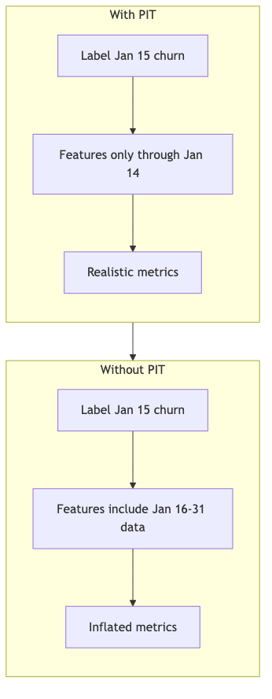
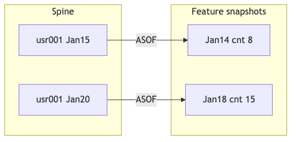

## Overview

Temporal correctness is critical for ML systems. When training a model, you must ensure features are computed using only data that would have been available at the time of prediction. Using future data ("data leakage") leads to artificially good training metrics but poor production performance.

Code examples in this chapter use the shared demo environment (`FEATURE_STORE_DEMO.CLICKSTREAM_DATA`) established in the [Introduction](../00_introduction/index.qmd).

The chapter covers how Snowflake Feature Store ensures temporal correctness through point-in-time (PIT) retrieval and ASOF joins, how to **backfill** materialized features, and how to avoid **silent errors** when features are *derived* from timestamps that only exist on the spine—not inside the Feature View SQL.

## Learning Objectives

After completing this chapter, you will be able to:

- Understand why point-in-time correctness matters
- Configure Feature Views for temporal retrieval using `EVENTS` / `ORDERS` and `timestamp_col`
- Generate training datasets without data leakage
- Debug and validate temporal correctness
- Handle late-arriving data in feature pipelines
- Run manual refresh / backfill for Dynamic Table-backed Feature Views
- Recognize when derived time-dependent features must be computed after retrieval (or via snapshot materialization)

```{python}
#| output: false
#| echo: false

from snowflake.snowpark import Session
from snowflake.snowpark.context import get_active_session
from snowflake.ml.feature_store import FeatureStore, FeatureView, Entity, CreationMode

try:
    session = get_active_session()
except Exception:
    session = Session.builder.config("connection_name", "default").create()

fs = FeatureStore(
    session=session,
    database="FEATURE_STORE_DEMO",
    name="FEATURE_STORE",
    default_warehouse="FS_DEV_WH",
    creation_mode=CreationMode.CREATE_IF_NOT_EXIST,
)
```

---

## Why Temporal Correctness Matters

### The Data Leakage Problem

{fig-alt="Without PIT future data leaks into labels with PIT only past data is used"}

### Real-World Impact

| Scenario | Without PIT | With PIT |
|----------|-------------|----------|
| **Training AUC** | 0.95 (looks great!) | 0.82 (realistic) |
| **Production AUC** | 0.72 (unexpected drop) | 0.80 (matches training) |
| **Business Impact** | Model fails in production | Model performs as expected |

---

## How Feature Store Ensures PIT Correctness

### The Spine + timestamp_col Pattern

> 📁 **Full code:** [`_code/pit_retrieval.py`](_code/pit_retrieval.py)

The training spine uses **`SESSIONS`**: `SESSION_START_TS` is the instant you want features "as of"; `IS_CONVERTED` is the label. User-level features come from **`EVENTS`**, aggregated into **daily snapshots** — one row per user per active day. This gives the ASOF join multiple timestamps per entity to choose from, so different spine events retrieve different historical snapshots.

```{python}
user_entity = Entity(name="USER", join_keys=["USER_ID"], desc="Clickstream user")

# 1. Feature View: daily event snapshots — one row per user per active day
#    Multiple rows per entity over time = meaningful ASOF selection
user_event_df = session.sql("""
    SELECT
        USER_ID,
        DATE_TRUNC('day', EVENT_TS)::TIMESTAMP_NTZ AS ACTIVITY_DATE,
        COUNT(EVENT_ID) AS EVENT_CNT,
        COUNT(DISTINCT PRODUCT_ID) AS PRODUCT_DISTINCT_CNT
    FROM FEATURE_STORE_DEMO.CLICKSTREAM_DATA.EVENTS
    GROUP BY USER_ID, DATE_TRUNC('day', EVENT_TS)
""")

user_event_fv = FeatureView(
    name="USER_DAILY_EVENT_STATS",
    entities=[user_entity],
    feature_df=user_event_df,
    timestamp_col="ACTIVITY_DATE",
    refresh_freq="1 hour",
    desc="Daily event activity snapshots per user — one row per active day",
)

# 2. Register at version V01
registered_fv = fs.register_feature_view(
    feature_view=user_event_fv, version="V01", block=True, overwrite=True,
)

# 3. Spine: entity + when + label (SESSIONS)
training_spine = session.sql("""
    SELECT
        s.USER_ID,
        s.SESSION_START_TS AS PREDICTION_TS,
        s.IS_CONVERTED::NUMBER AS LABEL
    FROM FEATURE_STORE_DEMO.CLICKSTREAM_DATA.SESSIONS s
    WHERE s.USER_ID IS NOT NULL
""")

# 4. Training set: ASOF join — for each session, retrieve the user's most
#    recent daily snapshot on or before PREDICTION_TS
training_set = fs.generate_dataset(
    name="CH06_PIT_DEMO",
    spine_df=training_spine,
    features=[registered_fv],
    spine_timestamp_col="PREDICTION_TS",
    output_type="dataset",
)

# Show a sample — note how different PREDICTION_TS values for the same user
# retrieve different daily snapshots via the ASOF join
training_set.read.to_snowpark_dataframe().select(
    "USER_ID", "PREDICTION_TS", "LABEL", "EVENT_CNT", "PRODUCT_DISTINCT_CNT"
).limit(8).show()
```

### How ASOF Joins Work

The Feature Store uses **ASOF joins** (temporal joins) to retrieve the most recent feature row **on or before** each spine timestamp, per entity. This only works meaningfully when the Feature View contains **multiple rows per entity over time** (e.g., daily snapshots, periodic aggregations):

{fig-alt="Spine rows map to the correct historical feature snapshot per entity"}

---

## Derived features and point-in-time correctness

`timestamp_col` is used for the **ASOF join** to pick the correct historical row. It is **not** automatically available inside `feature_df` as the spine’s prediction time. If you need values such as “tenure as of the spine date” or “age as of `EVENT_TS`”, you cannot, in general, compute them only from columns in the Feature View definition using the spine timestamp—there is no placeholder for the spine time in `feature_df`.

**Risk:** Computing `DATEDIFF` relative to the wrong reference (for example an SCD2 validity start, or `CURRENT_TIMESTAMP()`) **runs without error** but can be **silently wrong** at training or at Dynamic Table refresh time.

**When computation inside the Feature View *is* PIT-correct:**

- **Snapshot features:** The snapshot grain (for example `SNAPSHOT_TS`) is both in the row and used as `timestamp_col`; derived columns computed from that same timestamp are consistent with the ASOF-selected row.
- **Event-anchored features:** The reference time is a column on the event-level record (for example per `APPLICATION_ID`), and the entity keys match that grain.

**When logic must live outside the Feature View (or in a denser materialization):**

- **Shared enrichment after retrieval:** Store raw attributes in the Feature View; after `generate_dataset` / `retrieve_feature_values`, apply the same function for training and scoring using the spine’s `EVENT_TS` (or `AS_OF_DATE`) column.
- **Dense snapshot Feature View:** Materialize one row per entity per calendar day (or month) with derived fields precomputed for that date; register with `timestamp_col` equal to that date column. This trades storage for keeping logic inside Snowflake and the standard retrieval API.
- **Centralized SQL UDFs or Model Registry wrappers:** Keep governed, versioned logic in Snowflake or the registry, still applied **after** retrieval if the spine timestamp is required.

This pattern matches production lessons from large Feature Store deployments (slow-changing dimensions and time-relative attributes).

::: {.callout-tip}
## Include the Feature View timestamp for post-retrieval derivations
Both `generate_training_set` and `generate_dataset` accept `include_feature_view_timestamp_col=True` (default `False`). When enabled, the output includes each Feature View's `timestamp_col` value for the ASOF-matched row alongside the spine timestamp. When multiple Feature Views are included, each returned timestamp column is prefixed with `{FV_NAME}_{VERSION}_` (e.g., `USER_ORDER_FV_V01_LAST_ORDER_TS`), matching the `auto_prefix` convention for regular feature columns. This is one more reason to adopt a standard `timestamp_col` name like `FV_TS` across all Feature Views.

This is useful when you need to derive features that depend on the **gap** between the spine time and the feature time -- for example, "days since last order at prediction time":

```python
# user_order_fv (version="V01") has timestamp_col="LAST_ORDER_TS"
dataset = fs.generate_dataset(
    name="TRAINING_WITH_RECENCY",
    spine_df=spine_df,
    features=[user_order_fv],
    spine_timestamp_col="EVENT_TS",
    include_feature_view_timestamp_col=True,
)

# The returned timestamp column is always prefixed: {FV_NAME}_{VERSION}_{TS_COL}
training_df = dataset.read.to_snowpark_dataframe()
training_df = training_df.with_column(
    "DAYS_SINCE_LAST_ORDER",
    F.datediff("day", F.col("USER_ORDER_FV_V01_LAST_ORDER_TS"), F.col("EVENT_TS"))
)
```

This also supports **data quality checks** -- a large gap between the spine and FV timestamps indicates stale features for that entity, which may warrant filtering or flagging before training.
:::

---

## PIT Correctness with Entity Mappings {#sec-mapping-leakage}

A subtle but significant source of data leakage arises when **entity hierarchy mappings** (e.g., visitor → subscriber, device → user) are established retroactively. This is common in identity resolution workflows where a visitor's identity is confirmed after their browsing session.

### The Problem

Consider a two-level hierarchy: visitors generate events, and visitors are later mapped to subscribers. A rollup Feature View aggregates visitor-level tiles up to the subscriber level using a mapping table.

```
Timeline:
  Day 1: Visitor V1 generates 50 page views
  Day 3: Visitor V1 is identified as Subscriber S1 (mapping created)
  Day 5: Training spine requests Subscriber S1's features as of Day 2
```

The rollup Feature View uses the **current** mapping table, which includes the V1→S1 link. So Subscriber S1's "7-day page view count" as of Day 2 includes V1's Day 1 activity -- even though the mapping **did not exist** on Day 2. The model trains on features that would not have been available for real-time inference at Day 2.

### Impact Assessment

The severity depends on the mapping lag relative to feature windows:

| Mapping lag | Feature windows | Risk |
|------------|----------------|------|
| Minutes | 7d, 30d | Negligible -- mapping lag is < 0.01% of window |
| Hours | 7d, 30d | Low -- if mapping typically settles within same day |
| Days | 7d | Moderate -- recent window may include unmapped activity |
| Weeks | 7d, 30d | High -- significant portion of window uses retroactive mapping |

### Mitigation Strategies

**Strategy 1: Accept the approximation.** When the mapping lag is consistently small relative to feature windows (e.g., identity resolution within hours, feature windows of 7+ days), the leakage is minimal and unlikely to affect model quality.

**Strategy 2: Track mapping creation time.** Add a `MAPPED_AT` column to the mapping table and filter during training data generation:

```python
# Filter mapping to only include relationships that existed at the training event time
time_correct_mapping = session.sql("""
    SELECT VISITOR_ID, COMPANY_ID, SUBSCRIBER_ID
    FROM VISITOR_SUBSCRIBER_MAPPING
    WHERE MAPPED_AT <= :spine_timestamp
""")
```

This requires building the rollup as a **custom SQL Feature View** rather than using `RollupConfig`, since `RollupConfig` applies the mapping at DT refresh time without spine-time filtering.

**Strategy 3: Train at the fine-grained entity.** Use visitor-level (fine-grained) features directly in training, bypassing the rollup entirely. Reserve the subscriber-level rollup for inference where the current mapping is always correct:

```python
# Training: use visitor-level features directly
training_df = fs.generate_training_set(
    spine_df=visitor_spine,
    features=[visitor_engagement_fv],
    spine_timestamp_col="EVENT_TS",
)

# Inference: use subscriber-level rollup (current mapping is correct)
inference_df = fs.generate_training_set(
    spine_df=subscriber_spine,
    features=[subscriber_engagement_fv],
    spine_timestamp_col="PREDICTION_TS",
)
```

**Strategy 4: Snapshot the mapping.** Maintain daily snapshots of the mapping table and use the snapshot that matches the spine timestamp when building training data:

```sql
CREATE TABLE VISITOR_SUBSCRIBER_MAPPING_SNAPSHOTS AS
SELECT *, CURRENT_DATE AS SNAPSHOT_DATE
FROM VISITOR_SUBSCRIBER_MAPPING;
```

This provides full temporal correctness at the cost of mapping table storage proportional to `mappings × snapshot_count`.

---

## Configuring Feature Views for Temporal Retrieval

### timestamp_col Requirements {#sec-timestamp-col-requirements}

The `timestamp_col` should represent when the feature **row** is valid for ASOF selection.

> 📁 **Full code:** [`_code/timestamp_patterns.py`](_code/timestamp_patterns.py)

For ASOF joins to be meaningful, the Feature View must produce **multiple rows per entity over time**. A single row per entity (e.g., `GROUP BY USER_ID` with `MAX(EVENT_TS)`) always returns the same record regardless of spine timestamp -- it's a latest-state lookup, not a temporal one.

::: {.callout-tip}
**Standardize `timestamp_col` with aliasing.** Just as entity join keys are aliased to a consistent name (see [Chapter 1](../01_concepts/index.qmd)), adopt a **standard timestamp column name** across all Feature Views -- for example `FV_TS`. Alias the source timestamp in the Feature View SQL:

```sql
-- Every Feature View aliases its temporal column to the same name
SELECT USER_ID,
       DATE_TRUNC('day', ORDER_TS)::TIMESTAMP_NTZ AS FV_TS,
       ...
FROM ...
GROUP BY USER_ID, DATE_TRUNC('day', ORDER_TS)
```

Benefits:

- The **spine** only needs one `spine_timestamp_col` value regardless of which Feature Views are joined.
- `include_feature_view_timestamp_col=True` returns a predictable column name, simplifying leakage-validation code.
- New team members do not need to memorise per-Feature-View timestamp naming.
:::

```python
# Pattern 1: Daily event snapshots — one row per user per active day
# Each day's activity is a separate snapshot; ASOF picks the most recent day ≤ spine TS
user_event_fv = FeatureView(
    name="USER_DAILY_EVENT_STATS",
    feature_df=session.sql("""
        SELECT
            USER_ID,
            DATE_TRUNC('day', EVENT_TS)::TIMESTAMP_NTZ AS ACTIVITY_DATE,
            COUNT(EVENT_ID) AS EVENT_CNT,
            COUNT(DISTINCT PRODUCT_ID) AS PRODUCT_DISTINCT_CNT
        FROM FEATURE_STORE_DEMO.CLICKSTREAM_DATA.EVENTS
        GROUP BY USER_ID, DATE_TRUNC('day', EVENT_TS)
    """),
    entities=[user_entity],
    timestamp_col="ACTIVITY_DATE",
    refresh_freq="1 hour",
    desc="Daily event activity per user — one row per active day",
)

# Pattern 2: Daily order snapshots — one row per user per day with orders
user_order_fv = FeatureView(
    name="USER_DAILY_ORDER_STATS",
    feature_df=session.sql("""
        SELECT
            USER_ID,
            DATE_TRUNC('day', ORDER_TS)::TIMESTAMP_NTZ AS ORDER_DATE,
            SUM(TOTAL_AMT) AS ORDER_TOTAL_AMT_SUM,
            COUNT(ORDER_ID) AS ORDER_CNT,
            AVG(TOTAL_AMT) AS ORDER_TOTAL_AMT_AVG
        FROM FEATURE_STORE_DEMO.CLICKSTREAM_DATA.ORDERS
        GROUP BY USER_ID, DATE_TRUNC('day', ORDER_TS)
    """),
    entities=[user_entity],
    timestamp_col="ORDER_DATE",
    refresh_freq="1 hour",
    desc="Daily order activity per user — one row per order day",
)

# Pattern 3: Periodic snapshots from an external pipeline (e.g. dbt/Airflow)
# Pre-built snapshot table with one row per user per calendar day
user_snapshot_fv = FeatureView(
    name="USER_DAILY_SNAPSHOT",
    feature_df=session.table("FEATURE_STORE_DEMO.FEATURE_STORE.USER_DAILY_SNAPSHOT"),
    entities=[user_entity],
    timestamp_col="SNAPSHOT_TS",
    desc="Daily user profile snapshots — managed by external pipeline",
)

# Pattern 4: Tiled temporal aggregations (Feature class API)
# The tiling engine automatically creates time-bucketed rows per entity
# See Chapter 5 and Chapter 7 for details
```

::: {.callout-important}
## Single-row Feature Views and ASOF joins

A Feature View that produces **one row per entity** (e.g., `GROUP BY USER_ID` without a time dimension) behaves differently depending on whether `timestamp_col` is set:

- **No `timestamp_col`:** The Feature Store uses a standard **LEFT JOIN** on entity keys -- no ASOF logic applies. The single row is returned regardless of any spine timestamp. This is appropriate for static or slowly-changing attributes (product catalog, user demographics).
- **With `timestamp_col`:** An ASOF join is used, but because there is only one row per entity, it always returns that row for any spine timestamp >= the row's timestamp. This is effectively a **latest-state lookup**, not true point-in-time retrieval.

Neither case provides temporal correctness for features that evolve over time. For time-varying features, ensure the Feature View produces **multiple rows per entity at different timestamps** (see the snapshot and event-anchored patterns above). The ASOF join then correctly selects different snapshots depending on the spine event time.
:::

::: {.callout-tip}
## Performance tip: omit `timestamp_col` for single-row Feature Views
If you know a Feature View only ever produces one row per entity key, **omit `timestamp_col`** even if the DataFrame contains a timestamp column. This avoids the more expensive ASOF join in favour of a simple LEFT JOIN on entity keys, with no change in result correctness.

When `timestamp_col` is not set, the Feature Store classifies every column that is not an entity join key as a **feature** (the SDK logic: `feature_names = all_columns - join_keys - timestamp_col`). This means your timestamp column (e.g., `LAST_ORDER_TS`) is returned as a regular feature in the output of `generate_dataset` / `generate_training_set` -- you do not need `include_feature_view_timestamp_col=True` to access it, and it is always available for post-retrieval derivations like recency calculations.
:::

---

## Late-arriving data

### The Challenge

In real systems, data often arrives late. A click that occurred at 10:00 might only land in `EVENTS` at 10:15.

### Solutions

> 📁 **Full code:** [`_code/late_data.py`](_code/late_data.py)

```python
# Option 1: Event timestamp (business time) — timestamp_col = EVENT_TS on detailed rows
# Late rows still carry the true event time; the next Dynamic Table refresh incorporates them.

# Option 2: Processing timestamp — timestamp_col = RECORDED_TS when you must reflect
# "when we knew it" rather than "when it happened" (requires that column on the source).

# Option 2b: ROW_TIMESTAMP — Snowflake's system column METADATA$ROW_TIMESTAMP records when
# a row was inserted/updated. Useful for determining "when we knew it" without maintaining
# a separate processing-time column on the source. Available on standard tables.

# Option 3: Conservative spine — shift the ASOF cutoff earlier than the label time.
# The buffer accounts for BOTH late-arriving source data AND variability in pipeline
# execution times (e.g., a DT refresh or ETL job that doesn't run at a fixed time
# each day). Regardless of WHY features aren't yet materialised at the label time,
# the shifted cutoff ensures the ASOF join only returns features that were
# realistically available.
conservative_spine = session.sql("""
    SELECT
        e.USER_ID,
        e.EVENT_TS,
        DATEADD('hour', -2, e.EVENT_TS) AS FEATURE_CUTOFF_TS,
        CASE WHEN e.EVENT_NAME = 'Order Completed' THEN 1 ELSE 0 END AS LABEL
    FROM FEATURE_STORE_DEMO.CLICKSTREAM_DATA.EVENTS e
    WHERE e.USER_ID IS NOT NULL
""")
# Use FEATURE_CUTOFF_TS as spine_timestamp_col when generating the dataset if that
# matches your governance rule (tradeoff: features may be slightly stale).
```

**Option 3** is especially useful in environments where the data-engineering pipeline (or DT refresh) does not execute at a fixed time each day. Without the buffer, features generated by a late-running pipeline might not yet exist when the ASOF join evaluates a spine row, leading to nulls or stale values. Setting the cutoff conservatively (e.g., 2 hours back) accommodates that variability at the cost of slightly less fresh features.

This technique is also critical for **online inference** via OFTs: if the model is trained on point-in-time-perfect features but the OFT serves values subject to cumulative pipeline lag, the mismatch creates **training-serving skew** that degrades prediction accuracy. See [Chapter 8: Feature Freshness and Training-Serving Skew](../08_online_features/index.qmd#sec-training-serving-skew) for detailed guidance on sizing the buffer and alternative mitigation strategies.

**Dynamic Tables:** For materialized Feature Views, **late-arriving facts** are picked up on the **next refresh cycle** (and you can **manually refresh**—see [Backfill operations](#backfill-operations)).

---

## Backfill operations {#backfill-operations}

Backfill matters when you **add new features** and need historical rows materialized, when you fix upstream pipelines and must **recompute** stored features, or when you want to **force** a Dynamic Table refresh outside its schedule.

> 📁 **Full code:** [`_code/backfill_operations.py`](_code/backfill_operations.py)

```python
# Manual refresh (triggers Dynamic Table refresh for registered materialized FV)
fs.refresh_feature_view(registered_fv)
```

| Situation | Guidance |
|-----------|----------|
| **New features on historical data** | After deploying a new `feature_df`, register a new version (for example `V02`) or re-register; run `refresh_feature_view` (and/or wait for `refresh_freq`) so back periods fill in. |
| **Late-arriving data** | Usually no special backfill: the next **scheduled** Dynamic Table refresh includes new rows. Use **manual refresh** if you cannot wait. |
| **Bad pipeline run / logic bug** | **Drop** the broken Feature View version and **re-register** (same or new `version`), or cut **`V02`** with corrected SQL; refresh so consumers do not read stale wrong values. |

View-backed Feature Views (no `refresh_freq`) compute from source at query time—**backfill** in that case means fixing source tables or spine SQL, not refreshing a DT.

### Optimising backfill with IMMUTABLE WHERE

For Dynamic Tables with large historical partitions that rarely change, the [`IMMUTABLE WHERE`](https://docs.snowflake.com/en/user-guide/dynamic-tables-immutability-constraints) clause tells Snowflake to **skip** rows matching a predicate during incremental refresh. This can significantly reduce refresh time and cost for append-heavy workloads where historical data is stable:

```sql
CREATE OR REPLACE DYNAMIC TABLE FEATURE_STORE."USER_ORDER_FV$V01"
    TARGET_LAG = '1 hour'
    WAREHOUSE = FS_PROD_WH
    IMMUTABLE WHERE (ORDER_TS < CURRENT_TIMESTAMP() - INTERVAL '30 days')
AS
    SELECT USER_ID, ORDER_TS, SUM(TOTAL_AMT) OVER w AS ORDER_TOTAL_AMT_SUM, ...
    FROM ORDERS
    WINDOW w AS (PARTITION BY USER_ID ORDER BY ORDER_TS ROWS UNBOUNDED PRECEDING);
```

::: {.callout-note}
`IMMUTABLE WHERE` is a Dynamic Table SQL feature not currently exposed through the Feature Store Python API. Apply it post-registration via `ALTER DYNAMIC TABLE ... SET IMMUTABLE WHERE (...)`, or create the DT via SQL and register a View-based Feature View over it. The predicate is ignored on the first refresh and applied on subsequent refreshes. See the [immutability constraints documentation](https://docs.snowflake.com/en/user-guide/dynamic-tables-performance-optimize-immutability) for supported predicate patterns.
:::

### Lookup tables for dynamic history depth {#sec-lookup-tables}

Avoid hardcoding date literals or constants in DT SQL definitions (e.g., `WHERE event_ts > '2024-01-01'`). Instead, join to a **reference/config table** that contains the configurable parameter. This lets you adjust history depth, feature toggles, or threshold values without recreating the Dynamic Table:

```sql
-- Reference table for configurable DT parameters
CREATE TABLE IF NOT EXISTS CONFIG.DT_PARAMS (
    PARAM_NAME VARCHAR,
    PARAM_VALUE VARIANT
);

INSERT INTO CONFIG.DT_PARAMS VALUES ('HISTORY_CUTOFF', '"2024-01-01"'::VARIANT);
```

```sql
-- DT reads the cutoff dynamically from the config table
CREATE DYNAMIC TABLE FEATURE_STORE."USER_ORDER_FV$V01"
    TARGET_LAG = '1 hour'
    WAREHOUSE = FS_PROD_WH
AS
    SELECT o.USER_ID, o.ORDER_TS, SUM(o.TOTAL_AMT) AS ORDER_TOTAL_AMT_SUM
    FROM ORDERS o
    JOIN CONFIG.DT_PARAMS p ON p.PARAM_NAME = 'HISTORY_CUTOFF'
    WHERE o.ORDER_TS >= p.PARAM_VALUE::TIMESTAMP
    GROUP BY o.USER_ID, o.ORDER_TS;
```

Updating the config table row changes the history window on the **next DT refresh** without any DDL change. This same principle applies to any configurable parameter in DT SQL: date ranges, numeric thresholds, feature toggles, or environment-specific values. Keeping literals out of the DT definition makes the pipeline environment-agnostic and operationally flexible.

::: {.callout-warning}
Adding a JOIN to a config table may affect the DT engine's ability to use incremental refresh, depending on the query pattern. Test `REFRESH_MODE` in `INFORMATION_SCHEMA.DYNAMIC_TABLES()` after registration to verify incremental behavior is preserved. See [Chapter 5: Pitfall 2](../05_feature_pipelines/index.qmd) for diagnostics.
:::

---

## Validating Temporal Correctness

### Data Leakage Detection

> 📁 **Full code:** [`_code/validation.py`](_code/validation.py)

To validate that the ASOF join has not introduced data leakage, you need the Feature View's `timestamp_col` values alongside the spine timestamp in the output. Pass `include_feature_view_timestamp_col=True` when generating the dataset:

```python
training_set = fs.generate_dataset(
    spine_df=training_spine,
    features=[event_fv, order_fv],          # multiple Feature Views
    spine_timestamp_col="PREDICTION_TS",
    include_feature_view_timestamp_col=True, # include each FV's timestamp_col in output
)
```

When multiple Feature Views are included, the returned timestamp columns are **always** prefixed with `{FV_NAME}_{VERSION}_` -- for example, `EVENT_FV_V01_ACTIVITY_DATE` and `ORDER_FV_V01_ORDER_DATE`. This matches the `auto_prefix` convention used for regular feature columns and ensures disambiguation regardless of whether the underlying `timestamp_col` names collide. Adopting a **standard `timestamp_col` name** (e.g., `FV_TS`) across all Feature Views simplifies downstream code that iterates over these columns -- see the [timestamp_col Requirements](#sec-timestamp-col-requirements) callout above.

Validate each Feature View's timestamp column independently against the spine timestamp:

```python
from snowflake.snowpark import functions as F
from typing import Union


def validate_no_data_leakage(
    training_df,
    spine_timestamp_col: str,
    feature_timestamp_cols: Union[str, list[str]],
) -> dict:
    """
    Check that no Feature View timestamp is after the spine timestamp.

    Args:
        training_df: Output of generate_dataset with include_feature_view_timestamp_col=True.
        spine_timestamp_col: The spine's timestamp column (e.g. "PREDICTION_TS").
        feature_timestamp_cols: One or more Feature View timestamp columns to check
            (e.g. "ACTIVITY_DATE", or ["ACTIVITY_DATE", "ORDER_DATE"]).
    """
    if isinstance(feature_timestamp_cols, str):
        feature_timestamp_cols = [feature_timestamp_cols]

    total_rows = training_df.count()
    results = {}

    for fv_ts_col in feature_timestamp_cols:
        leakage_count = training_df.filter(
            F.col(fv_ts_col) > F.col(spine_timestamp_col)
        ).count()
        results[fv_ts_col] = {
            "valid": leakage_count == 0,
            "leakage_count": leakage_count,
        }

    return {
        "all_valid": all(r["valid"] for r in results.values()),
        "total_rows": total_rows,
        "per_feature_view": results,
    }
```

Usage:

```python
result = validate_no_data_leakage(
    training_df=training_set.read.to_snowpark_dataframe(),
    spine_timestamp_col="PREDICTION_TS",
    feature_timestamp_cols=["ACTIVITY_DATE", "ORDER_DATE"],
)

# result:
# {
#     "all_valid": True,
#     "total_rows": 50000,
#     "per_feature_view": {
#         "ACTIVITY_DATE": {"valid": True, "leakage_count": 0},
#         "ORDER_DATE":    {"valid": True, "leakage_count": 0},
#     }
# }
```

If any `leakage_count` is non-zero, either the Feature View's `timestamp_col` semantics are wrong, or there is a genuine data issue in the source tables.

---

## Best Practices

### 1. Always Define timestamp_col {.unnumbered}
```python
# ✅ GOOD: timestamp_col defined
fv = FeatureView(
    timestamp_col="ACTIVITY_DATE",  # or SNAPSHOT_TS, ORDER_DATE, etc.
    # ...
)

# ❌ BAD: No timestamp_col — PIT retrieval / ASOF semantics are not defined
fv = FeatureView(
    # timestamp_col missing!
    # ...
)
```

### 2. Use Timestamps That Produce Multiple Rows Per Entity {.unnumbered}
```python
# ✅ GOOD: Daily snapshots — many rows per entity over time
timestamp_col="ACTIVITY_DATE"    # daily event snapshot (GROUP BY USER_ID, DATE)
timestamp_col="ORDER_DATE"       # daily order snapshot (GROUP BY USER_ID, DATE)
timestamp_col="SNAPSHOT_TS"      # periodic snapshot table

# ⚠️  CAUTION: Single MAX() timestamp — only one row per entity; acts as
# latest-state lookup, not a temporal join. Valid for static/slowly-changing
# data, but does not provide PIT correctness for evolving features.
timestamp_col="LAST_EVENT_TS"    # from GROUP BY USER_ID with MAX(EVENT_TS)

# ❌ BAD: Timestamp that does not match how you want "as of" to behave
timestamp_col="ROW_INSERTED_TS"  # unless ingest-time semantics are intentional
```

### 3. Validate temporal correctness {.unnumbered}
Run leakage detection (see [Leakage Detection](#sec-leakage-detection) above) when introducing new or recently modified Feature Views, when upstream data quality is uncertain, or when the training pipeline changes. Rather than requiring every data scientist to do this manually on every training run, consider automating validation at one or more of these points:

- **Scheduled quality job**: A Task-based process that periodically generates a sample dataset, runs leakage checks, and publishes results to an alert or quality dashboard.
- **CI gate on model promotion**: Include leakage detection as a step in your CI/CD pipeline so that temporal correctness is verified automatically before a model is promoted from staging to production. This is especially valuable when Feature View definitions or upstream pipelines change between model versions.
- **Post-registration hook**: Run a quick validation after registering or updating a Feature View version, catching issues before any downstream model consumes the new features.

### 4. Version Feature Views consistently {.unnumbered}
Use **`V01`, `V02`, …** when registering so promotions and rollbacks stay explicit.

---

## Common Pitfalls

### ❌ Pitfall 1: Missing timestamp_col

**Problem:** Features retrieved without temporal context.

**Solution:** Always define `timestamp_col` in Feature Views used for offline / historical retrieval.

### ❌ Pitfall 2: Wrong Timestamp Semantics

**Problem:** Using processing time when event time is needed (or vice versa).

**Solution:** Align `timestamp_col` with your governance definition of “as of.”

### ❌ Pitfall 3: Derived time features inside Feature View without a reference column

**Problem:** Computing “as of spine” deltas inside `feature_df` when only the spine carries that time — **silent wrong values**.

**Solution:** Enrich after retrieval, use snapshot/dense materialization, or keep the reference time on the row (snapshot or event entity).

### ❌ Pitfall 4: Not Validating

**Problem:** Data leakage goes undetected until production.

**Solution:** Implement leakage detection in your training pipeline.

### ❌ Pitfall 5: Partial Leading-Edge Intervals as Data Leakage {#sec-partial-interval-leakage}

**Problem:** When source data is a continuous stream of transactions aggregated into fixed time buckets (e.g., 15-minute intervals, hourly bins), the *current* bucket at any point in time is **incomplete**. If feature computation includes this partial bucket via `CURRENT ROW` in window functions, the resulting features have a different distribution than what the model was trained on:

- **Training data** is historical — all intervals are complete
- **Inference data** includes the latest interval, which is only partially filled
- Rolling means are biased downward, DIFFs are systematically negative, rate-of-change features are distorted

This is a form of **data leakage** in reverse: rather than future data leaking into training, the model trains on a distribution (complete intervals) that doesn't match what it sees at serving time (partial intervals). The effect is the same — degraded prediction quality.

**Solution:** Two DT-safe strategies and one source-management strategy:

1. **Exclude CURRENT ROW in window functions (DT-safe):** Use `ROWS BETWEEN N PRECEDING AND 1 PRECEDING` inside the DT. This is deterministic and preserves incremental refresh.

2. **Use `offset` in tiled Feature Views (DT-safe):** The Feature class `offset` parameter shifts the window back, inherently skipping the potentially partial current interval (e.g., `Feature.avg("QTY", "1h", offset="15m")`).

3. **Gate the source table externally:** Use a scheduled Task (or Stream+Task) that writes only **complete** intervals into a staging table. The Feature View's DT then reads from that staging table, which by construction never contains partial data -- no non-deterministic functions needed in the DT SQL.

::: {.callout-warning title="Do not use CURRENT_TIMESTAMP() inside a DT"}
`CURRENT_TIMESTAMP()` is non-deterministic and forces FULL refresh. The gating logic that decides which intervals are "complete" must live in a Task or ingestion pipeline **outside** the DT.
:::

The external gating pattern in practice:

```sql
-- 1. Task runs on a schedule (e.g., every 15 minutes) and copies only
--    fully closed intervals into ORDERS_COMPLETE.
CREATE OR REPLACE TASK GATE_COMPLETE_INTERVALS
  WAREHOUSE = FS_DEV_WH
  SCHEDULE  = '15 MINUTE'
AS
  MERGE INTO FEATURE_STORE_DEMO.CLICKSTREAM_DATA.ORDERS_COMPLETE tgt
  USING (
      SELECT *
      FROM FEATURE_STORE_DEMO.CLICKSTREAM_DATA.ORDERS_RAW
      WHERE ORDER_TS < TIME_SLICE(CURRENT_TIMESTAMP(), 15, 'MINUTE')
  ) src
  ON tgt.ORDER_ID = src.ORDER_ID
  WHEN NOT MATCHED THEN INSERT VALUES (src.*);

-- 2. The Feature View DT reads from the gated table — no partial intervals.
--    All SQL is deterministic → eligible for incremental refresh.
CREATE OR REPLACE DYNAMIC TABLE FEATURE_STORE."USER_ORDER_STATS$V01"
  TARGET_LAG = '15 minute'
  WAREHOUSE  = FS_DEV_WH
AS
  SELECT
      USER_ID,
      SUM(TOTAL_AMT) AS SPEND_SUM,
      COUNT(*)        AS ORDER_CNT
  FROM FEATURE_STORE_DEMO.CLICKSTREAM_DATA.ORDERS_COMPLETE
  GROUP BY USER_ID;
```

See [Chapter 5: Partial Leading-Edge Interval](../05_feature_pipelines/index.qmd#sec-partial-interval) for the full pipeline-level mitigation pattern and [Chapter 7](../07_aggregations_api/index.qmd#sec-partial-interval-tiling) for the tiling-specific safeguard.

---

## Summary

| Concept | Description |
|---------|-------------|
| **Point-in-Time (PIT)** | Retrieve features as they existed at a specific time |
| **timestamp_col** | Column defining feature **row** validity for ASOF selection |
| **ASOF Join** | Temporal join picking the latest feature row on or before the spine timestamp |
| **Multi-row requirement** | Feature Views need multiple rows per entity over time for meaningful ASOF; single-row FVs are latest-state lookups |
| **Data Leakage** | Using future data to predict past events |
| **Backfill / refresh** | `fs.refresh_feature_view(registered_fv)`; new versions or re-register after fixes |
| **Derived temporal features** | Often require post-retrieval enrichment or snapshot materialization |

---

## Next Steps

Continue to [Chapter 7: Aggregations API](../07_aggregations_api/index.qmd) to learn about the Feature class for declarative time-windowed aggregations.
