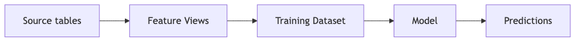

## Overview

This chapter covers the end-to-end workflow for using Feature Store in ML pipelines: from designing spines and generating training datasets to batch and online inference.

Code examples in this chapter use the shared demo environment (`FEATURE_STORE_DEMO.CLICKSTREAM_DATA`) established in the [Introduction](../00_introduction/index.qmd).

## Learning Objectives

After completing this chapter, you will be able to:

- Design effective spines for training and inference
- Choose between `generate_dataset()` and `generate_training_set()` for your workload
- Generate training data with point-in-time correctness
- Apply feature column prefixing for disambiguation
- Integrate with Snowflake Model Registry using open-source or Snowflake ML estimators
- Implement batch inference workflows, including Dynamic Table (DT)-based continuous scoring

---

## Spine Design

The **spine** defines which entities need features and when. Its structure differs between training and inference.

| Use Case | Required Columns | Optional Columns |
|----------|------------------|------------------|
| **Training** | Entity keys, Timestamp | Label (target) |
| **Batch Inference** | Entity keys, Timestamp | — |
| **Online Inference** | Entity keys only | — |

### Training Spine

> 📁 **Full code:** [`_code/spine_design.py`](_code/spine_design.py)

Use **`SESSION_START_TS`** from `SESSIONS` as the point-in-time column so its name matches what you pass to `spine_timestamp_col`. If you alias it (for example `SESSION_START_TS AS EVENT_TS`), the original name is no longer in the DataFrame—downstream code and `spine_timestamp_col` must use the aliased name consistently.

```python
# Training spine: USER_ID + PIT timestamp + label (conversion from session)
training_spine = session.sql("""
    SELECT
        USER_ID,
        SESSION_START_TS,
        IS_CONVERTED AS LABEL
    FROM FEATURE_STORE_DEMO.CLICKSTREAM_DATA.SESSIONS
""")
```

### Inference Spine

The timestamp can be `CURRENT_TIMESTAMP()` (score as of now) or an event timestamp when you want to persist predictions against a specific point in time:

```python
# Inference spine: score active users as of now
inference_spine = session.sql("""
    SELECT
        USER_ID,
        CURRENT_TIMESTAMP() AS PREDICTION_TS
    FROM FEATURE_STORE_DEMO.CLICKSTREAM_DATA.USERS
    WHERE IS_ACTIVE = TRUE
""")
```

---

## `generate_dataset()` vs `generate_training_set()`

Both methods accept `spine_df`, `features`, and `spine_timestamp_col` and perform point-in-time correct feature retrieval. They target different downstream workflows.

| | `fs.generate_dataset()` | `fs.generate_training_set()` |
|---|-------------------------|------------------------------|
| **Returns** | A versioned Snowflake ML **Dataset** (Parquet files in a stage) | A **Snowpark DataFrame** (not a versioned Dataset object) |
| **Versioning** | Supports a `version` parameter for the Dataset | No built-in versioning |
| **Typical use** | Deep learning (TensorFlow, PyTorch) and pipelines that consume the Dataset API | Classic ML (scikit-learn, XGBoost), especially training inside a Virtual Warehouse via Python stored procedures / UDFs |
| **Persist** | Dataset lifecycle is managed as a registered Dataset | Use `save_as` parameter, or call `df.write.save_as_table()` on the returned DataFrame |

Both methods ultimately return a Snowpark DataFrame that you can further transform, persist via `df.write.save_as_table()`, or convert to pandas for local training. The key difference is that `generate_dataset()` additionally wraps the result in a versioned Dataset object for Parquet-based consumption.

See the Snowflake ML Dataset documentation: [Snowflake ML Dataset](https://docs.snowflake.com/en/developer-guide/snowflake-ml/dataset).

### Versioned Dataset (deep learning)

```python
dataset = fs.generate_dataset(
    spine_df=training_spine,
    features=[user_order_fv, user_session_fv],
    spine_timestamp_col="SESSION_START_TS",
    version="V01",
)
# Consume Parquet-backed Dataset per Snowflake ML Dataset docs (e.g. TensorFlow / PyTorch).
```

### Snowpark DataFrame (classic ML)

```python
training_df = fs.generate_training_set(
    spine_df=training_spine,
    features=[user_order_fv, user_session_fv],
    spine_timestamp_col="SESSION_START_TS",
    save_as="FEATURE_STORE_DEMO.FEATURE_STORE.TRAINING_SET_CONVERSION_V01",
)
# training_df is a Snowpark DataFrame; use in Snowpark or convert for sklearn / XGBoost as needed.
```

---

## Generating Training Datasets

### Basic usage (Snowpark / classic ML)

```python
training_df = fs.generate_training_set(
    spine_df=training_spine,
    features=[user_order_fv, user_session_fv],
    spine_timestamp_col="SESSION_START_TS",
)
```

### Joining multiple Feature Views

```python
training_df = fs.generate_training_set(
    spine_df=training_spine,
    features=[
        user_order_fv,
        user_session_fv,
        user_profile_fv,
    ],
    spine_timestamp_col="SESSION_START_TS",
)
```

### Multi-entity spine design (hierarchical features) {#sec-multi-entity-spine}

When Feature Views exist at **different entity grains** (e.g., user-level, order-level, lineitem-level), the spine must carry **all relevant join keys** so each Feature View can match on its entity. Build the spine by joining through the entity hierarchy:

```python
# Spine at the order level, carrying keys for customer and nation Feature Views
multi_entity_spine = session.sql("""
    SELECT
        o.ORDER_ID,
        o.CUSTOMER_ID,
        c.NATION_ID,
        o.ORDER_DATE AS EVENT_TS
    FROM ORDERS o
    JOIN CUSTOMERS c ON o.CUSTOMER_ID = c.CUSTOMER_ID
""")

training_df = fs.generate_training_set(
    spine_df=multi_entity_spine,
    features=[
        order_fv,             # entity: ORDER_ID
        order_lineitem_agg_fv,  # entity: ORDER_ID (aggregated from lineitems)
        customer_fv,          # entity: CUSTOMER_ID
        nation_fv,            # entity: NATION_ID
    ],
    spine_timestamp_col="EVENT_TS",
)
```

The Feature Store LEFT-JOINs each Feature View on its entity keys. **Higher-level features** (nation, customer) are **denormalized** onto every order row. This is intentional -- each training example gets the full context of its parent entities.

| Spine grain | Feature View grain | Result |
|---|---|---|
| Same as FV | 1:1 match | One set of features per spine row |
| Finer than FV | N:1 (parent) | Parent features **duplicated** per child row |
| Coarser than FV | 1:N (child) | **Multiple matches** -- training data expands; use with care |

If the spine is **coarser** than the Feature View (e.g., spine at order level, FV at lineitem level), the LEFT JOIN produces multiple rows per spine entry. This is usually undesirable -- prefer an **aggregated rollup Feature View** at the spine grain instead (see [Chapter 4: Hierarchical Feature Views](../04_feature_views/index.qmd#sec-hierarchy-fvs)).

---

## Feature Column Prefixing {#sec-training-prefixing}

When joining multiple Feature Views, column name collisions can occur.

### Using `auto_prefix`

```python
training_df = fs.generate_training_set(
    spine_df=training_spine,
    features=[user_orders_fv, user_sessions_fv],
    spine_timestamp_col="SESSION_START_TS",
    auto_prefix=True,
)

# Result columns (example):
# USER_ORDERS__TOTAL_SPEND_7D
# USER_SESSIONS__SESSION_CNT_7D
```

### Using `.with_name()`

```python
training_df = fs.generate_training_set(
    spine_df=training_spine,
    features=[
        user_orders_fv.with_name("ord"),
        user_sessions_fv.with_name("sess"),
    ],
    spine_timestamp_col="SESSION_START_TS",
)

# Result columns (example):
# ord__TOTAL_SPEND_7D
# sess__SESSION_CNT_7D
```

### Choosing a strategy

| Scenario | Recommendation |
|----------|----------------|
| Single Feature View | No prefix needed |
| Multiple FVs, unique names | No prefix needed |
| Multiple FVs, potential collisions | Use `auto_prefix=True` |
| Want custom short prefixes | Use `.with_name()` |

---

## Model Registry integration

Use **open-source libraries** (scikit-learn, XGBoost, LightGBM, etc.) when your training data fits in memory, or **`snowflake.ml.modeling`** estimators when you need distributed fitting inside the warehouse. Both produce a trained object you can log with **`Registry.log_model()`**. See [Chapter 9: Preprocessing -- Pipeline Classes](../09_preprocessing/index.qmd#pipeline-classes-scikit-learn-vs-snowflake-ml) for guidance on choosing between the two.

> 📁 **Full code:** [`_code/model_registry.py`](_code/model_registry.py)

```python
from snowflake.ml.registry import Registry

reg = Registry(
    session=session,
    database_name="FEATURE_STORE_DEMO",
    schema_name="MODEL_REGISTRY",
)
reg.log_model(
    model,
    model_name="churn_model",
    version_name="V01",
    comment="Trained with USER_ORDER_FV V01, USER_SESSION_FV V01; spine SESSIONS + SESSION_START_TS",
)
```

### Lineage flow

{fig-alt="Source tables feature views training dataset model predictions"}

---

## Batch Inference

### Ad-Hoc Scoring

The spine timestamp for inference can be `CURRENT_TIMESTAMP()` (score as of *now*) or an event timestamp you want to persist predictions against (e.g. `SESSION_START_TS` for a specific session):

```python
# Inference spine: entities to score as of now
inference_spine = session.sql("""
    SELECT
        USER_ID,
        CURRENT_TIMESTAMP() AS PREDICTION_TS
    FROM FEATURE_STORE_DEMO.CLICKSTREAM_DATA.USERS
    WHERE IS_ACTIVE = TRUE
""")

# Point-in-time features as Snowpark DataFrame
inference_df = fs.generate_training_set(
    spine_df=inference_spine,
    features=[user_order_fv, user_session_fv],
    spine_timestamp_col="PREDICTION_TS",
)

# Score and persist
predictions = model.predict(inference_df.to_pandas().drop(columns=[...]))
inference_df.write.save_as_table("FEATURE_STORE_DEMO.FEATURE_STORE.PREDICTIONS_LATEST", mode="overwrite")
```

For frameworks that consume a Snowflake ML Dataset instead, build a spine the same way and use `generate_dataset()` with an appropriate `version`.

### Continuous Batch Inference with Dynamic Tables {#sec-continuous-batch}

For **single-Feature-View models** where all features come from one table (no ASOF join required), you can use a Dynamic Table (or DT-backed Feature View) to persist predictions that refresh automatically. Reference the Model Registry's SQL function directly in the DT definition:

```sql
CREATE DYNAMIC TABLE FEATURE_STORE.USER_CHURN_PREDICTIONS
  TARGET_LAG = '1 hour'
  WAREHOUSE  = FS_DEV_WH
AS
SELECT
    USER_ID,
    FEATURE_STORE_DEMO.MODEL_REGISTRY.CHURN_MODEL!PREDICT(
        ORDER_CNT, SPEND_SUM, AVG_ORDER_AMT
    ):output_feature_0::FLOAT AS CHURN_PROBABILITY,
    CURRENT_TIMESTAMP() AS SCORED_AT
FROM FEATURE_STORE.USER_PURCHASE_STATS$V01;
```

This pattern works well when the model reads directly from a single Feature View's columns. Each DT refresh re-scores all entities with the latest feature values.

The Model Registry's `!PREDICT` SQL function is automatically registered as **IMMUTABLE**, which makes it eligible for DT incremental refresh. If you create your own scoring UDF/UDTF outside of Model Registry, you must declare it immutable for the same reason -- see [UDF immutability for incremental refresh](#sec-udf-immutability) below.

::: {.callout-warning}
## ASOF join limitation

At this time, ASOF join is **not supported for incremental DT refresh**. If your model requires features from multiple Feature Views joined via ASOF (point-in-time correctness), you cannot embed that join in a Dynamic Table definition. Instead, use the ad-hoc scoring pattern above or schedule batch inference via a Task or external orchestrator.
:::

::: {.callout-warning}
## Pipeline lag affects batch inference too

The scoring DT above reads from `USER_PURCHASE_STATS$V01`, which is itself a Dynamic Table with its own `refresh_freq`. The features the model scores against are subject to cumulative lag: **source pipeline delay + upstream FV refresh + scoring DT target_lag**. A Stream/Task/Stored Procedure batch pattern has the same issue -- the Task schedule determines when scoring runs, but the upstream features may already be stale.

If the model was trained on point-in-time-perfect features (no lag), it may perform worse in production where features are always somewhat stale. To avoid this **training-serving skew**, train with a [conservative spine](../06_temporal_features/index.qmd#solutions) that bakes in realistic lag. See [Chapter 8: Feature Freshness and Training-Serving Skew](../08_online_features/index.qmd#sec-training-serving-skew) for detailed guidance on measuring actual lag and alternative mitigation strategies.
:::

### UDF Immutability for Incremental Refresh {#sec-udf-immutability}

Dynamic Tables in **incremental** refresh mode require every function in the `SELECT` to be deterministic. The Model Registry's `!PREDICT` function is registered as **IMMUTABLE** automatically, but if you build your own scoring UDF/UDTF outside of Model Registry, you must explicitly declare it immutable. A `VOLATILE` UDF forces the DT to use **full refresh** on every cycle, negating the performance benefits of incremental refresh.

**SQL:**

```sql
CREATE OR REPLACE FUNCTION FEATURE_STORE.SCORE_CHURN(
    order_cnt NUMBER, spend_sum NUMBER, avg_order_amt NUMBER
)
RETURNS FLOAT
LANGUAGE PYTHON
IMMUTABLE
RUNTIME_VERSION = '3.11'
HANDLER = 'run'
AS $$
def run(order_cnt, spend_sum, avg_order_amt):
    # Your scoring logic here
    ...
$$;
```

**Snowpark (decorator):**

```python
from snowflake.snowpark.functions import udf
from snowflake.snowpark.types import FloatType, IntegerType

@udf(
    name="FEATURE_STORE.SCORE_CHURN",
    input_types=[IntegerType(), FloatType(), FloatType()],
    return_type=FloatType(),
    immutable=True,
    replace=True,
)
def score_churn(order_cnt: int, spend_sum: float, avg_order_amt: float) -> float:
    ...
```

**Snowpark (`session.udf.register`):**

```python
session.udf.register(
    func=score_churn,
    name="FEATURE_STORE.SCORE_CHURN",
    input_types=[IntegerType(), FloatType(), FloatType()],
    return_type=FloatType(),
    immutable=True,
    replace=True,
)
```

Setting `immutable=True` causes Snowpark to emit the UDF with `IMMUTABLE` volatility in SQL. The DT can then treat it as eligible for incremental refresh. See the [Dynamic Table supported queries](https://docs.snowflake.com/en/user-guide/dynamic-tables-tasks-create#supported-queries) documentation for the full list of incremental refresh requirements.

---

## Dataset Generation at Scale {#sec-scale}

When training datasets involve many Feature Views (50+) or very large spines (hundreds of millions to billions of rows), the default single-query join strategy can hit memory or shuffle limits. Understanding these constraints helps you right-size your infrastructure and leverage SDK optimisations.

### The Batched Join Strategy (SDK 1.32+)

By default, `generate_training_set` and `generate_dataset` produce a single SQL statement that LEFT JOINs **all** Feature Views at once. At high Feature View counts, the final join stage shuffles data proportional to `spine_rows × feature_view_count × avg_features_per_fv`, which can cause out-of-memory (OOM) failures or queries that never complete.

SDK version 1.32+ automatically **batches** Feature View joins into groups of ~10, produces intermediate results for each batch, and performs a final merge. This happens transparently -- no API changes are required. The improvement can be dramatic:

| Scenario | Pre-1.32 (single query) | 1.32+ (batched) |
|----------|------------------------|-----------------|
| 77 FVs, ~1K features, ~90M spine rows | ~40 min on 4XL | ~17 min on 4XL Gen2 |
| 77 FVs, ~2K features, ~1.7B spine rows | OOM on 4XL | ~2 hours on 4XL Gen2 |

If you are on an older SDK version and cannot upgrade, the manual workaround is to split Feature Views into batches of 10-15, call `generate_training_set` for each batch, and join the results:

```python
import math

def generate_training_set_batched(
    fs, spine_df, feature_views, spine_timestamp_col, batch_size=10
):
    """Manually batch Feature View joins for older SDK versions."""
    batches = [
        feature_views[i:i + batch_size]
        for i in range(0, len(feature_views), batch_size)
    ]

    result_df = spine_df
    for batch in batches:
        batch_df = fs.generate_training_set(
            spine_df=spine_df,
            features=batch,
            spine_timestamp_col=spine_timestamp_col,
        )
        join_keys = [spine_timestamp_col] + [
            k for fv in batch for k in fv.entity.join_keys
        ]
        result_df = result_df.join(
            batch_df.drop(*spine_df.columns),
            on=list(set(join_keys) & set(result_df.columns)),
            how="left",
        )
    return result_df
```

### Warehouse Sizing for Dataset Generation

The optimal warehouse configuration depends on whether your bottleneck is **parallelism** (many joins, wide data shuffles) or **memory** (large intermediate results per node).

| Bottleneck | Symptom | Recommendation |
|------------|---------|----------------|
| Parallelism | High idle execution skew; CPU-bound | Scale **up** standard warehouse size (more nodes) |
| Memory | OOM errors; high disk spill | Consider Snowpark Optimized warehouse, or reduce batch size |
| Both | OOM + skew | Snowpark Optimized at larger size (3XL+) |

::: {.callout-tip title="Prefer standard Gen2 warehouses"}
For join-heavy dataset generation workloads, **standard Gen2 warehouses** typically outperform Snowpark Optimized warehouses of equivalent credit cost. A standard 4XL Gen2 (128 nodes × 16 GB) provides far more parallelism than an SPO 3XL (16 nodes × 256 GB) at similar cost. Only move to SPO when profiling confirms memory -- not parallelism -- is the constraint.
:::

### The Wide Resultset Problem {#sec-wide-resultset}

When training datasets exceed ~500 features across many Feature Views, Snowflake's query planner and columnar engine encounter **non-linear** performance degradation. The issue stems from SQL expression count, query compilation complexity, and memory pressure -- not just data volume:

| Scale | Compilation | Execution (full resultset) |
|-------|-------------|---------------------------|
| 10 FVs, ~200 features | Seconds | Minutes |
| 50 FVs, ~1,000 features | Minutes | Tens of minutes |
| 100 FVs, ~2,000 features | **35+ minutes** | **6+ hours (likely OOM)** |

::: {.callout-warning title="Known platform limitation"}
This is a known Snowflake limitation for wide resultsets. The Feature Store SDK mitigates it with batched joins (see above), but extremely wide datasets (2,000+ features) may still require architectural workarounds described below.
:::

**VARIANT column approach**: For extreme scale (>500 features), encapsulating each Feature View's output as a single OBJECT column dramatically reduces SQL expression count:

```python
# Instead of: SELECT entity_id, feat_1, feat_2, ..., feat_200 FROM fv_table
# Use:        SELECT entity_id, OBJECT_CONSTRUCT(*) AS features FROM fv_table

# Benchmark: 100 FVs, 2000 features
# Column-per-feature: 1,501 seconds for a single-row collect()
# VARIANT approach:     3.6 seconds for a single-row collect()
```

**Trade-offs of the VARIANT approach:**

| Aspect | Column-per-feature | VARIANT per FV |
|--------|-------------------|----------------|
| Query compilation | Non-linear with feature count | Near-constant |
| Column-level lineage | Full | Lost |
| Column-level security | Full | Lost |
| Client-side processing | Direct DataFrame access | Requires `json.loads()` per row |
| Memory overhead | Standard | ~2x (JSON deserialization) |

For most use cases, the batched join strategy (SDK 1.32+) combined with appropriate warehouse sizing is sufficient. Reserve the VARIANT approach for the largest deployments where batched joins still hit compilation or memory limits.

### Parquet and Iceberg Output {#sec-parquet-output}

For training datasets that feed distributed ML frameworks (Ray, Spark, PyTorch), writing directly to Parquet avoids the memory bottleneck of `to_pandas()`:

| Scale | Warehouse | Write time |
|-------|-----------|------------|
| 1B rows | Standard 4XL | ~4 minutes |
| 12B rows | Standard 4XL | ~35 minutes |

**Options for Parquet output:**

1. **`generate_dataset` with `output_type="parquet"`** -- writes directly to a Snowflake stage; files are readable by Ray's `read_parquet()`.
2. **Snowflake-managed Iceberg tables** -- queryable via both Snowflake SQL and external Parquet readers. Useful when the same training data is consumed by both Snowflake-based and external ML pipelines.
3. **`COPY INTO` from a materialized table** -- if you need fine-grained control over Parquet file layout (row group size, compression).

::: {.callout-tip title="Skip to_pandas() for large datasets"}
For datasets exceeding ~100M rows or ~500 features, writing to Parquet and reading directly from your ML framework is both faster and more memory-efficient than `to_pandas()`. This is especially true when using the VARIANT approach, where `to_pandas()` returns JSON strings requiring single-threaded `json.loads()` deserialization.
:::

---

## Best practices

### 1. Spine design {.unnumbered}
If your Feature Views follow the recommended convention of aliasing their timestamp column to a standard name (e.g., `FV_TS` -- see [Chapter 6: timestamp_col Requirements](../06_temporal_features/index.qmd#sec-timestamp-col-requirements)), name the spine timestamp to match:

```python
# ✅ GOOD: Standardized timestamp name matches FV convention
spine = session.sql("""
    SELECT
        USER_ID,
        SESSION_START_TS AS FV_TS,
        IS_CONVERTED AS LABEL
    FROM FEATURE_STORE_DEMO.CLICKSTREAM_DATA.SESSIONS
""")
# spine_timestamp_col="FV_TS" everywhere — same as every Feature View's timestamp_col

# ✅ ALSO GOOD: Explicit source name when you prefer traceability
spine = session.sql("""
    SELECT
        USER_ID,
        SESSION_START_TS,
        IS_CONVERTED AS LABEL
    FROM FEATURE_STORE_DEMO.CLICKSTREAM_DATA.SESSIONS
""")
# spine_timestamp_col="SESSION_START_TS"

# ❌ BAD: Ambiguous or opaque timestamp column
spine = session.sql("""
    SELECT
        USER_ID,
        SOME_DATE
    FROM FEATURE_STORE_DEMO.CLICKSTREAM_DATA.SESSIONS
""")
```

### 2. Feature selection {.unnumbered}
Registered Feature Views expose **`.slice(["col1", "col2"])`** to restrict columns. Do not assume `.select()` on the Feature View object.

```python
training_df = fs.generate_training_set(
    spine_df=training_spine,
    features=[
        user_order_fv.slice(["TOTAL_SPEND_7D", "ORDER_CNT_30D"]),
    ],
    spine_timestamp_col="SESSION_START_TS",
)
```

### 3. Validate before training {.unnumbered}
```python
# Check for data issues (column names depend on your spine / FVs)
assert training_df.filter(F.col("LABEL").isNull()).count() == 0
assert training_df.count() > 1000
```

---

## Common pitfalls

### ❌ Pitfall 1: No timestamp column

**Problem**: PIT retrieval does not work without a timestamp.

**Solution**: Always include a spine timestamp and set `spine_timestamp_col` to its name.

### ❌ Pitfall 2: Feature leakage

**Problem**: Using features computed from future data relative to the spine row.

**Solution**: Use `spine_timestamp_col` and validate cutoff behavior.

### ❌ Pitfall 3: Column collisions

**Problem**: Same feature names from multiple Feature Views.

**Solution**: Use `auto_prefix` or `.with_name()`.

### ❌ Pitfall 4: Wrong API for the framework

**Problem**: Expecting a Snowpark DataFrame from `generate_dataset()` or Dataset Parquet from `generate_training_set()`.

**Solution**: Use the comparison table above; match the method to DL (Dataset) vs classic ML (DataFrame / `save_as`).

### ❌ Pitfall 5: Training-serving skew from pipeline lag {#sec-pitfall-skew}

**Problem**: The model is trained on point-in-time-perfect features (ASOF join returns the exact values available at each event), but at inference time -- whether via an OFT, a DT-based scoring pipeline, or a scheduled Task/Sproc -- the features are subject to cumulative lag: source ETL delay + upstream Feature View `refresh_freq` + inference-layer lag (`target_lag`, Task schedule, etc.). The model sees feature distributions at inference that differ from training, degrading prediction accuracy.

**Solution**: Train with a **conservative spine** that shifts the ASOF cutoff back by the expected end-to-end pipeline lag (see [Chapter 6: Late-Arriving Data](../06_temporal_features/index.qmd#solutions)). This ensures the training features reflect realistic staleness. For detailed guidance on measuring actual lag and alternative mitigation strategies, see [Chapter 8: Feature Freshness and Training-Serving Skew](../08_online_features/index.qmd#sec-training-serving-skew).

---

## Summary

| Concept | Description |
|---------|-------------|
| **Spine** | DataFrame defining entities and timestamps (and label for training) |
| `generate_dataset()` | Versioned Snowflake ML Dataset (Parquet on a stage); strong fit for deep learning |
| `generate_training_set()` | Snowpark DataFrame; persist with `save_as` or `df.write.save_as_table()`; strong fit for classic ML |
| `auto_prefix` | Automatic column prefixing across Feature Views |
| `.with_name()` | Custom column prefixing |
| `.slice([...])` | Restrict features from a registered Feature View |
| **DT-based inference** | Single-FV models can use a Dynamic Table with Model Registry SQL functions for continuous batch scoring |

---

## Next steps

Continue to [Chapter 11: Operations](../11_operations/index.qmd) to learn about monitoring, data quality, and operational management.
