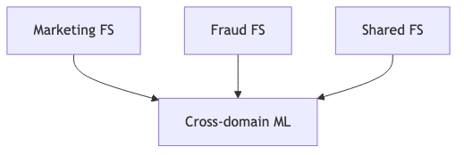
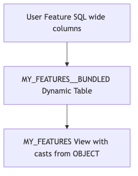
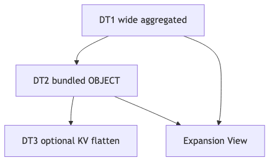

## Overview

This chapter covers advanced Feature Store patterns for enterprise-scale deployments, including streaming features, multi-Feature Store architectures, CI/CD integration, **testing strategies**, **multi-region and DR considerations**, and complex use cases.

Examples follow the **clickstream** sample layout: database `FEATURE_STORE_DEMO`, Feature Store schema `FEATURE_STORE`, source schema `CLICKSTREAM_DATA`, warehouse `FS_DEV_WH`, and tables such as `EVENTS`, `SESSIONS`, `ORDERS`, `USERS`, and `PRODUCTS`. Register Feature Views with version strings in **`V01`** format (for example `version="V01"`). Prefer aggregate column suffixes such as `_CNT`, `_SUM`, `_AVG`, timestamp columns ending in `_TS`, boolean prefixes `IS_`, and monetary fields such as `TOTAL_AMT`.

## Learning Objectives

After completing this chapter, you will be able to:

- Design streaming feature architectures using short-refresh DTs or external pipelines, and interpret platform roadmap status for native Streaming Feature Views
- Implement multi-Feature Store patterns with RBAC isolation and cross-domain training
- Plan multi-region and disaster recovery considerations for Feature Store schemas
- Integrate Feature Store deployments with CI/CD pipelines and environment promotion
- Apply structured testing: unit logic, PIT correctness, schema validation, and freshness checks
- Apply hybrid storage, two-tier Feature View architecture, and Dynamic Table (DT) cascades to manage wide and sparse feature data at scale
- Use `OBJECT_CONSTRUCT` and semi-structured types for embeddings, JSON features, and column-count reduction

---

## Platform capabilities and preview status (March 2026)

Several capabilities were previously described as **private preview** with general availability (GA) expected around **March 2026**. As of **late March 2026**, treat the following as **may be GA or in public preview depending on region and account**—always confirm in [Snowflake release notes](https://docs.snowflake.com/en/release-notes/new-features) and your account’s feature bundle before planning production work.

| Capability | Notes |
|------------|--------|
| **RollupConfig** (hierarchical aggregations) | Verify current availability; API names may evolve. |
| **Time-aggregated Feature Views** (Temporal Aggregation / `Feature` class) | Same guidance—confirm preview vs GA in documentation. |
| **Feature tiling** | Performance optimization for windowed aggregates; confirm support status. |
| **Streaming Feature Views** | Rollout may extend into **March–April 2026**; near-term options remain short Dynamic Table refresh or Snowpipe → staging → View-based FVs. |

::: {.callout-note}
These callouts are **not** removed when features graduate—timelines shift. Re-check Snowflake documentation before committing architecture.
:::

---

## Streaming Feature Views (roadmap and workarounds)

> 📁 **Full code:** [`_code/streaming_patterns.py`](_code/streaming_patterns.py)

### Current state

Many ML use cases (fraud scoring, session personalization, real-time recommendations) need features computed over data that is **seconds or minutes old**, not hours. Native Streaming Feature Views are the platform's long-term answer, but may not yet be enabled in every account and region.

Until your account is explicitly enabled, plan on **workarounds** that approximate low latency:

**Workaround 1 -- Short-refresh Dynamic Tables.** Set `refresh_freq` to the shortest interval your warehouse budget and data volume allow. A 1-minute refresh is not true streaming, but for many use cases (session-level aggregates, rolling 5-minute counts) the practical difference is negligible.

```python
realtime_fv = FeatureView(
    name="USER_REALTIME_FEATURES",
    entities=[user_entity],
    feature_df=session.table("FEATURE_STORE_DEMO.CLICKSTREAM_DATA.EVENTS"),
    timestamp_col="EVENT_TS",
    refresh_freq="1 minute",
    desc="Near real-time event counts, 1-min refresh cycle",
)
```

**Workaround 2 -- External streaming into a View-based Feature View.** An external pipeline (Kafka Connect, Snowpipe Streaming, or a custom producer) writes into a staging table. A View-based Feature View wraps that table so it is always current as of the last micro-batch:

```
  Kafka / Snowpipe Streaming
        │
        ▼
  EVENTS_STAGING (table, continuously appended)
        │
        ▼
  View-based Feature View (always reads latest rows)
```

### Illustrative native streaming pattern

When native Streaming Feature Views are available in your account, the API should resemble the following. **Confirm the exact signature and parameters in the release notes before using this in production:**

```python
streaming_fv = FeatureView(
    name="USER_STREAMING_FEATURES",
    entities=[user_entity],
    source_stream="USER_EVENTS_STREAM",  # Snowflake Stream object
    streaming=True,
    desc="True streaming features -- verify API availability",
)
```

---

## Multi-region and disaster recovery

> 📁 **Full code:** [`_code/multi_region_dr.py`](_code/multi_region_dr.py)

Enterprise deployments often require **multiple regions** and **disaster recovery (DR)**. At a high level:

- **Database replication:** Snowflake **database replication** can replicate databases that hold Feature Store schemas (for example `FEATURE_STORE_DEMO` / `FEATURE_STORE`), subject to replication rules, edition, and licensing.
- **Feature definitions:** **Feature Views** and related metadata can be promoted via **clone**, **CI/CD redeploy from repository definitions**, or replication-oriented workflows; choose based on whether secondary regions must own writable primaries or read-only copies.
- **Online Feature Tables:** **Online Feature Tables require separate provisioning per region** (and separate serving paths); replication alone does not replace regional online stores or cache layers.
- **Scope:** **Full multi-region and DR planning is beyond this guide.** Use current Snowflake documentation on replication, failover, and business continuity, and involve your platform team for RPO/RTO targets.


---

## Multi-Feature Store operations

Large organizations rarely run a single Feature Store schema. Different business domains (marketing, fraud, risk, personalization) have distinct data ownership, sensitivity levels, and development cadences. The Snowflake Feature Store maps one-to-one with a **schema**, so multiple Feature Stores are simply multiple schemas -- potentially in different databases.

### Cross-domain ML

A cross-domain model (e.g., a churn model that combines marketing engagement, fraud signals, and base demographic features) pulls Feature Views from multiple Feature Store schemas at training time via `generate_dataset` or `generate_training_set`. The diagram below illustrates the topology:

{fig-alt="Marketing fraud and shared feature stores feed a cross-domain model"}

Each Feature Store instance points to its own schema. At training time the consumer session must have grants on all schemas involved.

### RBAC considerations

Domain isolation is enforced through standard Snowflake RBAC. Each Feature Store schema can be owned by a different role. A "shared" schema holds cross-domain features that multiple teams consume. The consuming role only needs `USAGE` on the schema and `SELECT` on the underlying objects:

```python
marketing_fs = FeatureStore(session, database="FEATURE_STORE_DEMO", name="MARKETING_FS")
shared_fs    = FeatureStore(session, database="FEATURE_STORE_DEMO", name="SHARED_FS")
fraud_fs     = FeatureStore(session, database="FEATURE_STORE_DEMO", name="FRAUD_FS")
```

::: {.callout-tip}
When generating training data across Feature Stores, the session role must have grants on **all** schemas involved. Use a dedicated `ML_TRAINING` role with `SELECT` grants on each domain's Feature Store schema, rather than granting broad privileges to individual users.
:::

### Cross-domain training: pulling Feature Views from multiple Feature Stores

Create separate `FeatureStore` instances for each domain, retrieve the Feature Views you need, and pass them all to a single `generate_dataset` or `generate_training_set` call:

```python
marketing_fs = FeatureStore(session, database="FEATURE_STORE_DEMO", name="MARKETING_FS",
                            default_warehouse="FS_PROD_WH")
shared_fs    = FeatureStore(session, database="FEATURE_STORE_DEMO", name="SHARED_FS",
                            default_warehouse="FS_PROD_WH")
fraud_fs     = FeatureStore(session, database="FEATURE_STORE_DEMO", name="FRAUD_FS",
                            default_warehouse="FS_PROD_WH")

# Retrieve Feature Views from each domain
campaign_fv = marketing_fs.get_feature_view("CAMPAIGN_FV", "V01")
txn_risk_fv = fraud_fs.get_feature_view("TRANSACTION_RISK_FV", "V01")
user_base_fv = shared_fs.get_feature_view("USER_BASE_FV", "V01")

# Generate a cross-domain training set (any FeatureStore instance can call generate_*)
training_df = shared_fs.generate_training_set(
    spine_df=churn_spine,
    features=[campaign_fv, txn_risk_fv, user_base_fv],
    spine_timestamp_col="EVENT_TS",
)
```

### Cross-domain Feature View: sourcing from another Feature Store

A View-based Feature View in one Feature Store can read from a materialized Feature View in another. This is useful when a domain wants to expose a curated subset of another domain's features without duplicating the underlying DT:

```python
# In the MARKETING_FS: create a View that reads from SHARED_FS's materialized DT
cross_domain_df = session.sql("""
    SELECT USER_ID, LIFETIME_SPEND, ACCOUNT_AGE_DAYS, LAST_LOGIN_TS
    FROM FEATURE_STORE_DEMO.SHARED_FS."USER_BASE_FV$V01"
""")

user_base_marketing_fv = FeatureView(
    name="USER_BASE_MARKETING_FV",
    entities=[user_entity],
    feature_df=cross_domain_df,
    timestamp_col="LAST_LOGIN_TS",
    refresh_freq=None,  # View: reads from SHARED_FS's DT at query time
    desc="Curated user base features sourced from SHARED_FS for marketing models",
)

marketing_fs.register_feature_view(user_base_marketing_fv, "V01")
```

### Discovering Feature Views across Feature Stores

Feature Store schemas use Snowflake **tags** for metadata. You can query across multiple schemas using `INFORMATION_SCHEMA` or `TAG_REFERENCES` to build a cross-domain feature catalog:

```python
discovery_df = session.sql("""
    SELECT
        TAG_VALUE AS FEATURE_STORE_SCHEMA,
        OBJECT_NAME AS FEATURE_VIEW_NAME,
        OBJECT_DATABASE,
        OBJECT_SCHEMA
    FROM TABLE(INFORMATION_SCHEMA.TAG_REFERENCES_ALL_COLUMNS(
        'FEATURE_STORE_DEMO.SHARED_FS', 'SCHEMA'))
    WHERE TAG_NAME = 'SNOWML_FEATURE_VIEW_METADATA'
    UNION ALL
    SELECT
        TAG_VALUE, OBJECT_NAME, OBJECT_DATABASE, OBJECT_SCHEMA
    FROM TABLE(INFORMATION_SCHEMA.TAG_REFERENCES_ALL_COLUMNS(
        'FEATURE_STORE_DEMO.MARKETING_FS', 'SCHEMA'))
    WHERE TAG_NAME = 'SNOWML_FEATURE_VIEW_METADATA'
""")

discovery_df.show()
```

Alternatively, iterate programmatically:

```python
for fs_name in ["SHARED_FS", "MARKETING_FS", "FRAUD_FS"]:
    fs = FeatureStore(session, database="FEATURE_STORE_DEMO", name=fs_name,
                      default_warehouse="FS_PROD_WH")
    print(f"\n--- {fs_name} ---")
    fs.list_feature_views().select("NAME", "VERSION", "DESC").show()
```

---

## External Data Sources

Feature Views can wrap tables managed by external systems. For **dbt integration** (View-based Feature Views backed by dbt-managed tables), see [Chapter 5: Feature Pipelines -- External Orchestration](../05_feature_pipelines/index.qmd#sec-dbt).

### Iceberg Tables

Apache Iceberg tables registered as Snowflake External Tables or Snowflake-managed Iceberg Tables can serve as Feature View sources. The Feature View wraps the Iceberg table with a View (no `refresh_freq`) since the external system controls data updates:

```python
iceberg_fv = FeatureView(
    name="USER_FEATURES_ICEBERG",
    entities=[user_entity],
    feature_df=session.sql("""
        SELECT USER_ID, TOTAL_AMT, ORDER_TS
        FROM iceberg_catalog.feature_store_demo_clickstream.orders
    """),
    timestamp_col="ORDER_TS",
    desc="User order features from Iceberg-managed table",
)
```

This is functionally identical to any View-based Feature View -- the Iceberg table is just another source. Freshness depends entirely on the external write cadence.

---

## CI/CD for Feature Store

> 📁 **Full code:** [`_code/cicd_patterns.py`](_code/cicd_patterns.py)

Feature definitions should be treated as production code: version-controlled, reviewed, tested, and deployed through an automated pipeline. This prevents configuration drift between environments and ensures that every Feature View change is auditable.

### Feature definition as code

Store Feature View definitions (name, query, entities, refresh frequency, version) in a declarative format (YAML, JSON, or Python config) alongside the deployment script. A CI/CD pipeline triggers on changes to these definitions:

```yaml
# .github/workflows/feature-deploy.yml
name: Deploy Features

on:
  push:
    branches: [main]
    paths:
      - 'features/**'

jobs:
  deploy:
    runs-on: ubuntu-latest
    steps:
      - uses: actions/checkout@v4
      
      - name: Deploy Feature Views
        env:
          SNOWFLAKE_ACCOUNT: ${{ secrets.SF_ACCOUNT }}
          SNOWFLAKE_USER: ${{ secrets.SF_USER }}
        run: |
          python scripts/deploy_features.py
```

The `paths` filter ensures the pipeline only runs when Feature View definitions change -- not on unrelated code changes.

### Deployment script

The deployment script reads a configuration file, constructs each Feature View, and registers it. Version labels (`V01`, `V02`, ...) are part of the configuration so that version bumps are explicit and reviewable in pull requests:

```python
def deploy_feature_view(
    fs: FeatureStore,
    config: dict,
) -> None:
    fv = FeatureView(
        name=config["name"],
        entities=config["entities"],
        feature_df=session.sql(config["query"]),
        timestamp_col=config["timestamp_col"],
        refresh_freq=config.get("refresh_freq"),
    )
    fs.register_feature_view(fv, version=config["version"], block=True)
```

::: {.callout-tip title="Environment promotion"}
Combine this with the environment-strategy patterns from [Chapter 2](../02_design_organization/index.qmd#sec-environments). Parameterize database and schema names so that the same deployment script works across DEV, QA, and PROD by changing environment variables.
:::

::: {.callout-note title="Config-driven definitions vs config-driven deployment"}
This section covers **deployment-time** config: which Feature Views to register, in which environment, at what version. For **definition-time** config — programmatically generating the `Feature` objects and `feature_df` columns from data or specification tables — see [Chapter 7: Data-Driven Feature Definitions](../07_aggregations_api/index.qmd#sec-data-driven). The two patterns complement each other: data-driven definitions produce the Feature View content, and config-driven deployment pushes it through environments.
:::

---

## Testing strategies

> 📁 **Full code:** [`_code/testing_strategies.py`](_code/testing_strategies.py)

Reliable Feature Store operations depend on tests that go beyond "the job finished." The patterns below are the minimum bar for advanced deployments. Most can be implemented with **pytest** and Snowpark's local testing framework or a dedicated Snowflake test account.


### 1. Unit tests for feature logic {.unnumbered}
Test **DataFrame or Snowpark transformations in isolation**: build small fixtures (or sampled tables from `FEATURE_STORE_DEMO.CLICKSTREAM_DATA`), run the same logic your Feature View uses, and assert **row counts, column names, and values**—including naming conventions (`ORDER_CNT`, `TOTAL_AMT_SUM`, `LAST_ORDER_TS`).

```python
import pytest
from snowflake.snowpark.functions import col

def test_user_order_aggregates_schema_and_totals(order_stats_df):
    """order_stats_df: result of GROUP BY USER_ID on ORDERS-like input."""
    cols = order_stats_df.columns
    assert "USER_ID" in cols
    assert "ORDER_CNT" in cols
    assert "TOTAL_AMT_SUM" in cols
    row = order_stats_df.filter(col("USER_ID") == 42).collect()
    assert row[0]["ORDER_CNT"] == 3
```

### 2. PIT correctness tests (no future leakage) {.unnumbered}
After `generate_dataset`, assert that **feature view timestamps never exceed** the spine’s event time for the same row.

```python
from snowflake.snowpark.functions import col

def test_no_future_leakage(fs, test_spine, fv):
    dataset = fs.generate_dataset(
        spine_df=test_spine,
        features=[fv],
        spine_timestamp_col="EVENT_TS",
        include_feature_view_timestamp_col=True,
    )
    df = dataset.read.to_snowpark_dataframe()
    assert df.filter(col("FV_TS") > col("EVENT_TS")).count() == 0
```

Extend this pattern with **spot checks** on known entities and times (golden spines) and with **multiple Feature Views** joined on the same spine.

### 3. Schema validation {.unnumbered}
Before or after `register_feature_view`, assert that outputs match an **expected schema**: column set, types, and (where your contracts require it) order. Options include:

- `DESCRIBE TABLE` or `DESCRIBE VIEW` on the underlying object (see [Chapter 11](../11_operations/index.qmd) for how to identify the object type), compared to a checked-in manifest
- Queries against `INFORMATION_SCHEMA.COLUMNS` for `FEATURE_STORE_DEMO.FEATURE_STORE`
- API metadata from `fs.get_feature_view(name="USER_ORDER_FV", version="V01")` where available

Keep **one manifest** (YAML/JSON) as the source of truth shared by registration scripts and tests.

### 4. Freshness and quality hooks {.unnumbered}
Combine the above with **operational checks** (lag, null rates) as in Chapter 11—those belong in monitoring as well as in **smoke tests** after deploy.

```python
def test_feature_freshness():
    lag = get_feature_lag("USER_ORDER_FV")
    assert lag < timedelta(hours=2)

def test_feature_quality():
    null_rate = get_null_rate("USER_ORDER_FV", "TOTAL_AMT_SUM")
    assert null_rate < 0.01
```

---

## Wide & sparse feature data {#sec-wide-sparse}

ML feature tables are often wide. Sensor data, one-hot encodings, interaction features, and aggregation windows routinely produce tables with hundreds to thousands of columns. In many domains the data is also **sparse** -- a large fraction of feature values are NULL or zero.

| Scenario | Typical column count | Sparsity |
|----------|---------------------|----------|
| Sensor aggregations (manufacturing, IoT) | 400--600 | 30--50% |
| One-hot encoded categoricals | 500--10,000+ | 95%+ |
| User-item interaction matrices | 1,000--100,000+ | 99%+ |
| Time-windowed aggregation features | 200--2,000 | 40--70% |

Feature Store tables inherit these characteristics. When `generate_training_set()` or inference queries must process wide Feature Views, several Snowflake-specific costs compound.

### Why wide tables hurt in Snowflake

**SQL compilation cost.** Every column in a query must be parsed, resolved, and optimized. At 500+ columns, compilation can dominate total query time -- particularly for `UNPIVOT`, `PIVOT`, and `SELECT *` operations.

**Micro-partition overhead.** Each column adds metadata overhead (min/max statistics, null counts, bloom filters). At 500+ columns per-partition metadata grows substantially, impacting partition pruning and scan initialisation.

**Column limits.** Standard tables, Iceberg tables, and Dynamic Tables all have a practical limit of ~2,000 columns. Hybrid Tables (for online serving) have similar limits, with latency proportional to row width.

**Transfer and memory expansion.** Wide tables transferred via Arrow or Parquet carry every column even when sparse. There is also a known Snowflake Datasets issue where all numeric columns may be expanded to full-width `NUMBER(38,0)` in the underlying Parquet files, causing significant memory bloat when loaded into Pandas.

**Feature View joins at scale.** `generate_training_set()` performs ASOF joins across Feature Views. More columns per Feature View increases the join payload. Splitting wide data across many Feature Views (vertical partitioning) multiplies the number of joins instead.

### Column count thresholds

| Feature count | Recommendation |
|---------------|----------------|
| < 100 | Standard wide table -- no special handling needed |
| 100--500 | Consider hybrid packing for sparse features (> 60% sparse) |
| 500--2,000 | Hybrid packing recommended; consider DT cascade |
| > 2,000 | Hybrid packing mandatory; vertical partitioning for logical groups |

### Semi-structured types in Feature Views

Snowflake's `VARIANT`, `OBJECT`, and `ARRAY` types are first-class column types and work inside Feature Views. They serve three roles: **vector embeddings**, **JSON-structured data**, and **packed wide features**.

**Embeddings and arrays.** ML embeddings are naturally represented as `ARRAY` or `VECTOR` columns, avoiding hundreds of individual dimension columns:

```python
embedding_fv = FeatureView(
    name="USER_EMBEDDINGS",
    entities=[user_entity],
    feature_df=session.sql("""
        SELECT USER_ID, EMBEDDING_VECTOR, LAST_UPDATED_TS
        FROM FEATURE_STORE_DEMO.FEATURE_STORE.USER_EMBEDDINGS
    """),
    timestamp_col="LAST_UPDATED_TS",
    desc="User embeddings as ARRAY column",
)
```

```python
import numpy as np
df = fs.generate_dataset(spine_df=spine, features=[embedding_fv],
                         spine_timestamp_col="EVENT_TS").read.to_pandas()
X_embed = np.stack(df["EMBEDDING_VECTOR"].values)
```

**JSON features.** User preferences, configuration objects, or other nested structures can be stored as `VARIANT` or `OBJECT` columns, preserving hierarchical structure:

```python
json_fv = FeatureView(
    name="USER_PREFERENCES",
    entities=[user_entity],
    feature_df=session.sql("""
        SELECT USER_ID, PREFERENCES, UPDATED_TS
        FROM FEATURE_STORE_DEMO.CLICKSTREAM_DATA.USER_PROFILES
    """),
    timestamp_col="UPDATED_TS",
    desc="User preferences as VARIANT/OBJECT column",
)
```

### Hybrid storage: key columns + OBJECT payload {#sec-object-construct}

The recommended pattern for wide Feature Views is **hybrid storage**: entity keys, timestamp, and any frequently queried columns remain as native columns; all other features are packed into a single `OBJECT` column. This combines efficient joins/filtering on keys with compact storage for the feature payload.

| Aspect | Hybrid (keys + OBJECT) | Standard wide table |
|--------|----------------------|---------------------|
| SQL queryability on keys | Excellent | Excellent |
| Storage efficiency (sparse data) | Good -- absent keys = no storage | Poor -- NULLs/zeros stored explicitly |
| Column-limit safe | Yes -- one OBJECT column regardless of feature count | No -- hits ~2,000 limit |
| SQL compile time | Low -- single column in projection | High -- each column parsed individually |
| ML library compatibility | Good -- unpack in Python | Excellent -- direct DataFrame |

**Packing with `OBJECT_CONSTRUCT`:**

```sql
SELECT
    USER_ID,
    OBJECT_CONSTRUCT(* EXCLUDE (USER_ID, UPDATED_TS)) AS FEATURES,
    UPDATED_TS
FROM FEATURE_STORE_DEMO.CLICKSTREAM_DATA.USER_WIDE_FEATURES;
```

The `* EXCLUDE` syntax packs all columns except the named ones. `OBJECT_CONSTRUCT` automatically drops NULL keys, providing inherent sparsity compression.

::: {.callout-tip title="NULL vs zero handling"}
Use `OBJECT_CONSTRUCT` (drops NULLs) when absent features should default to a known value (e.g., 0). Use `OBJECT_CONSTRUCT_KEEP_NULL` when you need to preserve the distinction between NULL (missing/unknown) and zero (measured as zero). For most ML use cases where sparse features default to 0, combining `NULLIF(col, 0)` with `OBJECT_CONSTRUCT` eliminates both NULL and zero keys from the OBJECT, maximising compression:

```sql
OBJECT_CONSTRUCT(
    'OHE_CAT_1', NULLIF(OHE_CAT_1, 0),
    'OHE_CAT_2', NULLIF(OHE_CAT_2, 0),
    ...
) AS SPARSE_FEATURES
```
:::

For dynamically generated columns (e.g., per-category aggregates where new categories appear), use `OBJECT_AGG`:

```sql
SELECT
    USER_ID,
    OBJECT_AGG(CATEGORY_NAME, SPEND_AMT) AS CATEGORY_SPEND_MAP,
    MAX(UPDATED_TS) AS UPDATED_TS
FROM FEATURE_STORE_DEMO.CLICKSTREAM_DATA.USER_SPEND_BY_CATEGORY
GROUP BY USER_ID;
```

**Registering the Feature View:**

```python
packed_fv = FeatureView(
    name="USER_CATEGORY_SPEND",
    entities=[user_entity],
    feature_df=session.table("FEATURE_STORE_DEMO.FEATURE_STORE.USER_CATEGORY_SPEND_V"),
    timestamp_col="UPDATED_TS",
    desc="Per-category spend packed into OBJECT column",
)
```

**Unpacking in Python:**

```python
import pandas as pd

df = fs.generate_dataset(
    spine_df=spine, features=[packed_fv],
    spine_timestamp_col="EVENT_TS",
).read.to_pandas()

features_df = pd.json_normalize(df["FEATURES"])
training_df = pd.concat([df.drop(columns=["FEATURES"]), features_df], axis=1)
```

For sparse matrices (e.g., feeding XGBoost or LightGBM which accept sparse input natively):

```python
from scipy.sparse import coo_matrix
import json

records = df["FEATURES"].apply(json.loads).tolist()
feature_names = sorted(set(k for r in records for k in r))
name_to_idx = {n: i for i, n in enumerate(feature_names)}

rows, cols, vals = [], [], []
for i, rec in enumerate(records):
    for k, v in rec.items():
        rows.append(i)
        cols.append(name_to_idx[k])
        vals.append(float(v))

X_sparse = coo_matrix((vals, (rows, cols)), shape=(len(records), len(feature_names))).tocsr()
```

### Two-tier Feature View architecture

For production-grade wide Feature Views backed by Dynamic Tables, the recommended pattern is a **two-tier architecture**: a materialized bundled DT underneath, with an expansion View on top. The expansion View presents the same wide-column schema that consumers expect while the bundled DT stores data compactly.

{fig-alt="Wide SQL to bundled DT then expansion view for consumers"}

| Object | Name | Type | Consumer-facing? |
|--------|------|------|-----------------|
| Expanded Feature View | `{name}` | View | Yes -- consumers query this |
| Bundled Feature View | `{name}__BUNDLED` | Dynamic Table | Internal -- efficient storage |

The consumer-facing name goes on the **expansion View** so that `SELECT * FROM my_features` returns the expected wide columns. The bundled DT is an implementation detail.

**Expansion SQL:**

The expansion query can be used in two ways -- either as a **View-based Feature View** registered through the Feature Store API, or as a standalone `CREATE VIEW` statement managed outside the API:

```sql
-- Expansion query: extract sparse features from the bundled OBJECT
SELECT
    USER_ID,
    UPDATED_TS,
    AGE,
    INCOME,
    CITY,
    COALESCE(SPARSE_FEATURES:OHE_CAT_1::INTEGER, 0)  AS OHE_CAT_1,
    COALESCE(SPARSE_FEATURES:OHE_CAT_2::INTEGER, 0)  AS OHE_CAT_2,
    COALESCE(SPARSE_FEATURES:OHE_CAT_3::INTEGER, 0)  AS OHE_CAT_3
    -- ... generated from metadata
FROM FEATURE_STORE_DEMO.FEATURE_STORE.USER_WIDE_FEATURES__BUNDLED
```

```python
# Option A: Register as a View-based Feature View (preferred — visible in the Feature Store)
expansion_df = session.sql("SELECT ... FROM USER_WIDE_FEATURES__BUNDLED")  # query above

wide_fv = FeatureView(
    name="USER_WIDE_FEATURES", entities=[user_entity],
    feature_df=expansion_df, timestamp_col="UPDATED_TS",
    refresh_freq=None,  # View — reads from the bundled DT at query time
    desc="Wide expansion of USER_WIDE_FEATURES__BUNDLED",
)
wide_fv = fs.register_feature_view(feature_view=wide_fv, version="V01")
```

```sql
-- Option B: Standalone CREATE VIEW (managed outside the Feature Store API)
CREATE VIEW FEATURE_STORE_DEMO.FEATURE_STORE.USER_WIDE_FEATURES AS
SELECT ... FROM FEATURE_STORE_DEMO.FEATURE_STORE.USER_WIDE_FEATURES__BUNDLED;
```

`COALESCE` with the appropriate default (0 for numeric, NULL for strings) handles features that were absent from the OBJECT due to sparsity.

::: {.callout-note title="When NOT to bundle"}
If the Feature View has **no refresh frequency** (i.e., it is a plain View with no materialization), bundling serves no purpose -- there is no stored data to compress. The packing/unpacking adds unnecessary query-time overhead. Only apply the two-tier pattern to **DT-backed Feature Views**.
:::

### Type fidelity and metadata

When features are packed into an OBJECT, all values become `VARIANT`. The original Snowflake types (`INTEGER`, `DOUBLE`, `NUMBER(10,2)`, `VARCHAR`, `BOOLEAN`) are lost. The expansion View must cast each feature back to its original type.

Maintain a metadata table or manifest that records each packed feature's original type so that expansion Views and Python unpacking can apply the correct casts:

| Original type | OBJECT extraction | Default |
|---------------|-------------------|---------|
| `INTEGER` / `NUMBER(p,0)` | `features:col::INTEGER` | `0` |
| `DOUBLE` / `FLOAT` | `features:col::DOUBLE` | `0.0` |
| `NUMBER(p,s)` where s > 0 | `features:col::NUMBER(p,s)` | `0` |
| `VARCHAR` | `features:col::VARCHAR` | `NULL` or `''` |
| `BOOLEAN` | `features:col::BOOLEAN` | `FALSE` |

### Dynamic Table cascade for multiple representations

When wide Feature Views serve multiple query patterns (parameter discovery, point lookups, full key-value scans), a **DT cascade** pre-materialises multiple representations from a single source:

{fig-alt="DT1 wide feeds DT2 bundled and expansion view optional DT3 KV"}

| Representation | Best for |
|---------------|----------|
| DT1 (wide) | Direct columnar access, traditional ML training |
| DT2 (hybrid) | Point lookups (`obj:SENSOR_042`), efficient transfer, `OBJECT_KEYS` |
| DT3 (KV, optional) | Pre-built tall/EAV rows -- replaces runtime UNPIVOT |
| Expansion View | Consumers expecting wide columns -- schema-identical to DT1 |

**DT cascade SQL:**

```sql
CREATE DYNAMIC TABLE my_features__bundled
    TARGET_LAG = DOWNSTREAM  WAREHOUSE = FS_DEV_WH
AS SELECT entity_id, ts,
          OBJECT_CONSTRUCT(* EXCLUDE (entity_id, ts)) AS features
   FROM (/* user's wide feature query */);

-- Optional: pre-materialized KV for heavy KV consumers
CREATE DYNAMIC TABLE my_features__kv
    TARGET_LAG = '1 hour'  WAREHOUSE = FS_DEV_WH
AS SELECT b.entity_id, b.ts,
          f.key   AS feature_name,
          f.value AS feature_value
   FROM my_features__bundled b,
        LATERAL FLATTEN(input => b.features) f;

-- Expansion View (always created)
CREATE VIEW my_features AS
SELECT entity_id, ts,
       COALESCE(features:feat_1::INTEGER, 0)   AS feat_1,
       COALESCE(features:feat_2::DOUBLE, 0.0)  AS feat_2,
       ...
FROM my_features__bundled;
```

Set `TARGET_LAG = DOWNSTREAM` on intermediate DTs so the cascade is driven by a concrete lag on the leaf DT (see [Chapter 5: Feature Pipelines](../05_feature_pipelines/index.qmd) for `DOWNSTREAM` behavior). Only create DT3 (the KV materialization) if multiple consumers run frequent KV-pattern queries and the resulting row count (`entity_count * feature_count`) is manageable.

::: {.callout-note}
The SQL examples above use `CREATE DYNAMIC TABLE` / `CREATE VIEW` for clarity, but each stage can equally be implemented through the **Feature Store API** (register a View-based or DT-backed Feature View). Using the API makes the objects discoverable within the Feature Store and ensures entity/timestamp metadata is tracked.
:::

### Feature discovery without UNPIVOT

Querying the distinct set of feature names is a common need. The naive approach (`UNPIVOT` + `DISTINCT`) is expensive on wide tables because it materialises all rows then deduplicates. With the hybrid DT, use `OBJECT_KEYS()` on a single row instead:

```sql
-- Fast: reads one row from the hybrid DT
SELECT f.value::VARCHAR AS feature_name
FROM (SELECT features FROM my_features__bundled LIMIT 1) s,
     LATERAL FLATTEN(input => OBJECT_KEYS(s.features)) f;
```

::: {.callout-warning}
**`OBJECT_CONSTRUCT` vs. `OBJECT_CONSTRUCT_KEEP_NULL`**: If the bundle was created with `OBJECT_CONSTRUCT` (without `KEEP_NULL`), keys whose values are NULL are **dropped** from the OBJECT. `OBJECT_KEYS` on any single row will only return keys that have non-NULL values in that specific row, so the result may be incomplete. To get the full set of feature names, either:

- Use `OBJECT_CONSTRUCT_KEEP_NULL` when building the bundle so all keys are always present, or
- Query `INFORMATION_SCHEMA.COLUMNS` on the expansion View (zero-scan metadata query), or
- Sample multiple rows and take the `DISTINCT` union of `OBJECT_KEYS` results.
:::

`INFORMATION_SCHEMA.COLUMNS` on the expansion View is the most reliable zero-scan approach regardless of how the bundle was built.

### Cross-engine expansion

Store data in compact (hybrid/OBJECT) form. Transfer it between engines as-is. Expand to wide/dense form only at the point of model training:

| Engine | Expansion from OBJECT |
|--------|----------------------|
| **Python (Pandas)** | `pd.json_normalize()` |
| **Python (scipy)** | `dict` → `coo_matrix()` for sparse input to XGBoost/LightGBM |
| **R** | `jsonlite::fromJSON()` + `tidyr::pivot_wider()` |
| **DuckDB** | `json_extract()` + PIVOT |
| **Spark** | `from_json()` + select |

This "expand at the last moment" principle minimises transfer costs and memory usage across all engines.

### Anti-patterns for wide data

| Anti-pattern | Problem | Fix |
|-------------|---------|-----|
| **Runtime UNPIVOT on wide tables** | Materialises all rows × columns, compilation alone can take minutes at 500+ columns | Pre-materialise KV in a DT, or use `OBJECT_CONSTRUCT` + `FLATTEN` |
| **SELECT DISTINCT on UNPIVOT for parameter names** | Scans entire table to discover a fixed set of names | Use `OBJECT_KEYS()` on one row, or `INFORMATION_SCHEMA.COLUMNS` |
| **Vertical partitioning as only strategy** | Splitting wide data across many Feature Views multiplies ASOF join cost | Use hybrid packing within each Feature View to keep column count manageable |
| **Ignoring sparsity when values are zeros** | Standard wide tables store zeros explicitly; at 90% sparsity, 90% of storage is wasted | Use `NULLIF(col, 0)` before `OBJECT_CONSTRUCT` to convert zeros to NULLs; reconstitute via `COALESCE(..., 0)` in the expansion View |

::: {.callout-note title="Further reading"}
See also [Chapter 9: Preprocessing -- Pre-Encoding Categoricals](../09_preprocessing/index.qmd) for OBJECT-column strategies specific to one-hot encoded features, and [Chapter 4: Feature Views](../04_feature_views/index.qmd#sec-base-presentation) for the Base + Presentation Layer Model which complements the two-tier approach.
:::

---

## Dataset Generation at Enterprise Scale {#sec-enterprise-scale}

At large scale (50+ Feature Views, billions of spine rows, thousands of features), the default single-query join strategy in `generate_training_set` / `generate_dataset` hits memory and shuffle limits. This section covers architectural patterns for scale.

### Batched Joins

SDK version 1.32+ automatically batches Feature View joins into groups of ~10, producing intermediate results before a final merge. This resolved OOM failures seen at 77+ Feature Views and ~1.7 billion spine rows. See [Chapter 10: Dataset Generation at Scale](../10_training_inference/index.qmd#sec-scale) for manual batching code when upgrading the SDK is not immediately possible.

### Warehouse Selection: Standard vs Snowpark Optimized

A common misconception is that Snowpark Optimized (SPO) warehouses are always better for large-scale dataset generation. In practice, **standard Gen2 warehouses** provide superior performance for join-heavy workloads because they offer more parallelism per credit:

| Warehouse | Nodes | Memory per node | Total memory | Best for |
|-----------|-------|----------------|--------------|----------|
| Standard 4XL Gen2 | 128 | 16 GB | ~2 TB | Wide joins, high parallelism |
| SPO 3XL | 16 | 256 GB | ~4 TB | Python UDFs, memory-heavy single-node ops |

SPO warehouses are designed for Python UDFs and stored procedures that run on a single node and need large local memory. Dataset generation (`generate_training_set`) is a distributed SQL operation where parallelism -- not per-node memory -- is the bottleneck. At equivalent credit rates, standard Gen2 provides ~8x more nodes, significantly reducing shuffle and sort times.

::: {.callout-tip}
Reserve SPO warehouses for model training inside stored procedures (where the model fitting runs on a single node) and use standard warehouses for dataset generation.
:::

### Sizing Guidelines

| Spine rows | Feature Views | Estimated features | Recommended warehouse |
|-----------|---------------|--------------------|-----------------------|
| < 10M | < 20 | < 200 | Standard M or L |
| 10M-100M | 20-50 | 200-500 | Standard XL-2XL Gen2 |
| 100M-1B | 50-100 | 500-2,000 | Standard 4XL Gen2 |
| > 1B | 100+ | 2,000+ | Standard 4XL+ Gen2; batch FVs if OOM |

### Wide Resultset Mitigation

At extreme scale (100+ Feature Views, 2,000+ features), Snowflake's query compilation scales **non-linearly** with the number of output columns and join expressions. Even with batched joins, compilation times of 35+ minutes and execution times of 6+ hours have been observed. The root cause is the SQL expression tree size and columnar scan overhead for very wide resultsets.

When batched joins alone are insufficient, two architectural patterns can help:

1. **VARIANT column encoding** -- encapsulate each Feature View's features into a single OBJECT column, reducing the SQL expression count to one per Feature View rather than one per feature. This reduces a 2,000-feature compilation from 1,501 seconds to 3.6 seconds in benchmarks. See [Chapter 10: The Wide Resultset Problem](../10_training_inference/index.qmd#sec-wide-resultset) for trade-offs.

2. **Parquet/Iceberg output** -- bypass `to_pandas()` entirely by writing training data to Parquet files on a stage or to a Snowflake-managed Iceberg table. At 4XL warehouse scale, 1B rows writes in ~4 minutes and 12B rows in ~35 minutes. The output is natively readable by Ray, Spark, and PyTorch DataLoader. See [Chapter 10: Parquet and Iceberg Output](../10_training_inference/index.qmd#sec-parquet-output).

::: {.callout-note}
These patterns are most relevant for customers with 500+ features. For most deployments, the SDK batched join strategy and standard Gen2 warehouse sizing are sufficient.
:::

---

## Best practices

### 1. Partition Feature Views by refresh cadence {.unnumbered}
Features that change every minute should not share a Dynamic Table with features that change daily. Mixing cadences forces the entire table to refresh at the fastest rate, wasting compute:

```python
fast_features_fv = FeatureView(name="FAST_FEATURES_FV", refresh_freq="5 minutes", ...)
slow_features_fv = FeatureView(name="SLOW_FEATURES_FV", refresh_freq="1 day", ...)
```

Separate Feature Views by update frequency, then combine them at training time via `generate_dataset` or `generate_training_set`.

### 2. Document feature ownership and dependencies {.unnumbered}
As the number of Feature Views grows, it becomes critical to track which source tables feed each Feature View and which models consume them. A simple dependency manifest (YAML, JSON, or a database table) prevents orphaned features and simplifies impact analysis when source schemas change:

```yaml
features:
  USER_ORDER_FV:
    owner: data-engineering
    depends_on:
      - FEATURE_STORE_DEMO.CLICKSTREAM_DATA.ORDERS
      - FEATURE_STORE_DEMO.CLICKSTREAM_DATA.USERS
    consumers:
      - churn_model
      - ltv_model
```

Combine this with the `FeatureView.lineage()` API and SQL lineage queries described in [Chapter 11: Operations](../11_operations/index.qmd).

### 3. Automate testing in CI {.unnumbered}
Run **pytest** (unit + PIT + schema contracts) on every change to feature definitions; gate deploys on green builds. See the **Testing strategies** section above for the minimum test categories.

---

## Common pitfalls

### Pitfall 1: Over-engineering from day one

**Problem**: Teams design multi-region, multi-schema, streaming architectures before they have a single model in production.

**Solution**: Start with a single Feature Store schema, View-based or simple DT-based Feature Views, and a manual deployment script. Add streaming, multi-schema isolation, and CI/CD automation only when the scale and organizational complexity demand it. The patterns in this chapter are a menu, not a mandatory checklist.

### Pitfall 2: Inconsistent patterns across teams

**Problem**: Each team uses different naming conventions, version strategies, and refresh configurations. This creates confusion when cross-domain models attempt to join Feature Views from different schemas.

**Solution**: Establish organization-wide standards early: `V01`-style versioning, consistent naming conventions (see [Chapter 2](../02_design_organization/index.qmd)), and shared Entity definitions. A "Feature Store working group" or a shared manifest format prevents divergence before it becomes entrenched.

### Pitfall 3: No testing beyond "it runs"

**Problem**: Feature issues (future leakage, schema drift, stale data) are discovered in production, often after a model has been serving incorrect predictions for days.

**Solution**: Implement the minimum test bar described in the **Testing strategies** section above: unit tests for transformation logic, PIT correctness tests, schema validation, and freshness/quality checks. Integrate these into CI/CD so that no Feature View change reaches production without passing them.

### Pitfall 4: Unexpected full refresh on aggregate DTs

**Problem**: A Dynamic Table Feature View that should be refreshing incrementally is instead performing **full refresh** every cycle, causing unexpectedly high compute costs. This often goes unnoticed until the bill arrives.

**Solution**: After registering any DT-backed Feature View, check `REFRESH_MODE` in `INFORMATION_SCHEMA.DYNAMIC_TABLES()`. The most common cause of unexpected full refresh is **aggregations on `FLOAT`-typed columns combined with a JOIN** in the same query block. The DT engine cannot guarantee incremental correctness for floating-point aggregate diffs across joins. Cast to fixed-point (`NUMBER(38, 6)`) before aggregating, or split into a base DT + View layer. See [Chapter 4](../04_feature_views/index.qmd), [Chapter 5](../05_feature_pipelines/index.qmd), and [Chapter 11](../11_operations/index.qmd) for detailed guidance and workarounds.

---

## Summary

| Pattern | Use Case | Key Consideration |
|---------|----------|-------------------|
| **Streaming / low latency** | Near real-time features | Short-refresh DTs or external pipelines until native streaming is GA |
| **Multi-Feature Store** | Domain isolation, cross-domain ML | RBAC grants must span schemas for training; use a shared `ML_TRAINING` role |
| **Multi-region / DR** | Geographic resilience | Database replication works; Online Feature Tables need per-region provisioning |
| **External data sources** | Iceberg integration | View-based FVs wrap external tables; dbt covered in Ch05 |
| **CI/CD** | Automated, auditable deployments | Parameterise database/schema for environment promotion |
| **Testing** | Preventing production incidents | Minimum bar: unit, PIT, schema, freshness tests |
| **Wide & sparse data** | 100+ feature columns, sparse data, sensor/OHE tables | Hybrid storage (keys + OBJECT), two-tier FV, DT cascade; expand at last moment |
| **Semi-structured features** | Embeddings, JSON, packed columns | `ARRAY`, `VARIANT`, `OBJECT_CONSTRUCT`; unpack in Python/R/Spark |

---

## Next steps

Continue to [Chapter 13: Migration Guide](../13_migration_guide/index.qmd) for guidance on migrating from other Feature Store platforms.
