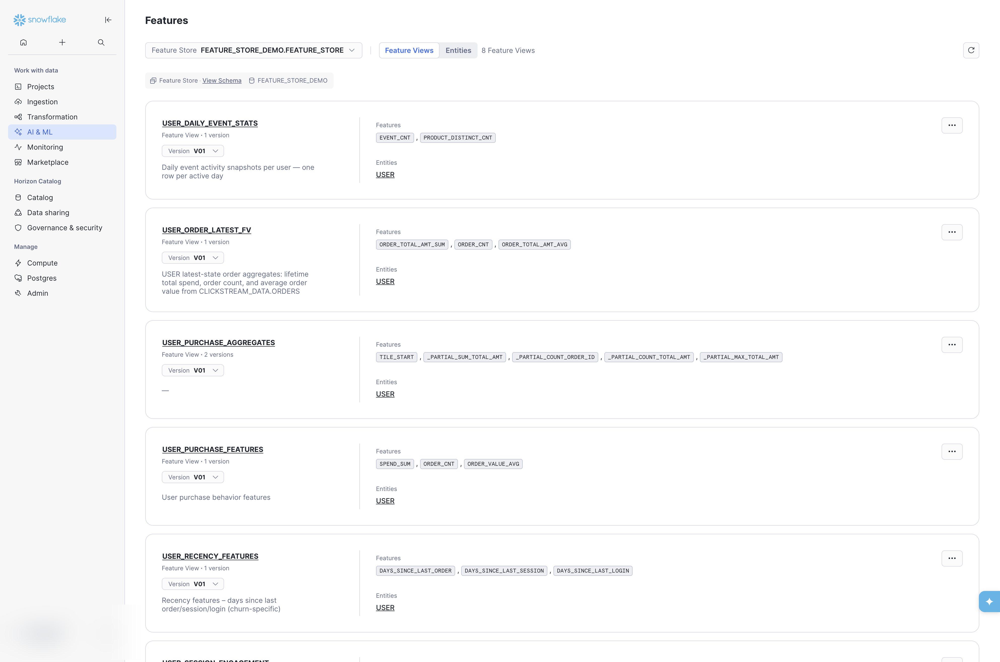
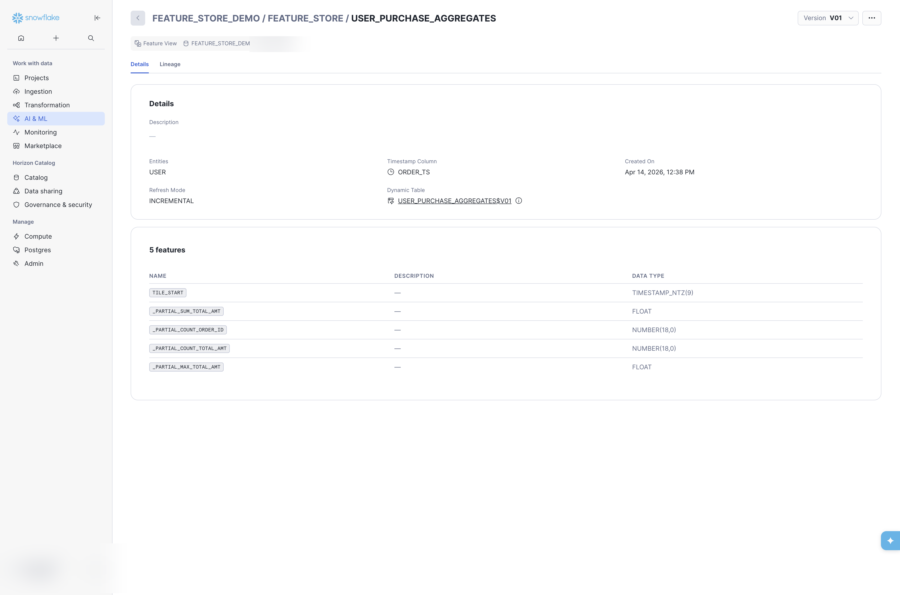
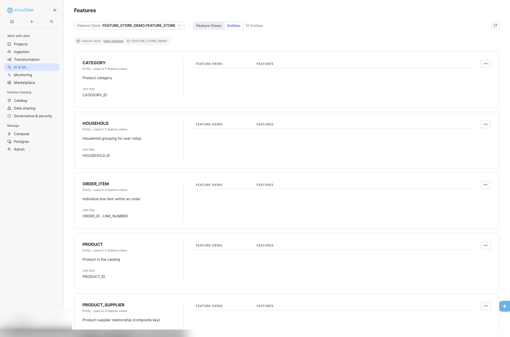
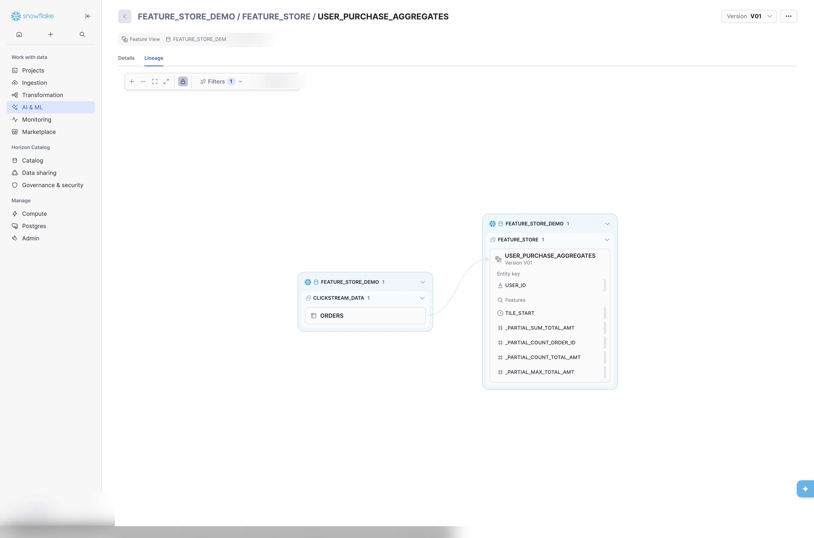
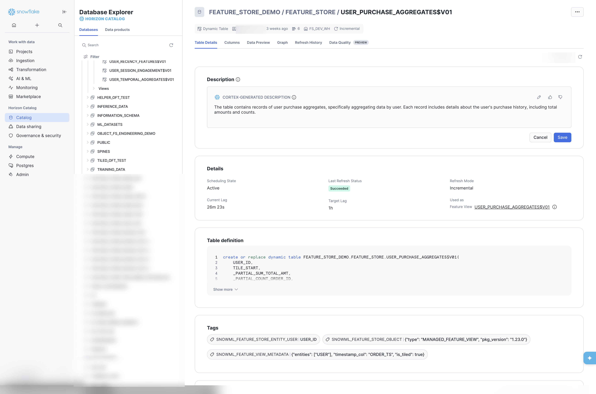
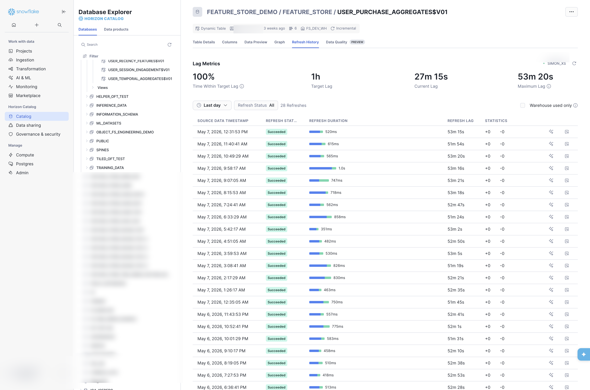
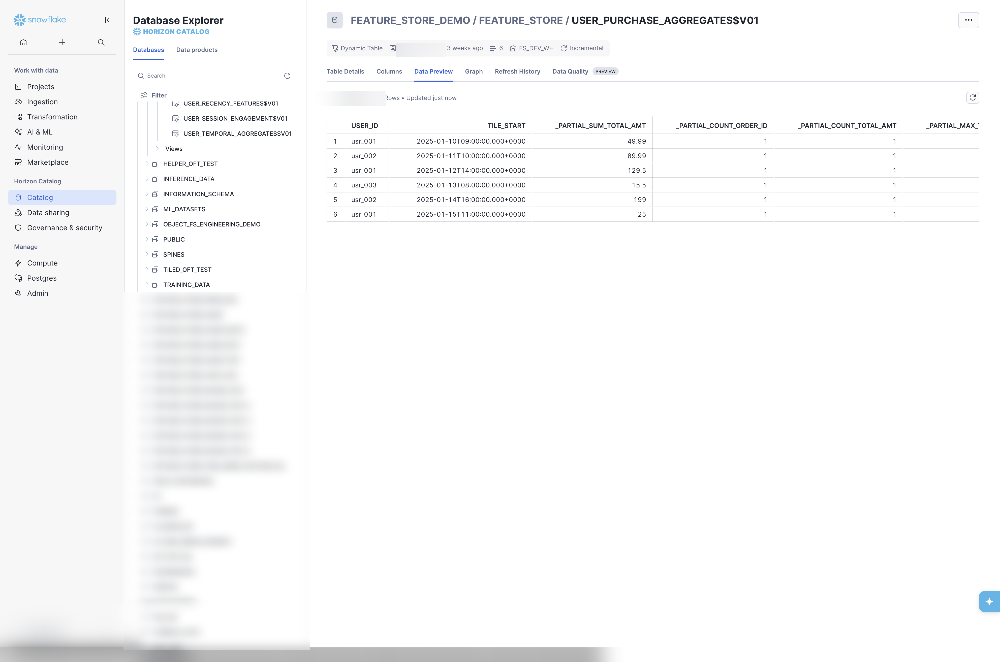

## Overview

Operational excellence is critical for production Feature Stores. This chapter covers monitoring, data quality, lineage tracking, and day-to-day operational management.

Examples use the **clickstream** sample layout: database `FEATURE_STORE_DEMO`, Feature Store schema `FEATURE_STORE`, source schema `CLICKSTREAM_DATA`, warehouse `FS_DEV_WH`, and Feature View version labels in **`V01`** format (for example `version="V01"`, dynamic table suffix `$V01`).

## Learning Objectives

After completing this chapter, you will be able to:

- Monitor Feature Store health and performance
- Apply Dynamic Table SQL features beyond the Python API (INITIALIZATION_WAREHOUSE, ROW_TIMESTAMP, retention settings)
- Implement data quality checks
- Track data lineage end-to-end
- Discover and search existing features to avoid duplication
- Troubleshoot common issues

> 📂 **Chapter code:** [Browse companion scripts on GitHub](https://github.com/Snowflake-Labs/snowflake-featurestore-imp-guide/tree/main/Snowflake_FeatureStore_Implementation_Guide/12_operations/_code)

```{python}
#| output: false
#| echo: false

from snowflake.snowpark import Session
from snowflake.snowpark import functions as F
from snowflake.snowpark.context import get_active_session
from snowflake.ml.feature_store import FeatureStore, CreationMode

try:
    session = get_active_session()
except Exception:
    session = Session.builder.config("connection_name", "default").create()

fs = FeatureStore(
    session=session,
    database="FEATURE_STORE_DEMO",
    name="FEATURE_STORE",
    default_warehouse="FS_DEV_WH",
    creation_mode=CreationMode.CREATE_IF_NOT_EXIST,
)
```

---

## Metadata and INFORMATION_SCHEMA

Entity and Feature View definitions live in the **Snowflake ML Feature Store** service; they are **not** rows in non-existent views such as `INFORMATION_SCHEMA.MODELS`, `INFORMATION_SCHEMA.MODEL_DATASETS`, or `INFORMATION_SCHEMA.DATASET_FEATURE_VIEWS` — **those views do not exist**.

Use this instead:

| Need | Where to look |
|------|----------------|
| Physical columns behind features | `INFORMATION_SCHEMA.COLUMNS` (and `TABLES` / `VIEWS` for object types) |
| Dynamic Table refresh / lag | `TABLE(INFORMATION_SCHEMA.DYNAMIC_TABLE_REFRESH_HISTORY(...))`, `TABLE(INFORMATION_SCHEMA.DYNAMIC_TABLES())` |
| Model Registry models | `INFORMATION_SCHEMA.MODEL_VERSIONS` (not `MODELS`) |
| Python API catalog | `FeatureStore.list_feature_views()`, `get_feature_view()` |

---

## Refresh Monitoring

### Dynamic Table Refresh Status

> 📁 **Full code:** [`_code/monitoring.sql`](_code/monitoring.sql)

Refresh history is exposed by the **table function** [`DYNAMIC_TABLE_REFRESH_HISTORY`](https://docs.snowflake.com/en/sql-reference/functions/dynamic_table_refresh_history) (invoke via `TABLE(INFORMATION_SCHEMA.DYNAMIC_TABLE_REFRESH_HISTORY(...))`).

```sql
-- Check refresh history for a registered Feature View backed by a Dynamic Table
SELECT
    NAME,
    STATE,
    REFRESH_START_TIME,
    REFRESH_END_TIME,
    STATISTICS:numInsertedRows::INT AS ROWS_INSERTED
FROM TABLE(INFORMATION_SCHEMA.DYNAMIC_TABLE_REFRESH_HISTORY(
    NAME => 'FEATURE_STORE_DEMO.FEATURE_STORE.USER_ORDER_FV$V01'
))
ORDER BY REFRESH_START_TIME DESC
LIMIT 10;

-- Check current lag
SELECT
    NAME,
    TARGET_LAG,
    SCHEDULING_STATE,
    DATA_TIMESTAMP,
    TIMESTAMPDIFF('minute', DATA_TIMESTAMP, CURRENT_TIMESTAMP()) AS LAG_MINUTES
FROM TABLE(INFORMATION_SCHEMA.DYNAMIC_TABLES())
WHERE DATABASE_NAME = 'FEATURE_STORE_DEMO'
  AND SCHEMA_NAME = 'FEATURE_STORE';
```

### Manual Refresh

To trigger a refresh outside the scheduled `refresh_freq` (see also [Chapter 6: backfill patterns](../06_temporal_features/index.qmd)):

::: {.panel-tabset}

## Python API

```python
fv = fs.get_feature_view(name="USER_ORDER_FV", version="V01")
fs.refresh_feature_view(fv)
```

## SQL

```sql
ALTER DYNAMIC TABLE FEATURE_STORE_DEMO.FEATURE_STORE."USER_ORDER_FV$V01" REFRESH;
```

:::

### Alerting for Stale Features

```sql
-- Create alert for stale features (>60 min lag)
CREATE ALERT feature_staleness_alert
  WAREHOUSE = FS_DEV_WH
  SCHEDULE = 'USING CRON 0 * * * * UTC'
  IF (EXISTS (
    SELECT *
    FROM TABLE(INFORMATION_SCHEMA.DYNAMIC_TABLES())
    WHERE DATABASE_NAME = 'FEATURE_STORE_DEMO'
      AND SCHEMA_NAME = 'FEATURE_STORE'
      AND TIMESTAMPDIFF('minute', DATA_TIMESTAMP, CURRENT_TIMESTAMP()) > 60
  ))
  THEN
    CALL SYSTEM$SEND_EMAIL('ml-alerts@company.com', 'Stale Features', 'Alert');
```

::: {.callout-important title="Auto-suspension after 5 consecutive refresh failures"}
Snowflake automatically **suspends** a Dynamic Table after **5 consecutive refresh failures**. Timeouts and cancellations count toward this threshold; skipped refreshes (where the table was not attempted because an upstream DT failed with `UPSTREAM_FAILED`) do not count.

Once suspended, the Feature View DT will not refresh again until manually resumed -- staleness accumulates silently. The alert above catches lag, but it will not fire if the table is suspended and data is simply stale. Add a second alert targeting `SCHEDULING_STATE`:

```sql
-- Alert when any Feature View DT is suspended (auto-suspend after 5 consecutive failures)
CREATE ALERT feature_view_suspended_alert
  WAREHOUSE = FS_DEV_WH
  SCHEDULE = 'USING CRON */15 * * * * UTC'
  IF (EXISTS (
    SELECT *
    FROM TABLE(INFORMATION_SCHEMA.DYNAMIC_TABLES())
    WHERE DATABASE_NAME = 'FEATURE_STORE_DEMO'
      AND SCHEMA_NAME = 'FEATURE_STORE'
      AND SCHEDULING_STATE:state::STRING = 'SUSPENDED'
  ))
  THEN
    CALL SYSTEM$SEND_EMAIL('ml-alerts@company.com', 'Feature View Suspended', 'Alert');
```

To resume a suspended Feature View:
```python
# Python API
fs.resume_feature_view(fs.get_feature_view("MY_FV", "V01"))

# SQL
ALTER DYNAMIC TABLE FEATURE_STORE_DEMO.FEATURE_STORE."MY_FV$V01" RESUME;
```

Investigate the root cause in `DYNAMIC_TABLE_REFRESH_HISTORY` before resuming -- resuming without fixing the underlying issue will restart the failure countdown.
:::

---

## Dynamic Table SQL Features Beyond the API {#sec-dt-sql-features}

The Feature Store Python API exposes the most common Dynamic Table parameters (`refresh_freq`, `warehouse`, etc.), but several powerful DT capabilities are only available via SQL today. You can apply these by creating the DT directly in SQL and wrapping it as a view-based Feature View, or by using `ALTER DYNAMIC TABLE` after the API creates the DT.

::: {.callout-note}
Check the [Feature Store release notes](https://docs.snowflake.com/en/developer-guide/snowflake-ml/feature-store) for future API integration of these features. See also [Appendix C](../appendices/C_snowpark_to_dynamic_table/index.qmd) for `IMMUTABLE WHERE` and `BACKFILL FROM`.
:::

::: {.callout-important title="TAG registration required for API visibility"}
Dynamic Tables created via SQL in the Feature Store schema are not visible to `fs.list_feature_views()` or the Snowsight Feature Store UI unless the correct internal TAGs are applied. When using `ALTER DYNAMIC TABLE` on an API-created object, the tags are already present. When creating a new DT entirely via SQL, you must add them yourself. See [Appendix D: Tag Convention](../appendices/D_tag_convention/index.qmd) for the required TAG schema and worked examples.
:::

### INITIALIZATION_WAREHOUSE

The initial population of a Dynamic Table (and any full re-initialization) is often far more expensive than incremental refreshes. `INITIALIZATION_WAREHOUSE` lets you point that one-time heavy lift at a larger warehouse while keeping a smaller, cheaper warehouse for day-to-day refreshes.

```sql
CREATE DYNAMIC TABLE FEATURE_STORE.USER_ORDER_FV$V01
  TARGET_LAG  = '1 hour'
  WAREHOUSE   = 'FS_PROD_WH'                  -- XS for incremental
  INITIALIZATION_WAREHOUSE = 'FS_INIT_4XL_WH' -- 4XL for first load
  AS
    SELECT ...;

-- Change or remove after creation
ALTER DYNAMIC TABLE FEATURE_STORE.USER_ORDER_FV$V01
  SET INITIALIZATION_WAREHOUSE = 'FS_INIT_2XL_WH';

ALTER DYNAMIC TABLE FEATURE_STORE.USER_ORDER_FV$V01
  UNSET INITIALIZATION_WAREHOUSE;
```

This is particularly valuable when promoting features to production where large historical datasets must be materialized for the first time, or when recovering from a full re-initialization event.

### INITIALIZE

By default, `CREATE DYNAMIC TABLE` (and `fs.register_feature_view()`) blocks until the initial refresh completes before returning. For large Feature Views this can take minutes or longer, holding up CI/CD pipelines or deployment scripts.

Set `INITIALIZE = ON_SCHEDULE` to make the CREATE statement return immediately. The table exists but is empty until its first scheduled refresh; queries against it during that window return a `Dynamic table is not initialized` error.

```sql
-- Create the DT without blocking -- initial data arrives on the first scheduled refresh
CREATE DYNAMIC TABLE FEATURE_STORE.USER_LARGE_HISTORY_FV$V01
  TARGET_LAG        = '1 hour'
  WAREHOUSE         = 'FS_PROD_WH'
  INITIALIZE        = ON_SCHEDULE   -- non-blocking; table is empty until first refresh
  AS
    SELECT ...;

-- Verify initialization before pointing consumers at the table
SELECT NAME, STATE, REFRESH_START_TIME, REFRESH_END_TIME
FROM TABLE(INFORMATION_SCHEMA.DYNAMIC_TABLE_REFRESH_HISTORY(
    NAME => 'FEATURE_STORE_DEMO.FEATURE_STORE.USER_LARGE_HISTORY_FV$V01'
))
ORDER BY REFRESH_START_TIME DESC
LIMIT 1;
-- STATE = 'SUCCEEDED' and REFRESH_END_TIME is populated → safe to query
```

The Feature Store Python API does not yet expose `INITIALIZE`. Apply it by creating the DT via SQL with the pattern above, or add it to an API-created DT using `ALTER DYNAMIC TABLE ... SET INITIALIZE = ON_SCHEDULE` before the first refresh cycle.

### ROW_TIMESTAMP

Row timestamps (`METADATA$ROW_LAST_COMMIT_TIME`) record the exact commit time of each row's last modification. Enabling this on Feature View Dynamic Tables gives you built-in pipeline observability -- you can measure end-to-end latency from source ingestion to feature availability without building custom auditing.

```sql
CREATE DYNAMIC TABLE FEATURE_STORE.SESSION_EVENT_FV$V01
  TARGET_LAG    = '1 hour'
  WAREHOUSE     = 'FS_PROD_WH'
  ROW_TIMESTAMP = TRUE
  AS
    SELECT ...;

-- Query freshness: how stale are the features?
SELECT USER_ID,
       METADATA$ROW_LAST_COMMIT_TIME AS FEATURE_UPDATED_AT,
       DATEDIFF('minute', METADATA$ROW_LAST_COMMIT_TIME, CURRENT_TIMESTAMP()) AS LAG_MINUTES
FROM FEATURE_STORE.SESSION_EVENT_FV$V01
ORDER BY LAG_MINUTES DESC
LIMIT 20;
```

Use cases for Feature Store pipelines:

- **Feature freshness SLAs** -- alert when `LAG_MINUTES` exceeds a threshold.
- **Incremental downstream processing** -- downstream consumers can use `METADATA$ROW_LAST_COMMIT_TIME` to efficiently identify rows that changed since their last read.
- **Audit and compliance** -- establish a definitive chronological record of when feature values were computed.

### DATA_RETENTION_TIME_IN_DAYS & MAX_DATA_EXTENSION_TIME_IN_DAYS

These parameters control [Time Travel](https://docs.snowflake.com/en/user-guide/data-time-travel) and staleness protection for Feature View Dynamic Tables.

| Parameter | Purpose | Default (SQL) |
|-----------|---------|---------------|
| `DATA_RETENTION_TIME_IN_DAYS` | How many days of historical snapshots are available via Time Travel (e.g., `AT(TIMESTAMP => ...)` queries) | 1 (but see note below) |
| `MAX_DATA_EXTENSION_TIME_IN_DAYS` | Grace period before a DT is marked **stale** due to upstream Time Travel expiry. If a DT cannot refresh within this window, it must be recreated. | 14 |

::: {.callout-warning}
## Feature Store API may set a higher retention default

The Feature Store Python API may set `DATA_RETENTION_TIME_IN_DAYS` to **90** when creating Dynamic Tables via `register_feature_view()`, rather than the SQL default of 1. Verify with `SHOW DYNAMIC TABLES` after registration. For Feature Views with **frequently changing data and high update volumes**, 90 days of Time Travel retention can be **very expensive** in storage. Reduce it to match your actual debugging and reproducibility needs:

```sql
ALTER DYNAMIC TABLE FEATURE_STORE_DEMO.FEATURE_STORE."USER_ORDER_FV$V01"
  SET DATA_RETENTION_TIME_IN_DAYS = 1;
```
:::

```sql
CREATE DYNAMIC TABLE FEATURE_STORE.USER_ORDER_FV$V01
  TARGET_LAG                      = '1 hour'
  WAREHOUSE                       = 'FS_PROD_WH'
  DATA_RETENTION_TIME_IN_DAYS     = 7
  MAX_DATA_EXTENSION_TIME_IN_DAYS = 28
  AS
    SELECT ...;

-- Adjust on an existing DT
ALTER DYNAMIC TABLE FEATURE_STORE.USER_ORDER_FV$V01
  SET DATA_RETENTION_TIME_IN_DAYS = 14;
```

**When to increase these values:**

- **`DATA_RETENTION_TIME_IN_DAYS`** -- increase when you need to reproduce historical training sets or debug feature drift by querying the DT at a past point in time. Enterprise Edition supports up to 90 days.
- **`MAX_DATA_EXTENSION_TIME_IN_DAYS`** -- increase for DTs with very long `TARGET_LAG` or infrequent refresh schedules to prevent accidental staleness. Be aware that higher values increase storage costs because Snowflake retains more micro-partition history.

::: {.callout-tip}
**Combine for resilience.** For production Feature Views, consider setting `DATA_RETENTION_TIME_IN_DAYS = 7` (enables weekly point-in-time debugging) alongside `INITIALIZATION_WAREHOUSE` (fast recovery if re-initialization is needed) and `ROW_TIMESTAMP = TRUE` (freshness monitoring). Together these provide a robust operational baseline.
:::

---

## Online Feature Table (OFT) Monitoring

For **online feature tables** (hybrid tables), use:

1. **Refresh history:** [`ONLINE_FEATURE_TABLE_REFRESH_HISTORY`](https://docs.snowflake.com/en/sql-reference/functions/online-feature-table-refresh-history) — `TABLE(INFORMATION_SCHEMA.ONLINE_FEATURE_TABLE_REFRESH_HISTORY(...))`.
2. **Storage:** [`SNOWFLAKE.ACCOUNT_USAGE.HYBRID_TABLES`](https://docs.snowflake.com/en/sql-reference/account-usage/hybrid_tables).
3. **Usage:** [`SNOWFLAKE.ACCOUNT_USAGE.HYBRID_TABLE_USAGE_HISTORY`](https://docs.snowflake.com/en/sql-reference/account-usage/hybrid_table_usage_history).

See [`_code/monitoring.sql`](_code/monitoring.sql) for example `ONLINE_FEATURE_TABLE_REFRESH_HISTORY` query.

---

## Warehouse Sizing for Feature Store Workloads {#sec-warehouse-sizing}

Different Feature Store operations have different compute profiles. Using the right warehouse type and size for each workload avoids both under-provisioning (OOM, timeouts) and over-provisioning (wasted spend).

### Workload Profiles

| Workload | Compute profile | Recommended warehouse |
|----------|----------------|----------------------|
| DT refresh (incremental) | Low CPU, low memory | Standard XS-S |
| DT refresh (full / initial) | High CPU, moderate memory | Standard L-2XL (or `INITIALIZATION_WAREHOUSE` at 4XL) |
| Dataset generation (`generate_training_set`) | High parallelism, wide shuffles | Standard Gen2 XL-4XL |
| Model training (in Snowpark stored procedures) | Single-node, high memory | Snowpark Optimized M-XL |
| Online Feature Table sync | Background, managed | No warehouse required (managed service) |

### Standard vs Snowpark Optimized

A common mistake is using **Snowpark Optimized (SPO)** warehouses for join-heavy operations like `generate_training_set`. SPO warehouses have fewer, larger nodes -- designed for Python UDFs that need large per-node memory. Dataset generation is a distributed SQL operation where parallelism matters more than per-node memory:

| Warehouse | Nodes (approx) | Memory per node | Total memory | Credits/hr |
|-----------|----------------|-----------------|-------------|------------|
| Standard 4XL | ~128 | ~16 GB | ~2 TB | 128 |
| SPO 3XL | ~16 | ~256 GB | ~4 TB | ~96 |

For the same credit spend, standard Gen2 provides ~8x more parallelism, significantly reducing shuffle and sort times for wide joins.

::: {.callout-tip title="Separate warehouses by workload"}
Use at least two warehouses: a **small standard warehouse** (XS-S) for incremental DT refreshes (they need minimal compute when source changes are small), and a **larger standard Gen2 warehouse** (XL-4XL) for dataset generation and initial DT population. The `INITIALIZATION_WAREHOUSE` DT parameter (see [above](#sec-dt-sql-features)) lets you assign a large warehouse for one-time population without affecting ongoing refresh costs.
:::

### Sizing for Tiled Feature Views

Tiled aggregation Feature Views (`features` + `feature_granularity`) have two distinct compute phases:

1. **Tile computation** (DT refresh) -- aggregates source data into tiles. Cost scales with source data volume and tile count.
2. **Tile reassembly** (query time / dataset generation) -- combines tiles into windows for each spine row. Cost scales with `spine_rows × tiles_per_window`.

For tile computation, a small warehouse (XS-M) is usually sufficient since each refresh only processes new/changed tiles. For tile reassembly during dataset generation, the cost can be substantial when combining long lookback windows (e.g., 360 days of daily tiles = 360 tiles per entity per window). Use the multi-granularity tile strategy from [Chapter 7](../07_aggregations_api/index.qmd#sec-multi-granularity) to reduce tile counts for long windows.

---

## Feature Discovery & Metadata

### Listing Feature Views

> 📁 **Full code:** [`_code/discovery.py`](_code/discovery.py)

::: {.panel-tabset}

## Python API

```python
fs.list_feature_views().select("NAME", "VERSION", "DESC").show()
```

## SQL

```sql
-- DT-backed Feature Views
SHOW DYNAMIC TABLES IN SCHEMA FEATURE_STORE_DEMO.FEATURE_STORE;

-- View-based Feature Views
SHOW VIEWS IN SCHEMA FEATURE_STORE_DEMO.FEATURE_STORE;
```

:::

```{python}
#| echo: false
fs.list_feature_views().select("NAME", "VERSION", "DESC").show()
```

### SQL metadata queries

There is no `DESCRIBE FEATURE VIEW` syntax in Snowflake. The underlying object is either a **Dynamic Table** (managed Feature View) or a **View** (external Feature View). Determine the object type first, then describe it:

```sql
-- Determine whether the underlying object is a TABLE (Dynamic Table) or VIEW
SELECT TABLE_NAME, TABLE_TYPE
FROM FEATURE_STORE_DEMO.INFORMATION_SCHEMA.TABLES
WHERE TABLE_SCHEMA = 'FEATURE_STORE'
  AND TABLE_NAME = 'USER_ORDER_FV$V01';

-- For Dynamic Tables: DESCRIBE TABLE
DESCRIBE TABLE FEATURE_STORE_DEMO.FEATURE_STORE."USER_ORDER_FV$V01";

-- For Views: DESCRIBE VIEW
DESCRIBE VIEW FEATURE_STORE_DEMO.FEATURE_STORE."USER_PROFILE_FV$V01";

-- List columns across all Feature Store objects
SELECT
    TABLE_NAME AS FEATURE_VIEW,
    COLUMN_NAME AS FEATURE,
    DATA_TYPE,
    COMMENT
FROM FEATURE_STORE_DEMO.INFORMATION_SCHEMA.COLUMNS
WHERE TABLE_SCHEMA = 'FEATURE_STORE';
```

### Searching columns safely with Snowpark

Do **not** build `INFORMATION_SCHEMA` SQL with f-strings from user input. Use Snowpark DataFrame filters with `F.lit()` for safe parameterisation:

```{python}
def search_feature_columns(session, search_term: str, limit: int = 50):
    """Search Feature Store columns by name pattern (case-insensitive)."""
    cols_df = session.table("FEATURE_STORE_DEMO.INFORMATION_SCHEMA.COLUMNS").filter(
        F.col("TABLE_SCHEMA") == "FEATURE_STORE"
    )
    return (
        cols_df.filter(
            F.lower(F.col("COLUMN_NAME")).like(F.concat(F.lit("%"), F.lit(search_term.lower()), F.lit("%")))
            | F.lower(F.col("COMMENT")).like(F.concat(F.lit("%"), F.lit(search_term.lower()), F.lit("%")))
        )
        .select(
            F.col("TABLE_NAME").alias("FEATURE_VIEW"),
            F.col("COLUMN_NAME").alias("FEATURE_NAME"),
            F.col("COMMENT").alias("DESCRIPTION"),
        )
        .limit(limit)
        .collect()
    )

rows = search_feature_columns(session, "ORDER")
for r in rows:
    print(f"  {r['FEATURE_VIEW']:45s}  {r['FEATURE_NAME']}")
```

### Avoiding Duplicate Features

A recurring challenge in fast-moving teams is **accidentally re-creating features** that already exist. Before creating a new Feature View, query existing features by name pattern:

```sql
-- Search for existing features by name pattern (clickstream-aligned)
SELECT 
    TABLE_NAME AS FEATURE_VIEW,
    COLUMN_NAME AS FEATURE_NAME,
    COMMENT AS DESCRIPTION
FROM INFORMATION_SCHEMA.COLUMNS
WHERE TABLE_CATALOG = 'FEATURE_STORE_DEMO'
  AND TABLE_SCHEMA = 'FEATURE_STORE'
  AND (
      COLUMN_NAME LIKE '%ORDER_%'
      OR COLUMN_NAME LIKE '%EVENT_%'
      OR COMMENT ILIKE '%order%'
  )
ORDER BY TABLE_NAME, COLUMN_NAME;
```

::: {.callout-tip}
This is particularly important when multiple squads work on the same entity (e.g., multiple USER or SESSION Feature View pipelines) or when onboarding new teams unfamiliar with existing feature catalogs.
:::

**Detecting duplicate feature names after the fact.** Use `OBJECT_AGG` to group feature column names and see which names appear in more than one Feature View:

```sql
SELECT
    COLUMN_NAME AS FEATURE_NAME,
    COUNT(*)    AS FV_COUNT,
    OBJECT_AGG(TABLE_NAME, DATA_TYPE) AS FEATURE_VIEWS
FROM FEATURE_STORE_DEMO.INFORMATION_SCHEMA.COLUMNS
WHERE TABLE_SCHEMA = 'FEATURE_STORE'
  AND COLUMN_NAME NOT IN ('USER_ID', 'SESSION_ID', 'ORDER_ID')  -- exclude entity keys
GROUP BY COLUMN_NAME
HAVING COUNT(*) > 1
ORDER BY FV_COUNT DESC;
```

The `FEATURE_VIEWS` column returns an OBJECT mapping each Feature View name to the column's data type, making it easy to spot inconsistencies (e.g., the same feature name stored as `NUMBER` in one FV and `FLOAT` in another).

### Searching Feature Views by Name or Description

For a Python-first workflow, search across all registered Feature Views:

```python
def search_features(fs: FeatureStore, search_term: str) -> list:
    """Search for features by name or description."""
    all_fvs = fs.list_feature_views()
    results = []
    
    for fv_info in all_fvs.collect():
        fv = fs.get_feature_view(name=fv_info.name, version=fv_info.version)
        if search_term.lower() in fv.name.lower():
            results.append(fv)
        elif fv.desc and search_term.lower() in fv.desc.lower():
            results.append(fv)
    
    return results
```

### Feature Catalog View {#sec-feature-catalog}

The SDK and `INFORMATION_SCHEMA` queries above return raw metadata that requires post-processing. For SQL-first teams, a **pre-built catalog view** that joins column metadata, Feature Store TAGs, and Dynamic Table status into a single queryable reference is more practical:

```sql
CREATE OR REPLACE VIEW FEATURE_STORE.FEATURE_CATALOG AS
WITH tagged_objects AS (
    SELECT
        OBJECT_DATABASE,
        OBJECT_SCHEMA,
        OBJECT_NAME,
        TAG_VALUE
    FROM TABLE(INFORMATION_SCHEMA.TAG_REFERENCES_ALL_COLUMNS(
        'FEATURE_STORE',
        'SCHEMA'
    ))
    WHERE TAG_NAME = 'SNOWML_FEATURE_STORE_OBJECT'
      AND TAG_VALUE IN ('FEATURE_VIEW', 'ENTITY')
)
SELECT
    t.OBJECT_NAME                           AS FEATURE_VIEW_NAME,
    c.COLUMN_NAME,
    c.DATA_TYPE,
    c.COMMENT                               AS COLUMN_DESCRIPTION,
    t.TAG_VALUE                             AS OBJECT_TYPE,
    dt.TARGET_LAG,
    dt.REFRESH_MODE,
    dt.SCHEDULING_STATE
FROM tagged_objects t
JOIN INFORMATION_SCHEMA.COLUMNS c
    ON c.TABLE_SCHEMA = t.OBJECT_SCHEMA
   AND c.TABLE_NAME   = t.OBJECT_NAME
LEFT JOIN INFORMATION_SCHEMA.DYNAMIC_TABLES() dt
    ON dt.SCHEMA_NAME = t.OBJECT_SCHEMA
   AND dt.NAME        = t.OBJECT_NAME
ORDER BY t.OBJECT_NAME, c.ORDINAL_POSITION;
```

Query the catalog with standard SQL:

```sql
-- All features in a specific Feature View
SELECT * FROM FEATURE_STORE.FEATURE_CATALOG
WHERE FEATURE_VIEW_NAME = 'USER_PURCHASE_STATS$V01';

-- Find all FLOAT features across the Feature Store
SELECT FEATURE_VIEW_NAME, COLUMN_NAME
FROM FEATURE_STORE.FEATURE_CATALOG
WHERE DATA_TYPE = 'NUMBER' AND OBJECT_TYPE = 'FEATURE_VIEW';
```

::: {.callout-tip title="Cross-schema catalog for multi-FS setups"}
For organisations with multiple Feature Store schemas, create a union view that spans schemas. Either generate it dynamically with a Stored Procedure that iterates over `TAG_REFERENCES_ALL_COLUMNS` per schema, or maintain a static `UNION ALL` across known schemas. See [Chapter 13: Multi-Feature Store operations](../13_advanced_patterns/index.qmd#sec-sharing-patterns) for cross-FS discovery patterns.
:::

::: {.callout-note title="Product feedback opportunity"}
A built-in `fs.catalog()` or `FEATURE_STORE_CATALOG()` table function would eliminate the need for this manual view. If this pattern is valuable to your team, consider submitting it as product feedback via your Snowflake account team.
:::

---

## Snowsight Feature Store UI {#sec-snowsight-ui}

Snowsight provides a dedicated Feature Store interface for browsing Feature Views, Entities, metadata, and lineage — no SDK or SQL required. This section walks through the key panels using the clickstream sample environment.

::: {.callout-tip}
## Navigation path

**AI & ML → Features** in the left sidebar. Select a Feature Store from the dropdown at the top of the page (`database.schema`). The dropdown lists every schema that contains objects with the required Feature Store TAGs **and** that the current role has access to — if a schema is missing, either its objects have not been tagged or your active role lacks the necessary privileges. See [Appendix D: Tag Convention](../appendices/D_tag_convention/index.qmd) for the required TAG schema and [Chapter 2: RBAC](../02_design_organization/index.qmd#sec-rbac) for role configuration.
:::

### Feature View Listing

The landing page shows all registered Feature Views in the selected Feature Store. Each card displays the Feature View name, version count, version selector, description, feature column badges, and entity links.

{width=95%}

The listing provides a quick inventory of what is available. Descriptions (set via `desc` at registration time) are visible here, reinforcing why every Feature View should carry a meaningful description. The **Entities** tab at the top switches to the entity-centric view (see [Entities](#sec-snowsight-entities) below).

### Feature View Details

Click a Feature View name to open its detail page. The **Details** tab surfaces key metadata: entities, timestamp column, creation date, refresh mode, the underlying Dynamic Table or View link, and the full column schema with data types.

{width=95%}

The **Version** dropdown (top-right) lets you switch between versions of the same Feature View to compare schemas. The Dynamic Table or View link (under *Dynamic Table* or *View*) navigates directly to the underlying DT or View object in the Database Explorer — useful for inspecting refresh status, SQL definition, and TAG values (see [Underlying Dynamic Table](#sec-snowsight-dt) below).

### Entities {#sec-snowsight-entities}

The **Entities** tab on the Feature Store landing page lists all registered Entities with their descriptions, join keys, and associated Feature Views.

{width=95%}

Entity descriptions and composite join keys (e.g. `ORDER_ID, LINE_NUMBER` for `ORDER_ITEM`) are visible at a glance. This view is particularly useful for teams evaluating which entities exist before creating new Feature Views — helping avoid duplicate or inconsistent entity definitions.  It is also useful to see the entity links to the Feature Views that are associated with the entity, when developing an ML model at a specific entity level.

### Lineage {#sec-snowsight-lineage}

The **Lineage** tab on the Feature View detail page renders a visual graph showing the source-to-Feature View data flow, including the source database, schema, table, and the Feature View's entity key and feature columns.  It will also show downstream ML models that have been trained with data sourced from the Feature View.

{width=95%}

The lineage graph is interactive: zoom, pan, and click nodes to drill into source objects. For API and SQL-based lineage queries, see [Data Lineage](#sec-lineage) below.

### Underlying Dynamic Table {#sec-snowsight-dt}

Clicking the Dynamic Table link from the Feature View detail page navigates to the DT's page in the Database Explorer. This page surfaces operational metadata not visible in the Feature Store UI: scheduling state, current and target lag, refresh mode, the full `CREATE DYNAMIC TABLE` SQL definition, and — critically — the **Feature Store TAGs** applied to the object.

{width=95%}

::: {.callout-note}
## Feature Store TAGs on the Dynamic Table

The **Tags** section shows the three internal TAGs the Feature Store SDK applies at registration time:

- `SNOWML_FEATURE_STORE_ENTITY_USER` — links this DT to the `USER` entity
- `SNOWML_FEATURE_STORE_OBJECT` — marks the object as a managed Feature View (includes `type` and `pkg_version`)
- `SNOWML_FEATURE_VIEW_METADATA` — stores entity mappings, `timestamp_col`, and tiling configuration as JSON

These TAGs are what make the object visible in the Feature Store UI and discoverable via `fs.list_feature_views()`. Objects created via SQL without these TAGs will not appear. See [Appendix D: Tag Convention](../appendices/D_tag_convention/index.qmd) for the full TAG schema and SQL-only registration instructions.
:::

### Refresh History

The **Refresh History** tab on the Dynamic Table page provides lag metrics and a timeline of individual refreshes. The summary bar shows time within target lag, target lag, current lag, and maximum lag. Each refresh row shows the source data timestamp, status, duration, and refresh lag.

{width=95%}

Use the **Date Range** filter and **Refresh Status** filter to narrow to specific time windows or failure states. The **Warehouse used only** toggle distinguishes incremental refreshes that consumed warehouse credits from no-op checks. For alerting on stale features via SQL, see [Alerting for Stale Features](#alerting-for-stale-features) earlier in this chapter.

### Data Preview

The **Data Preview** tab on the Dynamic Table page shows a sample of the materialized data without writing any SQL — useful for quick validation that the Feature View is refreshing correctly and producing expected values.

{width=95%}

---

## Data Lineage {#sec-lineage}

### Feature Store API Lineage

The Feature Store API provides a `.lineage()` method on registered Feature Views that returns upstream and downstream dependencies:

```python
fv = fs.get_feature_view(name="USER_ORDER_FV", version="V01")
lineage = fv.lineage()
print(lineage)
```

This returns the lineage graph showing which source tables feed into the Feature View and which models or datasets consume it. Use this before deprecating or deleting a Feature View version to confirm there are no active consumers (see also [Chapter 4: Managing Versions](../04_feature_views/index.qmd#sec-versioning)).

### Object Dependencies (SQL)

For a SQL-level view of dependencies, query `ACCOUNT_USAGE.OBJECT_DEPENDENCIES`:

```sql
-- View Feature View dependencies (Dynamic Table name includes $V01)
SELECT *
FROM SNOWFLAKE.ACCOUNT_USAGE.OBJECT_DEPENDENCIES
WHERE REFERENCING_OBJECT_NAME = 'USER_ORDER_FV$V01'
  AND REFERENCING_OBJECT_DOMAIN = 'DYNAMIC TABLE';
```

### Access History

```sql
-- Track feature usage across queries
SELECT *
FROM SNOWFLAKE.ACCOUNT_USAGE.ACCESS_HISTORY
WHERE BASE_OBJECTS_ACCESSED LIKE '%USER_ORDER_FV%'
ORDER BY QUERY_START_TIME DESC
LIMIT 100;
```

---

## Data Quality Monitoring

### Data Metric Functions (DMFs)

Snowflake **system** DMFs (for example `SNOWFLAKE.CORE.NULL_COUNT`, `NULL_PERCENT`, `ROW_COUNT`) are documented under [Data metric functions](https://docs.snowflake.com/en/sql-reference/functions-data-metric). Overview: [Introduction to data quality checks](https://docs.snowflake.com/en/user-guide/data-quality-intro).

**Custom** DMFs must declare **`RETURNS NUMBER`** (not `DECIMAL`); associate them with **`ALTER TABLE`** / **`ALTER VIEW`** using `ADD DATA METRIC FUNCTION`, and set schedules with `SET DATA_METRIC_SCHEDULE` ([working with DMFs in SQL](https://docs.snowflake.com/en/user-guide/data-quality-working)).

```sql
-- Custom DMF: null rate for a string column (RETURNS NUMBER per CREATE DATA METRIC FUNCTION)
CREATE OR REPLACE DATA METRIC FUNCTION FEATURE_STORE.NULL_RATE_STRING(
  t TABLE(col VARCHAR)
)
RETURNS NUMBER
LANGUAGE SQL
AS
$$
  SELECT COALESCE(
    SUM(IFF(col IS NULL, 1, 0)) / NULLIF(COUNT(*), 0),
    0
  )::NUMBER
  FROM t
$$;

-- Prefer system DMF when it fits — e.g. NULL_COUNT on a feature column
ALTER TABLE FEATURE_STORE_DEMO.FEATURE_STORE."USER_ORDER_FV$V01"
  ADD DATA METRIC FUNCTION SNOWFLAKE.CORE.NULL_COUNT ON (USER_ID);

ALTER TABLE FEATURE_STORE_DEMO.FEATURE_STORE."USER_ORDER_FV$V01"
  SET DATA_METRIC_SCHEDULE = 'USING CRON 0 * * * * UTC';
```

Dynamic tables support DMFs as table objects; use **`ALTER TABLE`** with the fully qualified dynamic table name (quote the identifier if it contains `$`).

### Standardized DMF Attachment for Feature Views

Manually attaching DMFs to each Feature View is error-prone and doesn't scale. Create a stored procedure that applies a standard set of quality checks to any registered Feature View:

```python
def attach_standard_dmfs(
    session,
    fv_full_name: str,
    schedule: str = "USING CRON 0 * * * * UTC",
):
    """
    Attach a standard set of DMFs to a registered Feature View DT.
    Call after register_feature_view() for each production FV.

    fv_full_name: fully qualified DT name, e.g.
        'FEATURE_STORE_DEMO.FEATURE_STORE."USER_ORDER_FV$V01"'
    """
    quoted = fv_full_name

    cols = session.sql(f"DESCRIBE TABLE {quoted}").collect()
    for col in cols:
        col_name = col["name"]
        session.sql(f"""
            ALTER TABLE {quoted}
              ADD DATA METRIC FUNCTION SNOWFLAKE.CORE.NULL_COUNT ON ("{col_name}")
        """).collect()

    session.sql(f"""
        ALTER TABLE {quoted}
          ADD DATA METRIC FUNCTION SNOWFLAKE.CORE.ROW_COUNT ON ()
    """).collect()

    session.sql(f"""
        ALTER TABLE {quoted}
          SET DATA_METRIC_SCHEDULE = '{schedule}'
    """).collect()
```

Call this immediately after registering each production Feature View:

```python
registered_fv = fs.register_feature_view(user_order_fv, version="V01", block=True)
attach_standard_dmfs(
    session,
    'FEATURE_STORE_DEMO.FEATURE_STORE."USER_ORDER_FV$V01"',
)
```

For a SQL-only workflow, wrap the same logic in a Snowflake Stored Procedure (`CREATE PROCEDURE ... LANGUAGE SQL` or `LANGUAGE PYTHON`) so it can be called from CI/CD pipelines or Tasks.

### Built-in Snowsight DMF Monitoring

Snowsight provides **built-in dashboards** for Data Metric Functions. Navigate to **Monitoring → Data Quality** to view DMF results without writing any code. The built-in UI shows metric history, alerting thresholds, and per-table/column health status. For basic monitoring needs this may be sufficient.

### Custom Monitoring with Streamlit in Snowflake

For Feature-Store-specific dashboards that go beyond what Snowsight provides out of the box, build a [Streamlit in Snowflake](https://docs.snowflake.com/en/developer-guide/streamlit/about-streamlit) app. DMF results accumulate in `SNOWFLAKE.LOCAL.DATA_QUALITY_MONITORING_RESULTS` and can be combined with other operational views:

- **Feature freshness dashboard** -- query `DYNAMIC_TABLES()` for lag and scheduling state; color-code by HEALTHY / WARNING / STALE thresholds.
- **Data quality trends** -- plot DMF results (null rates, row counts) over time per Feature View to detect drift or ingestion failures.
- **Cost attribution** -- join `SNOWFLAKE.ACCOUNT_USAGE.DYNAMIC_TABLE_REFRESH_HISTORY` with warehouse credit usage to show per-Feature-View compute costs.

```python
# Streamlit snippet: Feature View health summary
import streamlit as st

st.title("Feature Store Health")

health_df = session.sql("""
    SELECT NAME, SCHEDULING_STATE,
           TIMESTAMPDIFF('minute', DATA_TIMESTAMP, CURRENT_TIMESTAMP()) AS LAG_MINUTES
    FROM TABLE(INFORMATION_SCHEMA.DYNAMIC_TABLES())
    WHERE DATABASE_NAME = 'FEATURE_STORE_DEMO'
      AND SCHEMA_NAME = 'FEATURE_STORE'
""").to_pandas()

st.dataframe(
    health_df.style.applymap(
        lambda v: "background-color: red" if v > 60
        else "background-color: orange" if v > 30
        else "background-color: green",
        subset=["LAG_MINUTES"],
    )
)
```

A Streamlit dashboard provides operational visibility without requiring external BI tools and runs entirely within Snowflake.

---

## Feature Store Health Monitoring

### Quick Status Check

For a per-DT overview including refresh mode and last trigger:

```sql
SELECT 
    NAME,
    REFRESH_MODE,
    SCHEDULING_STATE,
    LAST_COMPLETED_REFRESH_START_TIME AS LAST_REFRESH_START_TS,
    LAST_REFRESH_TRIGGER
FROM TABLE(INFORMATION_SCHEMA.DYNAMIC_TABLES())
WHERE TABLE_CATALOG = 'FEATURE_STORE_DEMO'
  AND SCHEMA_NAME = 'FEATURE_STORE'
ORDER BY LAST_COMPLETED_REFRESH_START_TIME DESC;
```

Pay particular attention to the `REFRESH_MODE` column. If a Dynamic Table shows **`FULL`** when you expected **`INCREMENTAL`**, the underlying SQL contains a pattern the engine cannot track incrementally. The most common cause is **aggregations on `FLOAT`-typed columns combined with a JOIN in the same query block** (SUM, AVG, MIN, MAX, VAR, STD on FLOATs). The workaround is to cast float columns to fixed-point (`NUMBER(38, 6)`) before aggregating, or to split the query into a base DT (aggregation only) and a View layer that joins the results. See [Chapter 4: Feature Views](../04_feature_views/index.qmd) for the Base + Presentation pattern.

### Health Dashboard

Classify all Feature View DTs as HEALTHY, STALE, or WARNING:

```sql
WITH fv_health AS (
    SELECT
        NAME,
        SCHEDULING_STATE,
        TIMESTAMPDIFF('minute', DATA_TIMESTAMP, CURRENT_TIMESTAMP()) AS LAG_MINUTES,
        CASE
            WHEN SCHEDULING_STATE = 'RUNNING'
                 AND TIMESTAMPDIFF('minute', DATA_TIMESTAMP, CURRENT_TIMESTAMP()) < 60 THEN 'HEALTHY'
            WHEN TIMESTAMPDIFF('minute', DATA_TIMESTAMP, CURRENT_TIMESTAMP()) >= 60 THEN 'STALE'
            ELSE 'WARNING'
        END AS STATUS
    FROM TABLE(INFORMATION_SCHEMA.DYNAMIC_TABLES())
    WHERE DATABASE_NAME = 'FEATURE_STORE_DEMO'
      AND SCHEMA_NAME = 'FEATURE_STORE'
)
SELECT
    STATUS,
    COUNT(*) AS COUNT,
    ARRAY_AGG(NAME) AS FEATURE_VIEWS
FROM fv_health
GROUP BY STATUS;
```

---

## Best Practices

### 1. Monitor Proactively {.unnumbered}
```sql
-- Set up alerts before issues impact users
CREATE ALERT ...
```

### 2. Track Lineage {.unnumbered}
Document feature sources and consumers:

```python
fv = FeatureView(
    desc="""
    Sources: FEATURE_STORE_DEMO.CLICKSTREAM_DATA.ORDERS
    Consumers: churn_model_v1, ltv_model_v2
    Owner: ml-platform@company.com
    """,
    # ...
)
```

### 3. Regular Health Checks {.unnumbered}
Schedule weekly reviews:

- Feature View refresh status
- Data quality metrics
- Compute costs
- Unused features

### 4. Pin SDK Versions Across Environments {#sec-sdk-versioning .unnumbered}
Using different versions of `snowflake-ml-python` to create and retrieve Feature Views can cause inconsistent behavior, metadata mismatches, and retrieval errors. Feature Views registered with one SDK version may use internal formats that a different version cannot correctly interpret.

**Recommendations:**

- **Pin the same `snowflake-ml-python` version** in all environments: development notebooks, CI/CD pipelines, staging, and production stored procedures.
- **Use a `requirements.txt` or `conda` environment file** checked into source control alongside your feature definitions.
- **Test SDK upgrades** in a staging Feature Store before promoting to production. Register a representative set of Feature Views with the new version and verify that `generate_training_set`, `retrieve_feature_values`, and `get_refresh_history` all return expected results.
- **Document the SDK version** used for each Feature Store schema in your operational metadata (e.g., a `_FS_SDK_VERSION` tag or metadata table entry).

```python
# In your CI/CD pipeline or Dockerfile
# requirements.txt
snowflake-ml-python==1.34.0  # pin to exact version
snowflake-snowpark-python==1.48.1
```

See [Chapter 13: CI/CD for Feature Store](../13_advanced_patterns/index.qmd) for deployment pipeline patterns that enforce version consistency.

---

## Common Pitfalls

### ❌ Pitfall 1: No Monitoring

**Problem**: Issues discovered when models fail.

**Solution**: Implement proactive alerting.

### ❌ Pitfall 2: Missing Lineage

**Problem**: Can't trace feature issues to source.

**Solution**: Use OBJECT_DEPENDENCIES and document.

### ❌ Pitfall 3: Stale Features

**Problem**: Models using outdated features.

**Solution**: Monitor lag and set appropriate refresh.

### ❌ Pitfall 4: Non-existent INFORMATION_SCHEMA views

**Problem**: Queries fail or docs drift when assuming `INFORMATION_SCHEMA.MODELS` / `MODEL_DATASETS` / `DATASET_FEATURE_VIEWS`.

**Solution**: Use `COLUMNS` / `TABLES` / `VIEWS`, Dynamic Table functions, `MODEL_VERSIONS`, and the Feature Store Python API as in this chapter.

---

## Summary

| Capability | Implementation |
|------------|----------------|
| **Refresh Monitoring** | `INFORMATION_SCHEMA.DYNAMIC_TABLE_REFRESH_HISTORY`, `DYNAMIC_TABLES` |
| **Manual refresh** | `fs.refresh_feature_view(fv)` |
| **DT SQL Features** | `INITIALIZATION_WAREHOUSE`, `ROW_TIMESTAMP`, `DATA_RETENTION_TIME_IN_DAYS`, `MAX_DATA_EXTENSION_TIME_IN_DAYS` |
| **OFT monitoring** | `ONLINE_FEATURE_TABLE_REFRESH_HISTORY`, `HYBRID_TABLES`, `HYBRID_TABLE_USAGE_HISTORY` |
| **Feature Discovery** | `list_feature_views()`, `search_feature_columns()`, `DESCRIBE TABLE` / `DESCRIBE VIEW`, `INFORMATION_SCHEMA.COLUMNS` |
| **Feature Catalog View** | Pre-built SQL view joining columns, TAGs, and DT status into a single queryable catalog |
| **Snowsight UI** | Feature View listing, detail, entities, lineage graph, DT drill-through, refresh history, data preview |
| **Avoiding Duplicates** | Search by name pattern before creating new Feature Views |
| **Model Registry metadata** | `INFORMATION_SCHEMA.MODEL_VERSIONS` |
| **Lineage** | `FeatureView.lineage()`, `OBJECT_DEPENDENCIES`, `ACCESS_HISTORY` |
| **Data Quality** | System DMFs + custom DMFs; standardized attachment via Sproc; Streamlit dashboards |
| **Duplicate Detection** | `OBJECT_AGG` query on `INFORMATION_SCHEMA.COLUMNS` |

---

## Next Steps

Continue to [Chapter 13: Advanced Patterns](../13_advanced_patterns/index.qmd) to learn about streaming, multi-Feature Store, and CI/CD patterns.
