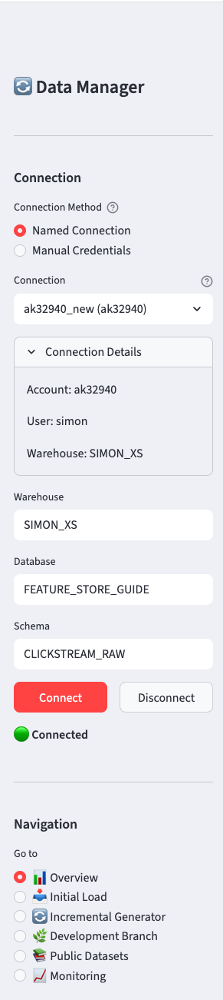
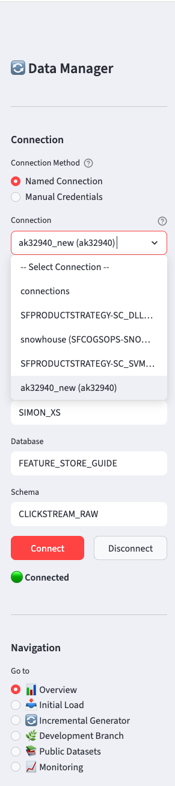
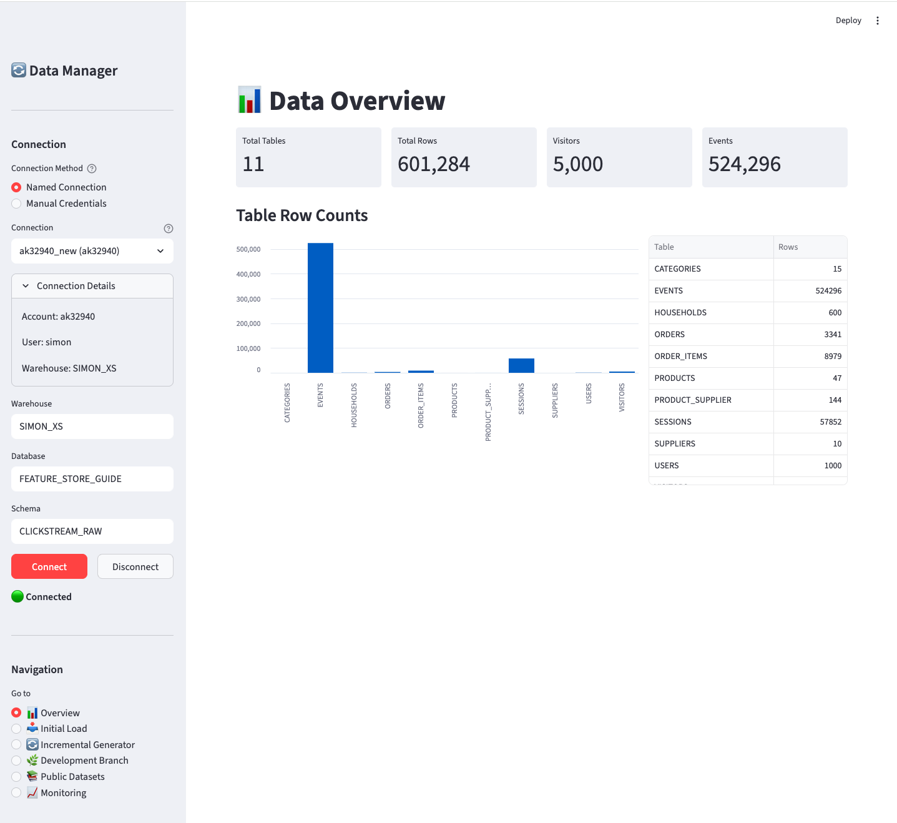
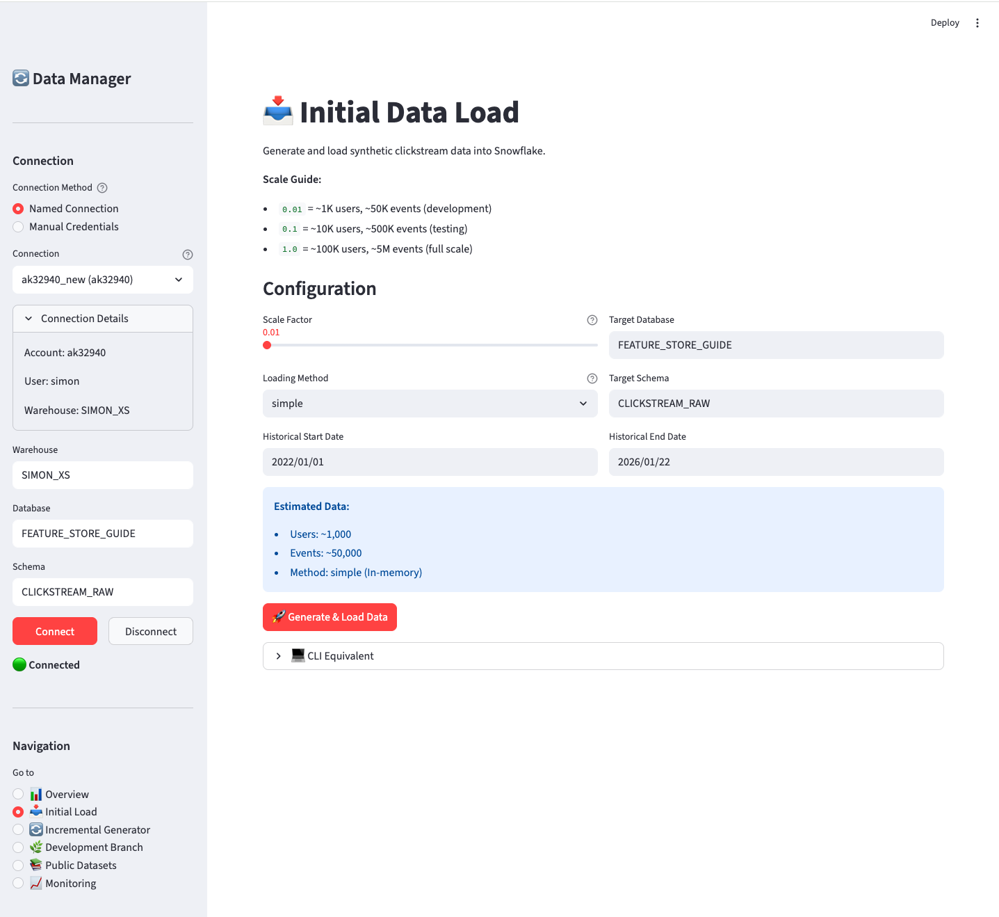
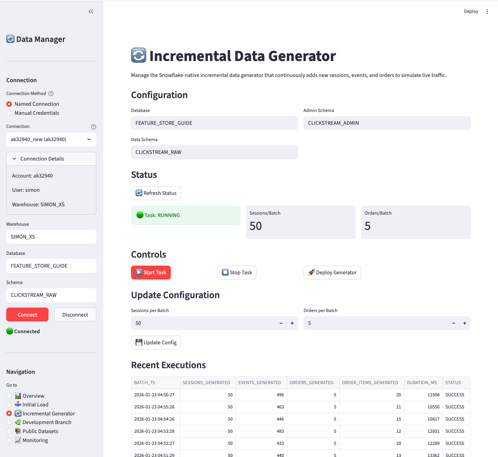
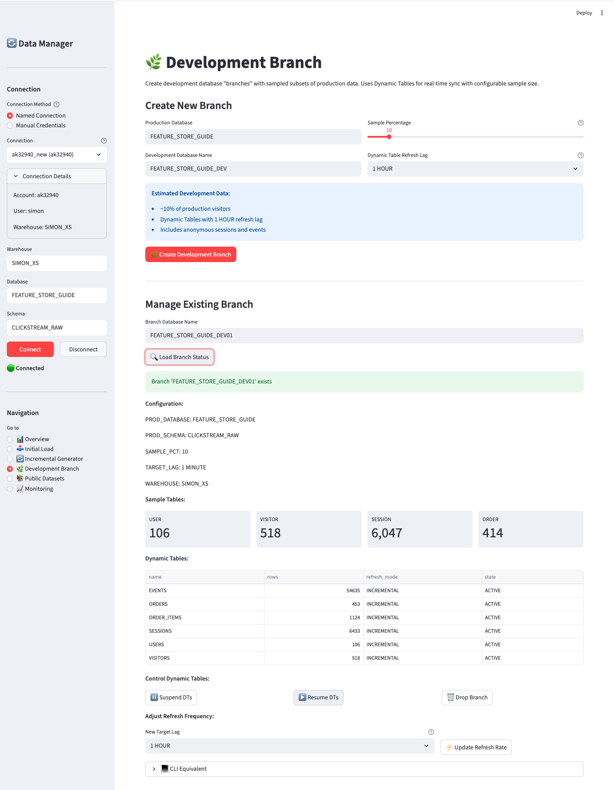
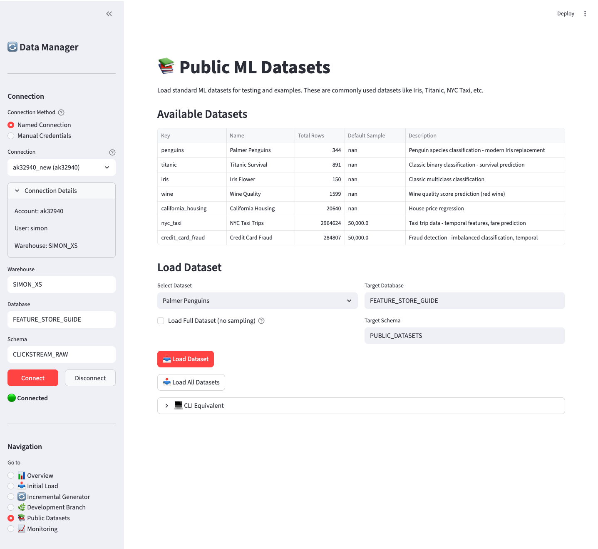
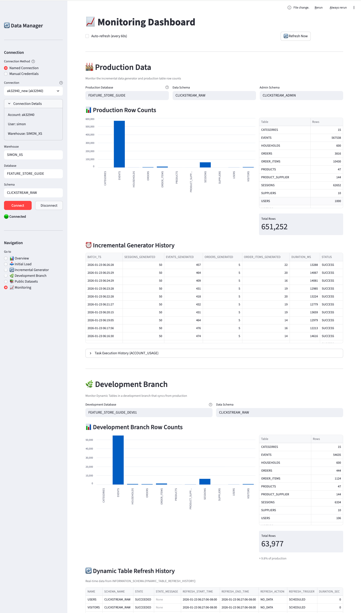

## Overview

The **Clickstream Data Manager** is a Streamlit application that provides an interactive interface for all data management tasks. It's the recommended way to set up sample data for the first time, as it guides you through each step with visual feedback.

{width=250 fig-align="left"}

### Features

| Page | Purpose |
|------|---------|
| 📊 Overview | Dashboard showing current data status |
| 📥 Initial Load | Generate and load synthetic clickstream data |
| 🔄 Incremental Generator | Manage continuous data generation task |
| 🌿 Development Branch | Create sampled dev environments with Dynamic Tables |
| 📚 Public Datasets | Load standard ML datasets |
| 📈 Monitoring | Track task and Dynamic Table refresh history |

## Quick Start

### Prerequisites

```bash
# Install dependencies
pip install streamlit pandas

# Optional: for TOML parsing (auto-detects connections)
pip install tomli  # Python < 3.11
```

### Launch the App

```bash
cd Snowflake_FeatureStore_Implementation_Guide/appendices/A_sample_data/data_manager/

# Option 1: Set connection via environment variable
export SNOWFLAKE_CONNECTION_NAME=your_connection
streamlit run app.py

# Option 2: Select connection in the UI (if connections.toml exists)
streamlit run app.py
```

The app will open in your browser at `http://localhost:8501`.

## Connecting to Snowflake

The sidebar provides two connection methods:

### Named Connection (Recommended)

If you have `~/.snowflake/connections.toml` configured, the app will automatically discover your connections:

{width=300}

Select your connection from the dropdown. The app shows connection details (account, user) to help you identify the right one.

### Manual Credentials

Alternatively, enter credentials directly:

- Account (e.g., `xy12345.us-east-1`)
- User
- Password

### Common Settings

Regardless of connection method, you can override:

- **Warehouse** - Compute warehouse to use
- **Database** - Target database (default: `FEATURE_STORE_DEMO`)
- **Schema** - Target schema (default: `CLICKSTREAM_DATA`)

Click **Connect** to establish the connection. The status indicator will show 🟢 when connected.

## Page Walkthroughs

### 📊 Overview

The Overview page shows the current state of your data:

{width=80%}

**Key metrics displayed:**

- Total tables and row counts
- Visitor and event counts
- Bar chart visualization of table sizes
- Detailed table breakdown

Use this page to verify data was loaded correctly or to check current data volumes.

---

### 📥 Initial Load

Generate and load synthetic clickstream data into your **Production database**.

This page creates the foundational clickstream data model that serves as the source for all feature engineering examples in this guide. The Production database contains the complete e-commerce dataset with visitors, sessions, events, orders, and supporting dimension tables.

{width=80%}

**Configuration options:**

| Option | Description | Default |
|--------|-------------|---------|
| Scale Factor | Controls data volume (0.01 = 1K users, 1.0 = 100K users) | 0.01 |
| Loading Method | `simple` (in-memory) or `bulk` (Parquet files) | simple |
| Target Database | Where to create the data | FEATURE_STORE_DEMO |
| Target Schema | Schema for data tables | CLICKSTREAM_DATA |
| Date Range | Historical date range for generated data | 2022-01-01 to yesterday |

**Scale guide:**

| Scale | Users | Sessions | Events | Orders | Use Case |
|-------|-------|----------|--------|--------|----------|
| 0.01 | ~1K | ~5K | ~50K | ~250 | Development |
| 0.1 | ~10K | ~50K | ~500K | ~2.5K | Testing |
| 1.0 | ~100K | ~500K | ~5M | ~25K | Full scale |

Click **Generate & Load Data** to start. The page shows progress and final row counts.

---

### 🔄 Incremental Generator

Transform your Production database into a **live, continuously updating dataset**.

This page deploys and manages a Snowflake-native incremental data generator that simulates real-time e-commerce traffic. Once started, the generator continuously adds new sessions, events, and orders to your Production database at a refresh frequency of your choosing. This enables testing of:

- Dynamic Tables that react to new data
- Streaming feature pipelines
- Point-in-time correct feature retrieval
- Real-time feature serving scenarios

{width=80%}

**Status section shows:**

- Task state (🟢 RUNNING / 🟡 SUSPENDED / ⚪ NOT DEPLOYED)
- Sessions per batch
- Orders per batch

**Controls:**

| Button | Action |
|--------|--------|
| ▶️ Start Task | Resume the incremental generation task |
| ⏹️ Stop Task | Suspend the task (stops generating data) |
| 🚀 Deploy Generator | Deploy the stored procedure and task (first time setup) |

**Configuration updates:**

Adjust sessions/orders per batch and click **Update Config** to change generation rate.

**Recent Executions:**

Shows the last 10 batch executions with timestamps, row counts, and duration.

::: {.callout-warning}
## Cost Consideration
The incremental generator runs on a schedule and consumes compute resources. Remember to **Stop Task** when not actively testing to avoid unnecessary costs.
:::

---

### 🌿 Development Branch

Create and maintain a **live subset of Production data** in a separate Development database.

This page creates a Development database branch that automatically stays synchronized with your Production database using Dynamic Tables. The branch contains a sampled subset of visitors (and all their related sessions, events, and orders), making it ideal for:

- Cost-effective development and testing with smaller data volumes
- Isolated experimentation without affecting production
- Testing feature pipelines with realistic, live-updating data
- Validating Dynamic Table refresh behavior

As new data flows into Production (via the Incremental Generator), the Development branch automatically receives the corresponding subset based on your sample percentage.

{width=80%}

**Create New Branch:**

| Option | Description | Default |
|--------|-------------|---------|
| Production Database | Source database to sample from | FEATURE_STORE_DEMO |
| Development Database | New database name to create | FEATURE_STORE_DEMO_DEV |
| Sample Percentage | % of visitors to include | 10% |
| DT Refresh Lag | How often Dynamic Tables refresh | 1 HOUR |

**Refresh Lag Options:**

| Option | Use Case |
|--------|----------|
| 1 MINUTE | Real-time testing, demos |
| 10 MINUTES | Active development |
| 15 MINUTES | Development with moderate refresh |
| 30 MINUTES | Standard development |
| 1 HOUR | Default, balanced cost/freshness |
| 2 HOURS | Lower cost, less frequent updates |
| 6 HOURS | Minimal cost, batch-style refresh |

**How it works:**

1. Creates a new database with identical schema structure
2. Samples visitors at the specified percentage
3. Creates Dynamic Tables that automatically sync from production
4. Maintains referential integrity (related sessions, events, orders follow the sampled visitors)

**Manage Existing Branch:**

- **Load Branch Status** - View current config and DT states
- **Suspend DTs** - Pause refresh (cost savings when not in use)
- **Resume DTs** - Resume automatic refresh
- **Update Refresh Rate** - Change the target lag for all Dynamic Tables
- **Drop Branch** - Delete the development database

**Adjusting Refresh Frequency:**

After creating a branch, you can change how frequently the Dynamic Tables refresh:

1. Enter the branch database name
2. Select a new target lag from the dropdown
3. Click **⚡ Update Refresh Rate**

This updates all Dynamic Tables in the branch to use the new refresh interval.

::: {.callout-tip}
## Environment Switching
Development branches use identical object names below the database level. Switch environments by changing `USE DATABASE`:

```sql
-- Production
USE DATABASE FEATURE_STORE_DEMO;
SELECT * FROM CLICKSTREAM_DATA.EVENTS LIMIT 10;

-- Development (10% sample)
USE DATABASE FEATURE_STORE_DEMO_DEV;
SELECT * FROM CLICKSTREAM_DATA.EVENTS LIMIT 10;  -- Same query!
```
:::

---

### 📚 Public Datasets

Load standard ML datasets for testing and examples:

{width=80%}

**Available datasets:**

| Dataset | Rows | Description |
|---------|------|-------------|
| penguins | 344 | Multi-class classification |
| titanic | 891 | Binary classification |
| iris | 150 | Classification basics |
| wine | 1,599 | Regression / classification |
| california_housing | 20,640 | Regression |
| nyc_taxi | ~3M (50K sample) | Temporal features |
| credit_card_fraud | 284K (50K sample) | Imbalanced classification |

**Options:**

- **Select Dataset** - Choose which dataset to load
- **Load Full Dataset** - For large datasets, bypass the default 50K sample limit
- **Target Database/Schema** - Where to create the table

Click **Load Dataset** for a single dataset or **Load All Datasets** to load everything.

---

### 📈 Monitoring

Track production data generation and development branch Dynamic Table refreshes:

{width=80%}

The Monitoring page is divided into two main sections:

**🏭 Production Data Section:**

Monitor the incremental data generator and production table statistics:

| Component | Description |
|-----------|-------------|
| Production Database | Database where production data and generator are deployed |
| Data Schema | Schema containing the data tables |
| Admin Schema | Schema containing the generator task and logs |
| Production Row Counts | Bar chart and table showing current row counts |
| Incremental Generator History | Recent batch executions with timestamps, row counts, and duration |

**🌿 Development Branch Section:**

Monitor Dynamic Tables in your development branches:

| Component | Description |
|-----------|-------------|
| Development Database | The dev branch database to monitor (default: `_DEV01` suffix) |
| Data Schema | Schema containing the Dynamic Tables |
| Development Row Counts | Bar chart and table showing current row counts with % of production |
| Dynamic Table Refresh History | Real-time refresh data from `INFORMATION_SCHEMA.DYNAMIC_TABLE_REFRESH_HISTORY()` |

**Row Limit Selectors:**

Both history tables include a "Rows" dropdown to control how many records are displayed (25, 50, 100, 250, or 500).

**Auto-refresh:**

Enable the checkbox to automatically refresh the dashboard every 60 seconds - useful for monitoring incremental generation and Dynamic Table refreshes in real-time.

::: {.callout-note}
## Real-Time Dynamic Table History
The Dynamic Table refresh history uses Snowflake's `INFORMATION_SCHEMA.DYNAMIC_TABLE_REFRESH_HISTORY()` table function, which provides real-time data with no latency. This shows both completed and in-progress refreshes.
:::

## Common Workflows

### First-Time Setup

1. **Connect** - Select your Snowflake connection and click Connect
2. **Initial Load** - Go to 📥 Initial Load, set scale to 0.01, click Generate & Load
3. **Verify** - Go to 📊 Overview to confirm data was loaded
4. **Public Datasets** (optional) - Load any additional datasets needed

### Testing Dynamic Tables

1. Complete first-time setup above
2. **Deploy Generator** - Go to 🔄 Incremental Generator, click Deploy Generator
3. **Start Task** - Click Start Task to begin continuous generation
4. **Monitor** - Go to 📈 Monitoring to watch data grow
5. **Stop Task** - When done testing, click Stop Task

### Creating a Dev Environment

1. Complete first-time setup with production-scale data (scale 0.1 or 1.0)
2. **Create Branch** - Go to 🌿 Development Branch
3. Set sample percentage (e.g., 10%)
4. Click **Create Development Branch**
5. Use `FEATURE_STORE_DEMO_DEV` for development/testing

## Troubleshooting

### App won't start

```bash
# Check Streamlit is installed
pip install streamlit

# Try a different port
streamlit run app.py --server.port 8502

# Check for import errors
python -c "from core import DataManager"
```

### Connection fails

1. Verify your connection works with SnowSQL or another tool
2. Check `~/.snowflake/connections.toml` format
3. Ensure your IP is allowlisted if using network policies
4. Try manual credentials instead of named connection

### "No tables found"

The database/schema doesn't exist or has no tables. Use **Initial Load** to create and populate tables.

### Incremental generator not running

1. Check task status - it may be SUSPENDED
2. Verify the task was deployed (click Deploy Generator)
3. Check EXECUTE TASK privilege on your role
4. Review task history for errors

## CLI Equivalents

Each page shows a **CLI Equivalent** section with the corresponding command-line commands. This is useful for:

- Automation and scripting
- CI/CD pipelines
- Reproducibility
- Users who prefer command-line interfaces

The Streamlit UI and CLI tools use the same underlying `core.py` module, ensuring consistent behavior.
